---
## Front matter
lang: ru-RU
title: Лабораторная работа №1
subtitle: Управление версиями
author:
  - Демидова Е. А.
institute:
  - Российский университет дружбы народов, Москва, Россия
date: 17 апреля 2023

## i18n babel
babel-lang: russian
babel-otherlangs: english

## Formatting pdf
toc: false
toc-title: Содержание
slide_level: 2
aspectratio: 169
section-titles: true
theme: metropolis
header-includes:
 - \metroset{progressbar=frametitle,sectionpage=progressbar,numbering=fraction}
 - '\makeatletter'
 - '\beamer@ignorenonframefalse'
 - '\makeatother'
---

# Введение

## Введение

**Цель работы**

Целью работы является изучение идеологии и применения средств контроля версий, 
а также освоение умения по работе с git.

**Задачи**

– Создать базовую конфигурацию для работы с git.
– Создать ключ SSH.
– Создать ключ PGP.
– Настроить подписи git.
– Зарегистрироваться на Github.
– Создать локальный каталог для выполнения заданий по предмету.

# Результаты работы

## Создание учетной записи

Создаю учетную запись на  https://github.com и заполняю основные данные.

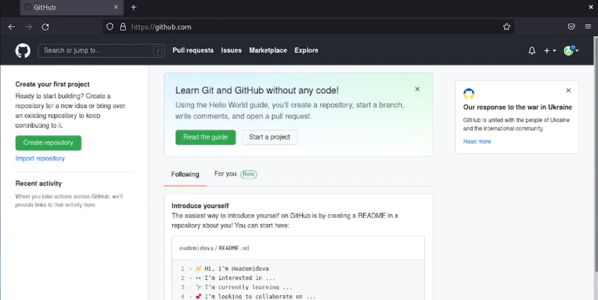{ #fig:001 width=70% }

## Установка ПО

Устанавливаю программное обеспечение, а именно git-flow и gh 

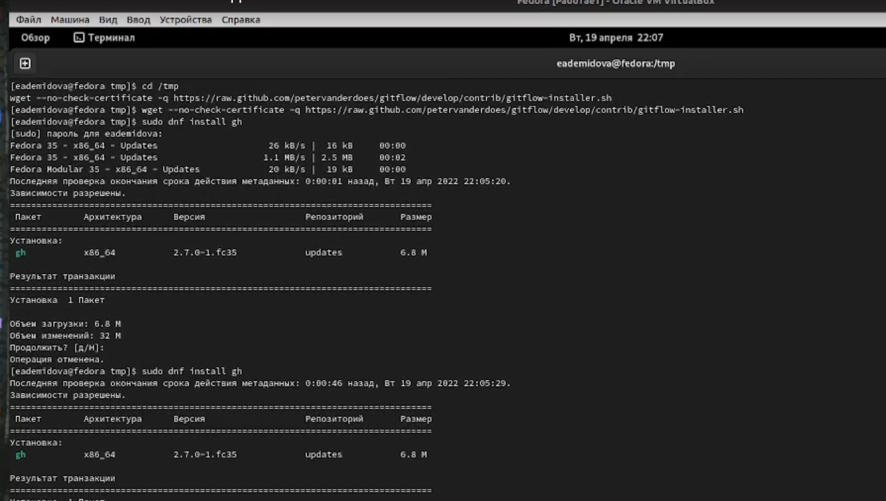{ #fig:002 width=70% }

## Настройка

Провожу базовую настройку git. Задаю имя и email владельца репозитория, настраиваю utf-8 в выводе сообщений git,верификацию и подписание коммитов git 

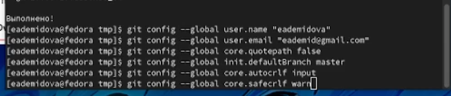{ #fig:003 width=70% }

## Ключи ssh

Создаю ключи ssh по алгоритму rsa и ed25519 

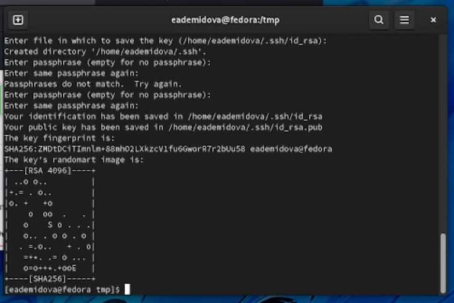{ #fig:004 width=60% }

## Ключи pgp

Создаю ключи pgp, выбирая необходимые опции 

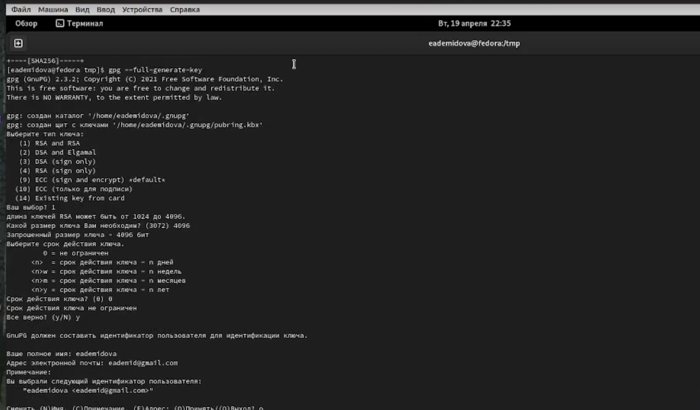{ #fig:005 width=70% }

## Ключи pgp

Добавляю PGP ключ в GitHub. Для этого вводим список ключей и копируем отпечаток приватного ключа, а затем добавляем его в специальное поле ввода в настройках GitHub 

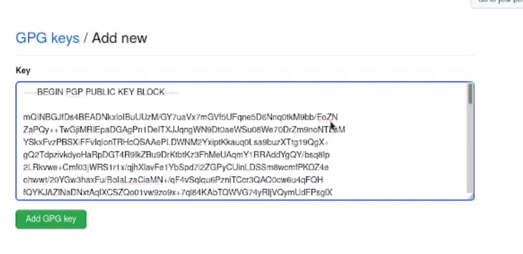{ #fig:006 width=70% }

## Коммиты

Настраиваем автоматические подписи коммитов git. Используя введёный email, укажим Git применять его при подписи коммитов 

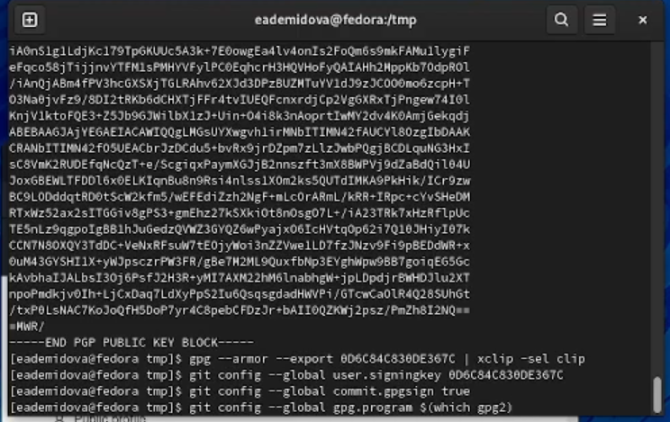{ #fig:007 width=60% }

## Настройка gh

Настроим gh. Авторизуемся и ответм на несколько наводящих вопросов 

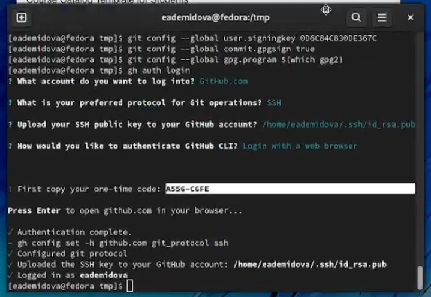{ #fig:008 width=60% }

## Создание репозитория

Создадим репозиторий курса на основе данного шаблона 

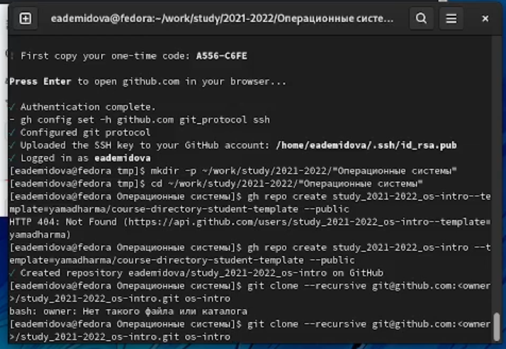{ #fig:009 width=60% }

## Создание репозитория

Перейдем в катаог курса, удалим лишние файлы, создадим необходиые каталоги и отправим файлы на сервер 

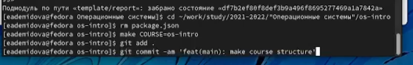{ #fig:010 width=70% }

## Создание репозитория

Репозиторий git был успешно создан

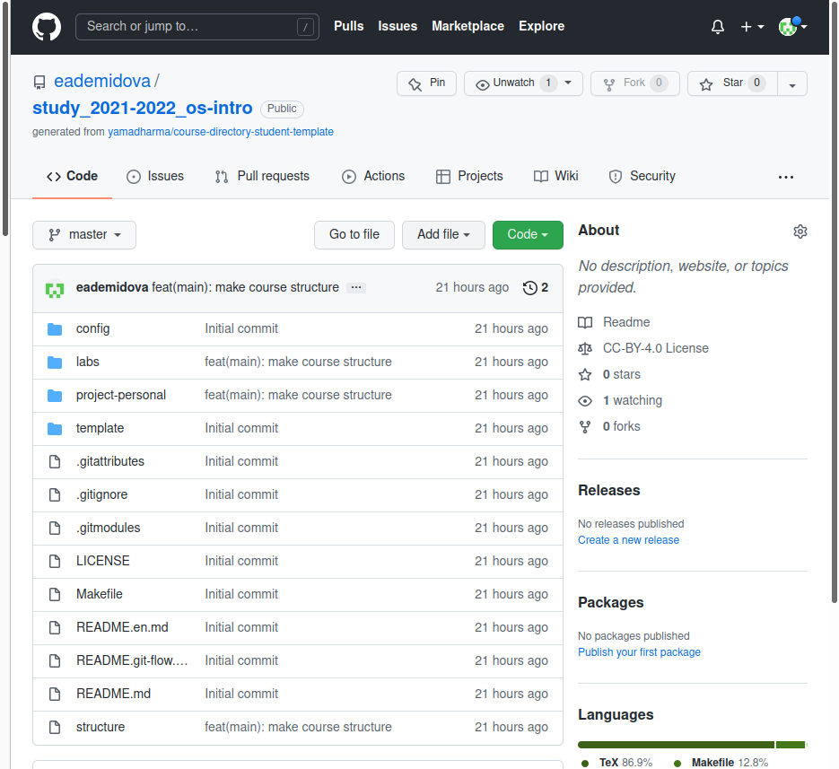{ #fig:011 width=40% }

## Создание репозитория

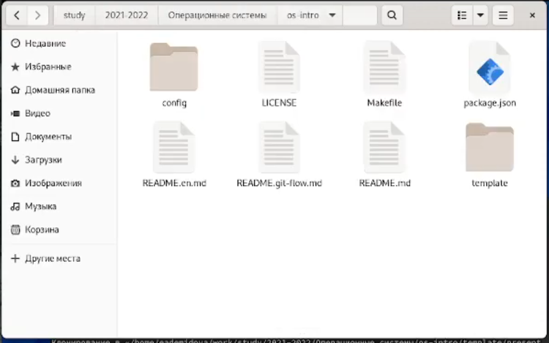{ #fig:012 width=60% }

## Выводы

В результате выполнения лабораторной работы была изучена идеология и применение средств контроля версий. А также освоены умения по работе с git, были обретены навыки создания ключей, репозитория, добавления и удаления файлов из репозитория.

## Список литературы

1.
Статья о системах контроля версий [Электронный ресурс]. 2020. URL: https:
//habr.com/ru/company/otus/blog/521290/.
2.
GitHub [Электронный ресурс]. 2021. URL: https://github.com/.

## {.standout}

Спасибо за внимание

