---
## Front matter
title: "Лабораторная работа №1"
subtitle: "Управление версиями"
author: "Демидова Екатерина Алексеевна"

## Generic otions
lang: ru-RU
toc-title: "Содержание"

## Bibliography
bibliography: bib/cite.bib
csl: pandoc/csl/gost-r-7-0-5-2008-numeric.csl

## Pdf output format
toc: true # Table of contents
toc-depth: 2
lof: true # List of figures
lot: false # List of tables
fontsize: 12pt
linestretch: 1.5
papersize: a4
documentclass: scrreprt
## I18n polyglossia
polyglossia-lang:
  name: russian
  options:
	- spelling=modern
	- babelshorthands=true
polyglossia-otherlangs:
  name: english
## I18n babel
babel-lang: russian
babel-otherlangs: english
## Fonts
mainfont: PT Serif
romanfont: PT Serif
sansfont: PT Sans
monofont: PT Mono
mainfontoptions: Ligatures=TeX
romanfontoptions: Ligatures=TeX
sansfontoptions: Ligatures=TeX,Scale=MatchLowercase
monofontoptions: Scale=MatchLowercase,Scale=0.9
## Biblatex
biblatex: true
biblio-style: "gost-numeric"
biblatexoptions:
  - parentracker=true
  - backend=biber
  - hyperref=auto
  - language=auto
  - autolang=other*
  - citestyle=gost-numeric
## Pandoc-crossref LaTeX customization
figureTitle: "Рис."
tableTitle: "Таблица"
listingTitle: "Листинг"
lofTitle: "Список иллюстраций"
lotTitle: "Список таблиц"
lolTitle: "Листинги"
## Misc options
indent: true
header-includes:
  - \usepackage{indentfirst}
  - \usepackage{float} # keep figures where there are in the text
  - \floatplacement{figure}{H} # keep figures where there are in the text
---

# Цель работы

Целью работы является изучение идеологии и применения средств контроля версий, а также освоение умения по работе с git.

# Задание

– Создать базовую конфигурацию для работы с git.
– Создать ключ SSH.
– Создать ключ PGP.
– Настроить подписи git.
– Зарегистрироваться на Github.
– Создать локальный каталог для выполнения заданий по предмету.

# Теоретическое введение

Cистема контроля версий (Version Control System, VCS) – это система, 
записывающая изменения в файл или набор файлов в течение времени и позволяющая вернуться позже 
к определенной версии [@habr:bash].
Среди классических VCS наиболее известны CVS, Subversion, а среди распределён-
ных — Git, Bazaar, Mercurial. Принципы их работы схожи, отличаются они в основном
синтаксисом используемых в работе команд.
Среди классических VCS наиболее известны CVS, Subversion, а среди распределён-
ных — Git, Bazaar, Mercurial. Принципы их работы схожи, отличаются они в основном
синтаксисом используемых в работе команд.                                       |
При выполнении работы была сипользована VCS Github [@git:bash].
История Git. В 2005 году компания, разрабатывающая систему контроля версий BitKeeper, порвала отношения с сообществом разработчиков ядра Linux. После этого сообщество приняло решение о разработке своей собственной системы контроля версий. Основными ценностями новой системы стали: полная децентрализация, скорость, простая архитектура, хорошая поддержка нелинейной разработки [@habr:bash].

# Выполнение лабораторной работы

1. Создаю учетную запись на  https://github.com (рис. [-@fig:001]). и заполняю основные данные.

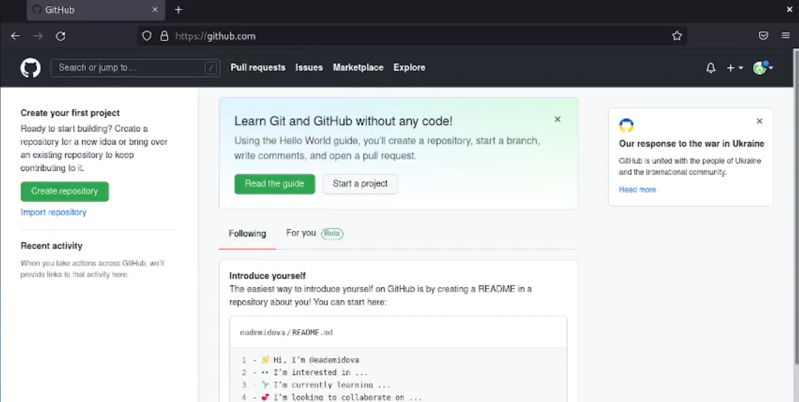{ #fig:001 width=70% }

2. Устанавливаю программное обеспечение, а именно git-flow и gh (рис. [-@fig:002])

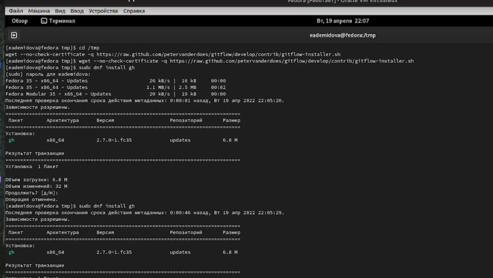{ #fig:002 width=70% }

3. Провожу базовую настройку git. Задаю имя и email владельца репозитория, настраиваю utf-8 в выводе сообщений git,верификацию и подписание коммитов git (рис. [-@fig:003])

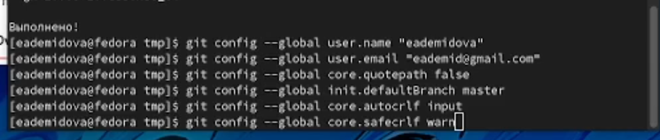{ #fig:003 width=70% }

4. Создаю ключи ssh по алгоритму rsa и ed25519 (рис. [-@fig:004])

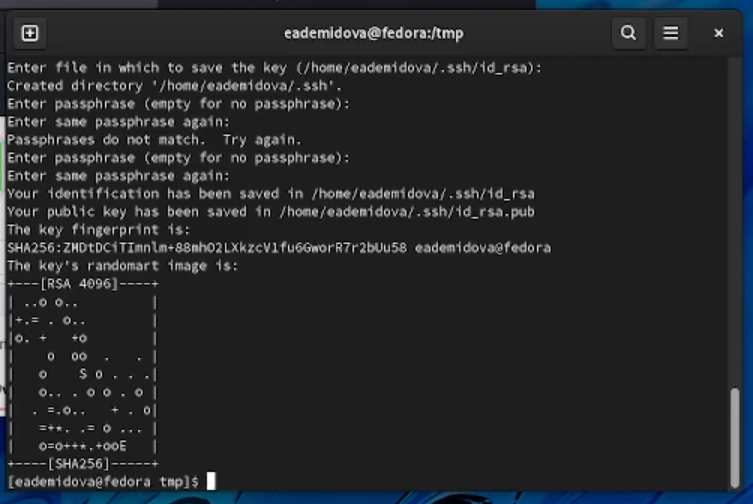{ #fig:004 width=70% }

5. Создаю ключи pgp, выбирая необходимые опции (рис. [-@fig:005])

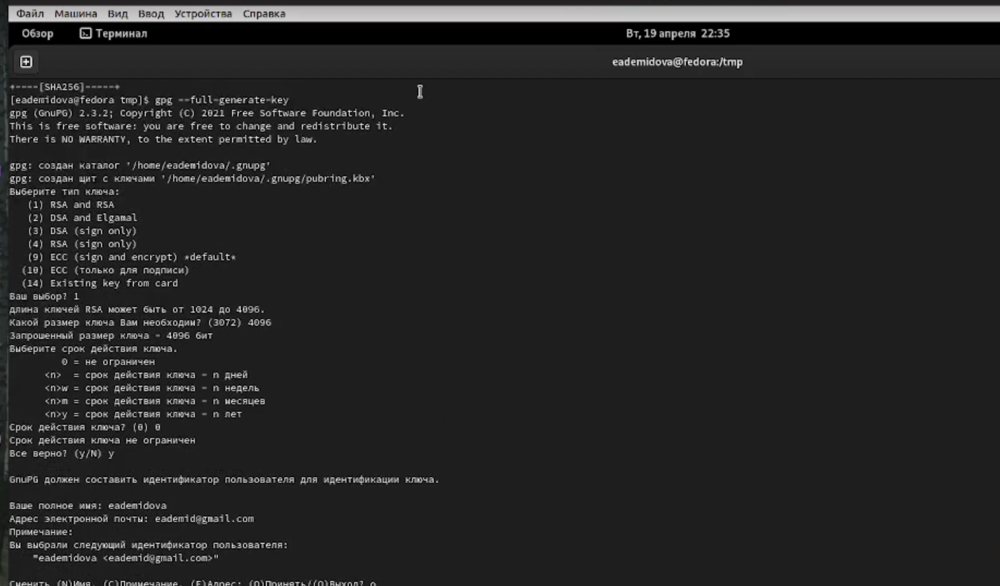{ #fig:005 width=70% }

6. Добавляю PGP ключ в GitHub. Для этого вводим список ключей и копируем отпечаток приватного ключа, а затем добавляем его в специальное поле ввода в настройках GitHub (рис. [-@fig:006])

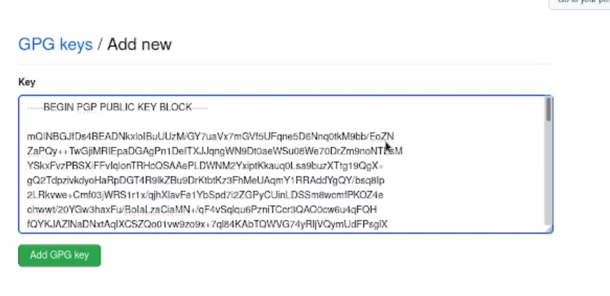{ #fig:006 width=70% }

7. Настраиваем автоматические подписи коммитов git. Используя введёный email, укажим Git применять его при подписи коммитов (рис. [-@fig:007])

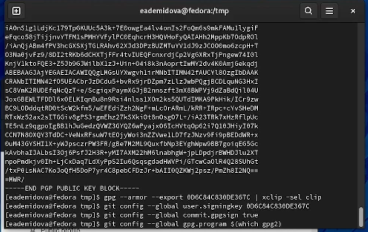{ #fig:007 width=70% }

8. Настроим gh. Авторизуемся и ответм на несколько наводящих вопросов (рис. [-@fig:008])

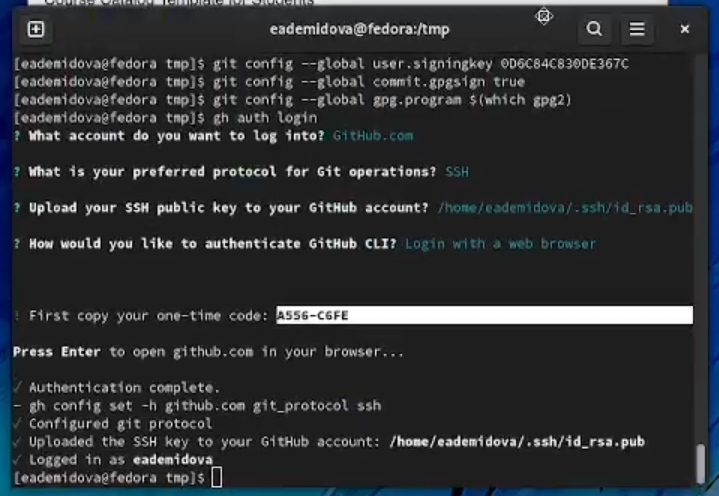{ #fig:008 width=70% }

9. Создадим репозиторий курса на основе данного шаблона (рис. [-@fig:009])

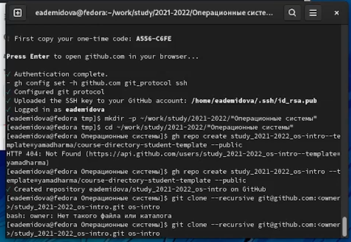{ #fig:009 width=70% }

10. Перейдем в катаог курса, удалим лишние файлы, создадим необходиые каталоги и отправим файлы на сервер (рис. [-@fig:010])

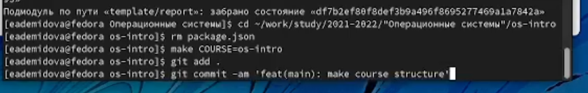{ #fig:010 width=70% }

Репозиторий git был успешно создан (рис. [-@fig:011])

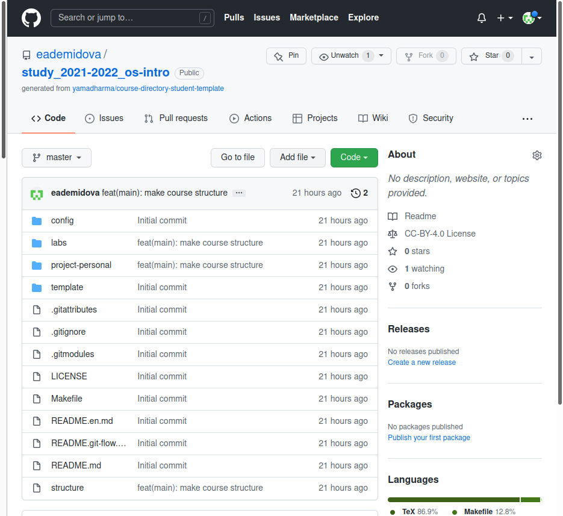{ #fig:011 width=70% }

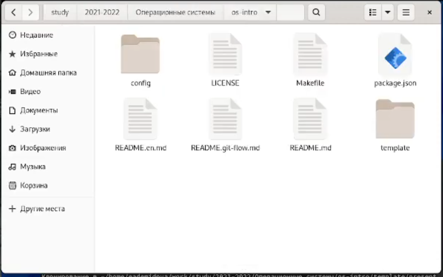{ #fig:012 width=70% }

# Контрольные вопросы
1. Системы контроля версий -VCS- это программное обеспечение, которое используется для облегчения работы с изменяющейся информацией, обычно - в проектах. Чаще всего используется при разработке, когда над одним проектом работает большое количество людей.

2. Репозиторий в системе контроля версий - Это удаленный репозиторий, в котором хранятся все файлы проекта
    commit - фиксирует изменения перед загрузкой файлов в систему контроля версий
    история хранит все изменения в проекте, и при необходимости позволяет откатиться в желаемое место
    рабочая копия - - это копия проекта на компьютере разработчика. Если другой член команды изменил проект, вам необходимо скачать новую версию проекта на свой компьютер.

3. В отличие от классических, в распределённых системах контроля версий центральный репозиторий не является обязательным. Среди классических VCS наиболее известны CVS, Subversion, а среди распределённых — Git, Bazaar, Mercurial. Принципы их работы схожи, отличаются они в основном синтаксисом используемых в работе команд. В децентрализованных системах у каждого из участников проекта есть полная копия проекта на своем компьютере, что делает его менее зависимым от сервера (Git).
4. Для начала необходимо создать и подключить удаленный репозиторий. Затем, поскольку никто, кроме вас, не изменяет проект, по мере изменения проекта отправляйте изменения на сервер, и нет необходимости загружать изменения.
5. Участник проекта (пользователь) перед началом работы посредством определённых команд получает нужную ему версию файлов. После внесения изменений, пользователь размещает новую версию в хранилище. При этом предыдущие версии не удаляются из центрального хранилища и к ним можно вернуться в любой момент.
6. Упрощение обмена информацией, ускорение разработки, устранение ошибок и недочетов при разработке.

    git init - инициализирует локальный репозиторий
    git add * или add. - добавляет файлы в репозиторий
    git commit - версия фиксации
    git pull - загружает текущую версию проекта
    git push - отправляет измененный проект на сервер
    git checkout - позволяет переключаться между ветками
    git status - текущий статус проекта
    git branch - просмотреть доступные ветки
    git remote add - добавить удаленный репозиторий

    git push --all (push origin master/любой branch)

7. Ветви функций, также иногда называемые ветвями тем, используются для разработки новых функций, которые должны появиться в текущих или будущих выпусках.

8. Существуют временные и системные файлы, которые загромождают проект и не нужны. путь к ним можно добавить в файл .gitignore, тогда они не будут добавлены в проект

# Выводы

В результате выполнения лабораторной работы была изучена идеология и применение средств контроля версий. А также освоены умения по работе с git, были обретены навыки создания ключей, репозитория, добавления и удаления файлов из репозитория.

# Список литературы{.unnumbered}

::: {#refs}
:::
