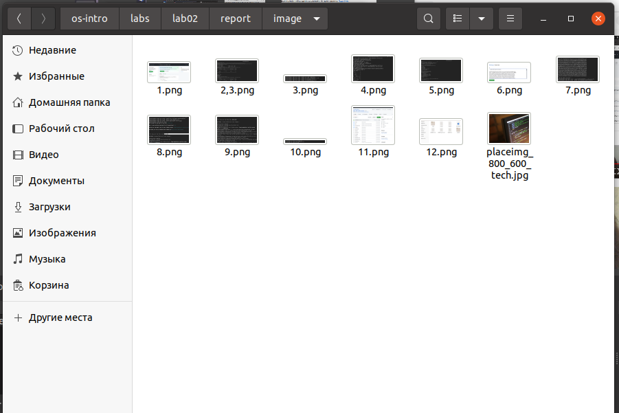
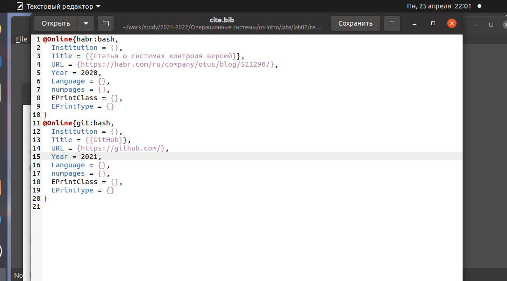
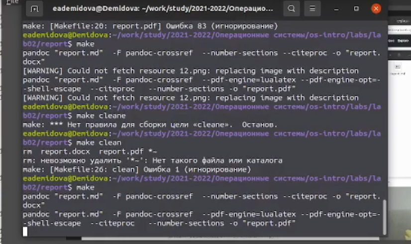
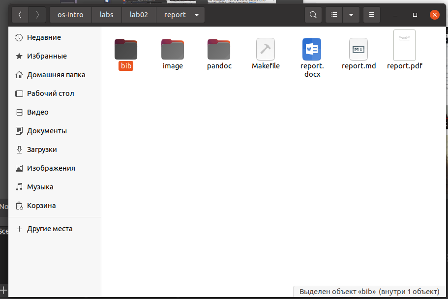

---
## Front matter
lang: ru-RU
title: Лабораторная работа №2
author: |
	Демидова Е.А.
institute: Российский Университет дружбы народов
date: 17.04.2023

## Formatting
toc: false
slide_level: 2
theme: metropolis
header-includes: 
 - \metroset{progressbar=frametitle,sectionpage=progressbar,numbering=fraction}
 - '\makeatletter'
 - '\beamer@ignorenonframefalse'
 - '\makeatother'
aspectratio: 43
section-titles: true
---

# Введение

## Введение

**Цель работы**

Научиться оформлять отчёты с помощью легковесного языка разметки Markdown.

**Задачи**

- Вставить скриншоты в папку image

- Вставить необходимую литературу в файл cite.bib

- Написать текст отчета

- Скомпилировать отчет 

# Результаты работы

## Скриншоты

Переименуем удобным образом скриншоты и поместим их в папку image

{ #fig:001 width=80% }

## Список литературы

Поместим в файл cite.bib нужные источники для теоретического введенеия

{ #fig:002 width=80% }

## Компиляция отчета

Скомпилируем отчет с помощью команды make

{ #fig:003 width=80%ъЪ}

## Результат

Проверим успешность компиляции отчета

{ #fig:004 width=70% }

## Выводы

В результате выполнения лабораторной работы я научилась оформлять отчёт с помощью языка разметки markdown

## {.standout}

Спасибо за внимание
