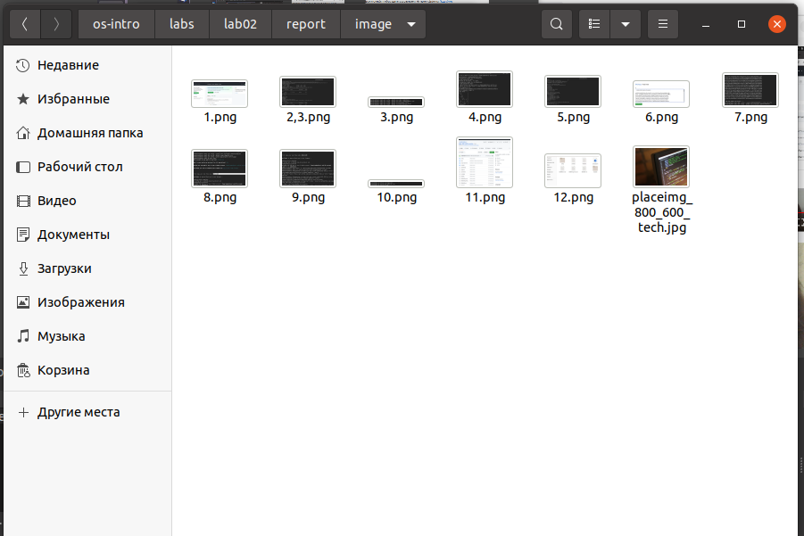
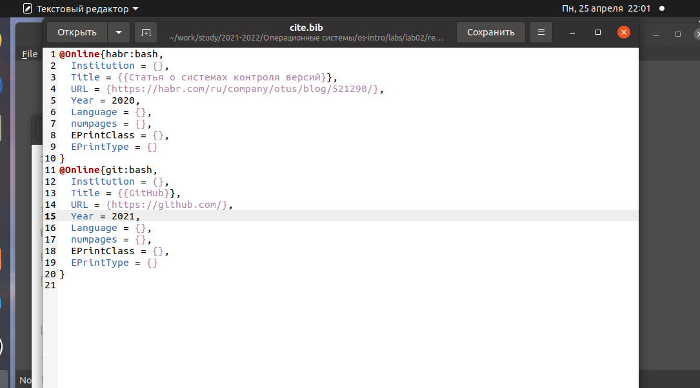
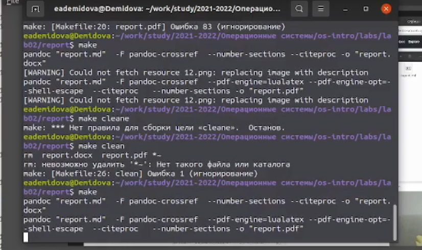
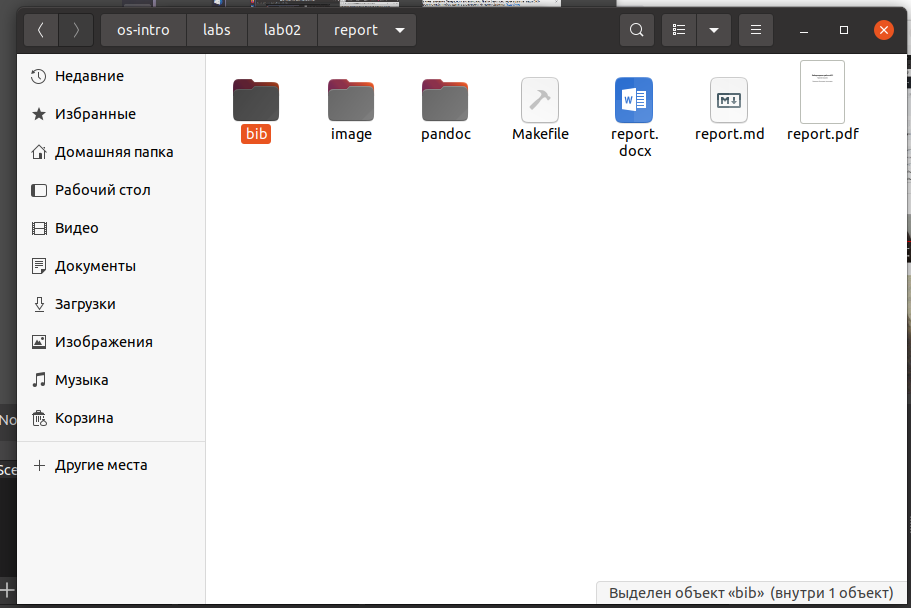

---
## Front matter
title: "Лабораторная работа №2"
subtitle: "Markdown"
author: "Демидова Екатерина Алексеевна"

## Generic otions
lang: ru-RU
toc-title: "Содержание"

## Bibliography
bibliography: bib/cite.bib
csl: pandoc/csl/gost-r-7-0-5-2008-numeric.csl

## Pdf output format
toc: true # Table of contents
toc-depth: 2
lof: true # List of figures
lot: false # List of tables
fontsize: 12pt
linestretch: 1.5
papersize: a4
documentclass: scrreprt
## I18n polyglossia
polyglossia-lang:
  name: russian
  options:
	- spelling=modern
	- babelshorthands=true
polyglossia-otherlangs:
  name: english
## I18n babel
babel-lang: russian
babel-otherlangs: english
## Fonts
mainfont: PT Serif
romanfont: PT Serif
sansfont: PT Sans
monofont: PT Mono
mainfontoptions: Ligatures=TeX
romanfontoptions: Ligatures=TeX
sansfontoptions: Ligatures=TeX,Scale=MatchLowercase
monofontoptions: Scale=MatchLowercase,Scale=0.9
## Biblatex
biblatex: true
biblio-style: "gost-numeric"
biblatexoptions:
  - parentracker=true
  - backend=biber
  - hyperref=auto
  - language=auto
  - autolang=other*
  - citestyle=gost-numeric
## Pandoc-crossref LaTeX customization
figureTitle: "Рис."
tableTitle: "Таблица"
listingTitle: "Листинг"
lofTitle: "Список иллюстраций"
lotTitle: "Список таблиц"
lolTitle: "Листинги"
## Misc options
indent: true
header-includes:
  - \usepackage{indentfirst}
  - \usepackage{float} # keep figures where there are in the text
  - \floatplacement{figure}{H} # keep figures where there are in the text
---

# Цель работы

Научиться оформлять отчёты с помощью легковесного языка разметки Markdown.

# Задание

- Сделайте отчёт по предыдущей лабораторной работе в формате Markdown.

- В качестве отчёта просьба предоставить отчёты в 3 форматах: pdf, docx и md (в архиве,
поскольку он должен содержать скриншоты, Makefile и т.д.)

# Теоретическое введение

Markdown (произносится маркда́ун) — облегчённый язык разметки, созданный с целью обозначения форматирования в простом тексте, с максимальным сохранением его читаемости человеком, и пригодный для машинного преобразования в языки для продвинутых публикаций (HTML, Rich Text и других)[@wiki:bash].

Диалект Markdown, поддерживаемый Pandoc, включает:
— заголовки разных уровней,
— внутритекстовые и выключные формулы в формате LaTeX, при конверсии в DOCX
преобразующиеся в формат Office Math Markup Language (OMML [4]), с которым ра-
ботает встроенный редактор формул Word 2007 и более поздних версий,
— таблицы,
— растровые рисунки в форматах JPEG и PNG, векторные в форматах EPS и EMF,
— нумерованные и маркированные списки, в том числе вложенные,
— фрагменты программного кода (форматируются моноширинным шрифтом),
— жирный/курсив/зачёркнутый текст, нижние/верхние индексы[@pavlov:verstka:ru]

# Выполнение лабораторной работы

Затем добавим необходимые скриншоты в папку image и расставим их по шаблону лабораторной работы (рис. [-@fig:001])

{ #fig:001 width=70% }

Изменим список источников литературы, находящийся в файле cite.bib, в соотсветствии с ичтосниками, используемыми в теоретическом введении (рис. [-@fig:002])

{ #fig:002 width=70% }

Затем написав всю нужную информацию в отчёт, то есть теоретическое введение, цели, выполнение лабораторной работы и вывод, скомпилируем отчет через терминал с помощью команды make (рис. [-@fig:003])

{ #fig:003 width=70% }

Отчёт успешно скомпилирован (рис. [-@fig:004])

{ #fig:004 width=70% }

# Выводы

В результате выполнения лабораторной работы я научилась оформлять отчёт с помощью языка разметки markdown.

# Список литературы{.unnumbered}

::: {#refs}
:::
