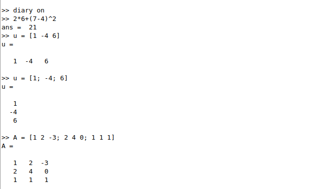
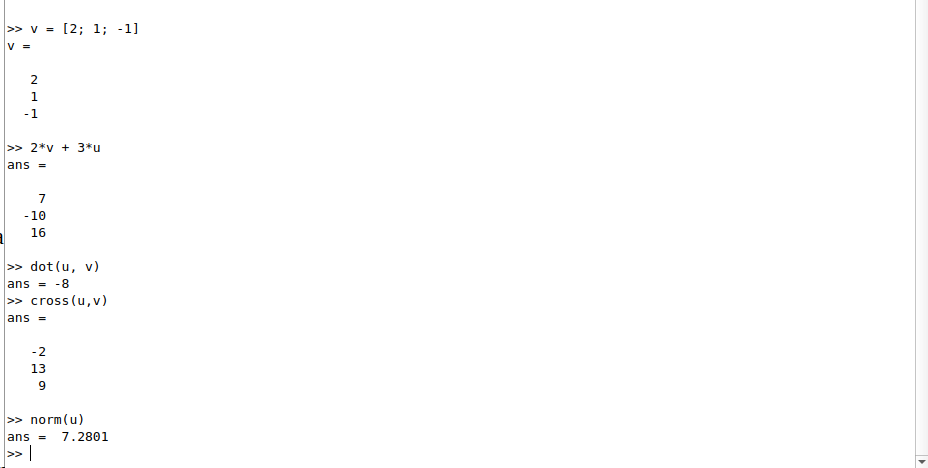
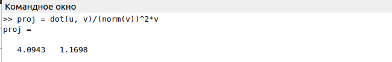
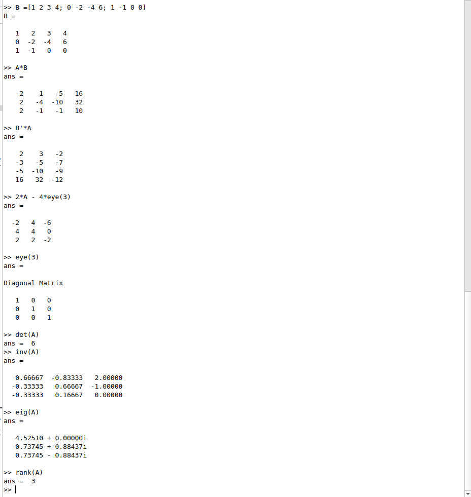
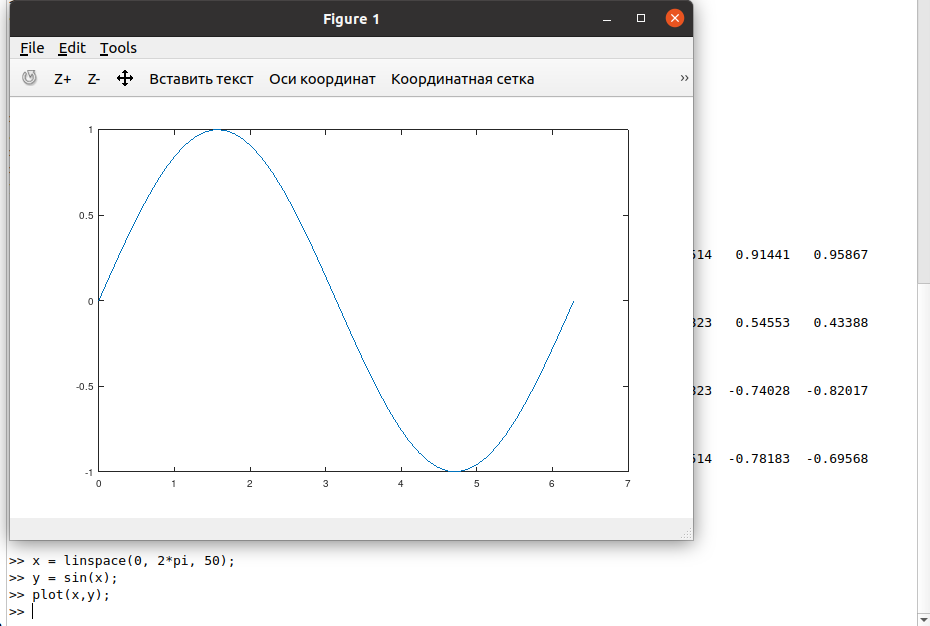
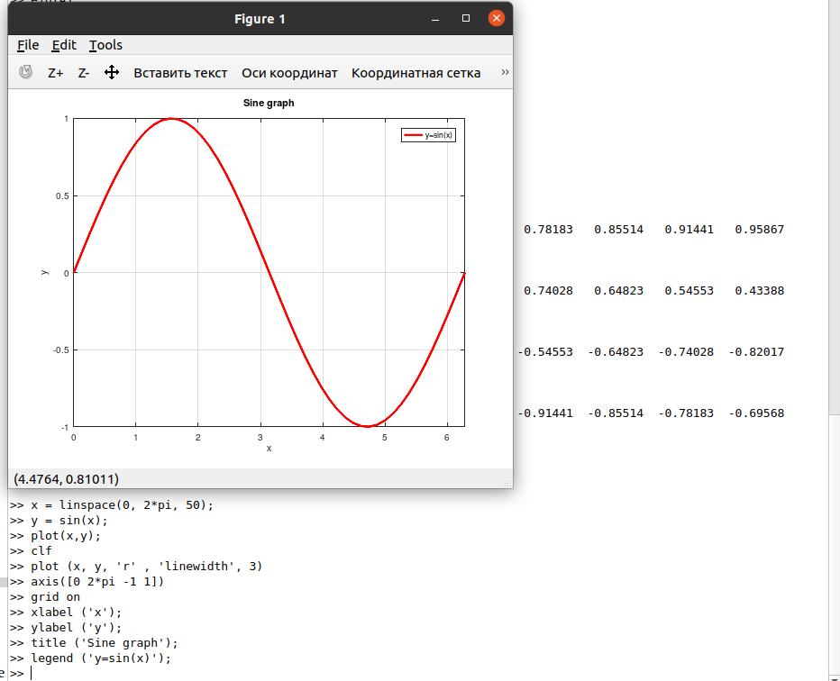
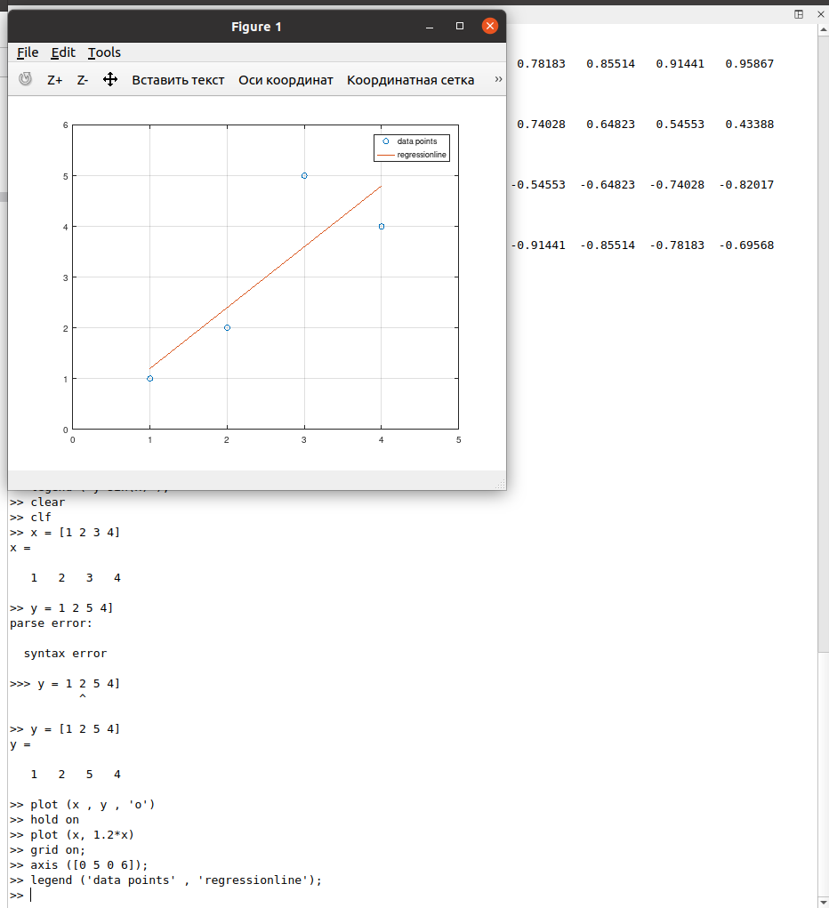
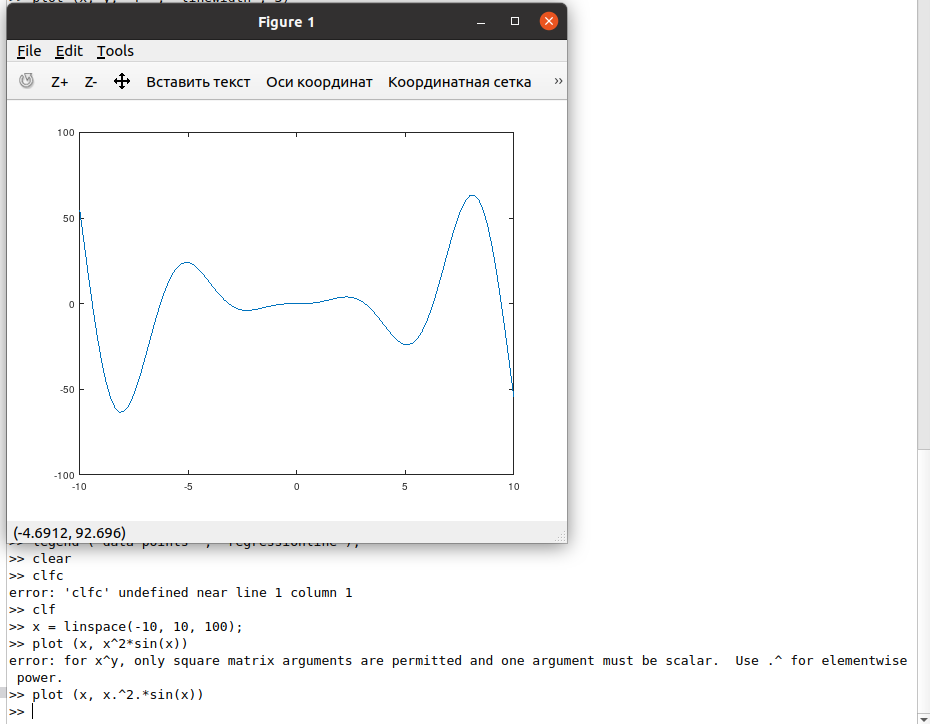
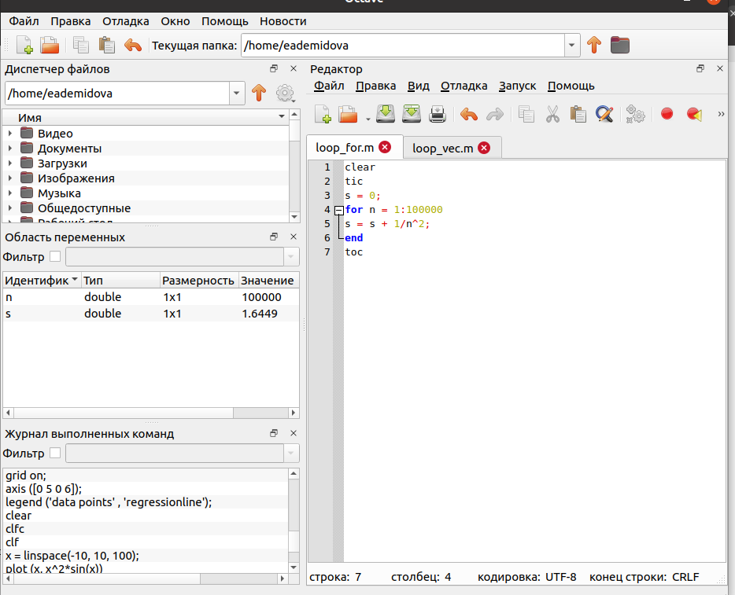
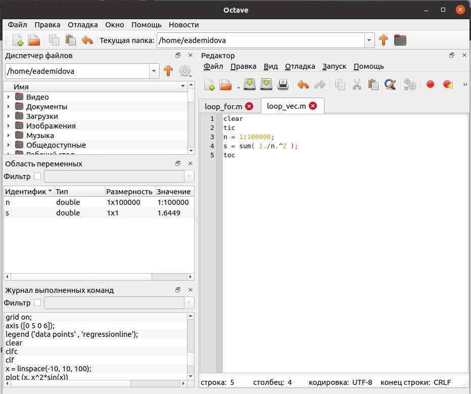

---
## Front matter
lang: ru-RU
title: Лабораторная работа №3
subtitle: Введение в работу с Octave
author:
  - Демидова Е. А.
institute:
  - Российский университет дружбы народов, Москва, Россия
date: 02 мая 2003

## i18n babel
babel-lang: russian
babel-otherlangs: english

## Formatting pdf
toc: false
toc-title: Содержание
slide_level: 2
aspectratio: 169
section-titles: true
theme: metropolis
header-includes:
 - \metroset{progressbar=frametitle,sectionpage=progressbar,numbering=fraction}
 - '\makeatletter'
 - '\beamer@ignorenonframefalse'
 - '\makeatother'
---

# Информация

## Докладчик

:::::::::::::: {.columns align=center}
::: {.column width="70%"}

  * Демидова Екатерина Алексеевна
  * студентка группы НКНбд-01-21
  * Российский университет дружбы народов
  * <https://github.com/eademidova>

:::
::: {.column width="30%"}

:::
::::::::::::::

# Введение

## Цель работы

Научиться выполнять основные вычисления и рисовать простейшие двумерные графики с помощью системы для математических вычислений Oсtave.

## Задание

- Выполнить простейшие операции.
- Выполнить операции с векторами.
- Вычислить проектор.
- Выполнить матричные операции.
- Построить простейшие графики.
- Построить два графика на одном чертеже.
- Построить график $y = x^2sin(x)$.
- Сравненить циклы и операции с векторами

# Выполнение лабораторной работы

## Простейшие операции

Воспользуемся  Octave как простейшим калькулятором, вычислив выражение $2*6 + (7-4)^2$. Затем зададим вектор-строку, вектор-столбец и матрицу.

{ #fig:001 width=60% }

## Операции с векторами

Зададим ещё один вектор-столбец и сложим получившиеся векторы, домножив на коэффициенты. Перемножим эти векторы скалярно с помощью функции dot() и векторно с помощью функции cross(). Найдём Также найдём норму вектора функцией norm()

{ #fig:002 width=70% }

## Вычисление проектора

Введём два новых вектора-строки u и v и вычисли проекцию вектора u на вектор v. В Octave это можно вычислить следующим образом:

{ #fig:003 width=70% }

## Матричные операции

Введём матрицы A и B. Произведём с ними различные матричные операции. Затем найдём определитель матрицы А, обратную ей матрицу, собственные значения и ранг матрицы A

{ #fig:004 width=40% }

## График $y = sin(x)$

{ #fig:005 width=60% }

## Улучшененный график $y = sin(x)$

Улучшим внешний вид графика. Подногим диапазон осей, нарисуем сетку, подпишем оси, сделаем заголовок графика и зададим легенду

{ #fig:006 width=50% }

## Два графика на одном чертеже

Начертим два графика на одном чертеже. Зададим два вектора и начертим эти точки, используя кружочки как маркеры. Чтобы добавить к нашему текущему графику ещё один. Дабавим график регрессии.

{ #fig:007 width=60% }

## график $y = x^2*sin(x)$

Построим график $y = x^2*sin(x)$, используя поэлементное возведение в степень .^ и поэлементное умножение .*. охраним графики в виде файлов, в результате получим следующий график

{ #fig:008 width=60% }

## Вычисление суммы циклом

Сравним эффективность работы с циклами и операций с векторами. Для этого вычислим одну
сумму.

{ #fig:009 width=60% }

## Вычисление суммы с помощью операций с векторами

При сравнении обнаружим, что результат одинаковый.

{ #fig:010 width=60% }

# Заключение

## Вывод

В результате выполнения работы научились выполнять основные вычисления и рисовать простейшие двумерные графики с помощью системы для математических вычислений Octave.

## Список литературы

1. GNU Octave [Электронный ресурс]. Free Software Foundation, 2023. URL:
https://octave.org/.
2. GNU Octave Documentation [Электронный ресурс]. Free Software Foundation, 2023. URL: https://docs.octave.org/latest/.
