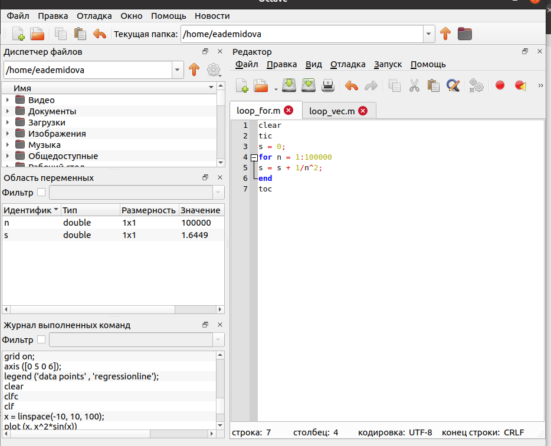

---
## Front matter
title: "Лабораторная работа №3"
subtitle: "Введение в работу с Octave"
author: "Демидова Екатерина Алексеевна"

## Generic otions
lang: ru-RU
toc-title: "Содержание"

## Bibliography
bibliography: bib/cite.bib
csl: pandoc/csl/gost-r-7-0-5-2008-numeric.csl

## Pdf output format
toc: true # Table of contents
toc-depth: 2
lof: true # List of figures
lot: false # List of tables
fontsize: 12pt
linestretch: 1.5
papersize: a4
documentclass: scrreprt
## I18n polyglossia
polyglossia-lang:
  name: russian
  options:
	- spelling=modern
	- babelshorthands=true
polyglossia-otherlangs:
  name: english
## I18n babel
babel-lang: russian
babel-otherlangs: english
## Fonts
mainfont: PT Serif
romanfont: PT Serif
sansfont: PT Sans
monofont: PT Mono
mainfontoptions: Ligatures=TeX
romanfontoptions: Ligatures=TeX
sansfontoptions: Ligatures=TeX,Scale=MatchLowercase
monofontoptions: Scale=MatchLowercase,Scale=0.9
## Biblatex
biblatex: true
biblio-style: "gost-numeric"
biblatexoptions:
  - parentracker=true
  - backend=biber
  - hyperref=auto
  - language=auto
  - autolang=other*
  - citestyle=gost-numeric
## Pandoc-crossref LaTeX customization
figureTitle: "Рис."
tableTitle: "Таблица"
listingTitle: "Листинг"
lofTitle: "Список иллюстраций"
lotTitle: "Список таблиц"
lolTitle: "Листинги"
## Misc options
indent: true
header-includes:
  - \usepackage{indentfirst}
  - \usepackage{float} # keep figures where there are in the text
  - \floatplacement{figure}{H} # keep figures where there are in the text
---

# Цель работы

Научиться выполнять основные вычисления и рисовать простейшие двумерные графики с помощью системы для математических вычислений Oсtave.

# Задание

- Выполнить простейшие операции.
- Выполнить операции с векторами.
- Вычислить проектор.
- Выполнить матричные операции.
- Построить простейшие графики.
- Построить два графика на одном чертеже.
- Построить график $y = x^2sin(x)$.
- Сравненить циклы и операции с векторами

# Теоретическое введение

Дадим определение GNU Octave. GNU Octave — свободная программная система для математических вычислений, использующая совместимый с MATLAB язык высокого уровня [@octave:bash].

На официальном сайте Octave даётся следующая характеристика этого научного языка программирования[]:

- Мощный синтаксис, ориентированный на математику, со встроенными инструментами 2D/3D-графики и визуализации.
- Бесплатное программное обеспечение, работающее на GNU/Linux, macOS, BSD и Microsoft Windows.
- Вставка, совместимая со многими скриптами Matlab

Приведём некоторые примеры использования Octave[@octave-doc:bash]:

1. Решение систем уравнений с помощью операций линейной алгебры над векторами и матрицами.

```

b = [4; 9; 2] # Column vector
A = [ 3 4 5;
      1 3 1;
      3 5 9 ]
x = A \ b     # Solve the system Ax = b

```

2. Визуализация данных с помощью высокоуровневых графических команд в 2D и 3D.

```

x = -10:0.1:10; # Create an evenly-spaced vector from -10..10
y = sin (x);    # y is also a vector
plot (x, y);
title ("Simple 2-D Plot");
xlabel ("x");
ylabel ("sin (x)");

```

# Выполнение лабораторной работы

Включим журналирование с помощью diary on. Затем воспользуемся  Octave как простейшим калькулятором, вычислив выражение $2*6 + (7-4)^2$. Затем зададим вектор-строку, вектор-столбец и матрицу (рис. [-@fig:001])

{ #fig:001 width=70% }

Зададим ещё один вектор-столбец и сложим получившиеся векторы, домножив на коэффициенты. Перемножим эти векторы скалярно с помощью функции dot() и векторно с помощью функции cross(). Найдём Также найдём норму вектора функцией norm() (рис. [-@fig:002])

{ #fig:002 width=70% }

Введём два новых вектора-строки u и v и вычисли проекцию вектора u на вектор v. В Octave это можно вычислить следующим образом (рис. [-@fig:003]):

{ #fig:003 width=70% }

Введём матрицы A и B. Вычислим их произведение $A*B$, произведение $B^T*A$, разность $2*A-4*I$, где I единичная матрицы размерности 3. Затем найдём определитель матрицы А, обратную ей матрицу, собственные значения и ранг матрицы A (рис. [-@fig:004])

{ #fig:004 width=70% }

Создадим вектор значений $x$, зададим вектор $y = sinx$ и построим график (рис. [-@fig:005])

{ #fig:005 width=70% }

Улучшим внешний вид графика. Сначала очистим получившийся график командой clf. Затем подногим диапазон осей, нарисуем сетку, подпишем оси, сделаем заголовок графика и зададим легенду (рис. [-@fig:006])

{ #fig:006 width=70% }

Начертим два графика на одном чертеже. Очистим память и рабочую область фигуры. Зададим два вектора и начертим эти точки, используя кружочки как маркеры. Чтобы добавить к нашему текущему графику ещё один, используем команду hold on. Дабавим график регрессии, зададим сетку, оси и легенду. (рис. [-@fig:007])

{ #fig:007 width=70% }

Очистим память и рабочую область фигуры. Создадим вектор $x$ и попробуем построить график $y = x^2*sin(x)$. С помощью команды `plot(x, x^2*sin(x))` сделать это не получится, так как ей задаётся в выражении матричное умножение, в то время, как нам необходимо поэлементное. Построим график $y = x^2*sin(x)$, используя поэлементное возведение в степень .^ и поэлементное умножение .*. охраним графики в виде файлов, в результате получим следующий график (рис. [-@fig:008])

{ #fig:008 width=70% }

Сравним эффективность работы с циклами и операций с векторами. Для этого вычислим
сумму 
$$
\sum_{n}^{10000000} 1/n^2
$$
Вычислим сумму с помощью цикла и с помощью операций с векторами. При сравнении обнаружим, что результат одинаковый. (рис. [-@fig:009], [-@fig:010])

{ #fig:009 width=70% }

{ #fig:010 width=70% }


# Выводы

В результате выполнения работы научились выполнять основные вычисления и рисовать простейшие двумерные графики с помощью системы для математических вычислений Octave.

# Список литературы{.unnumbered}

::: {#refs}
:::
