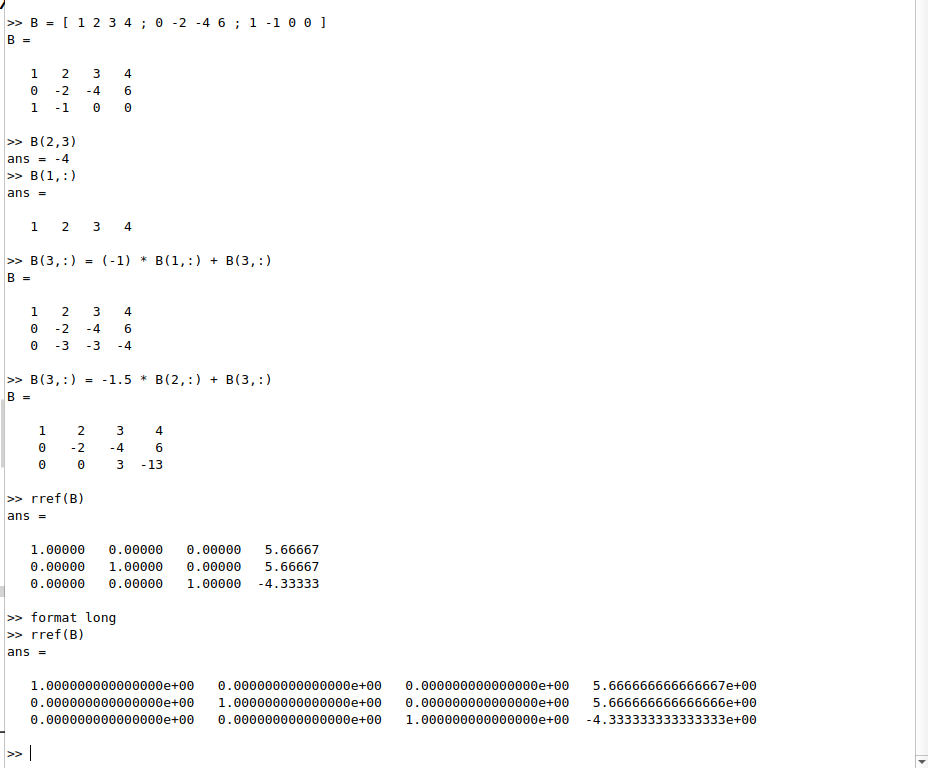
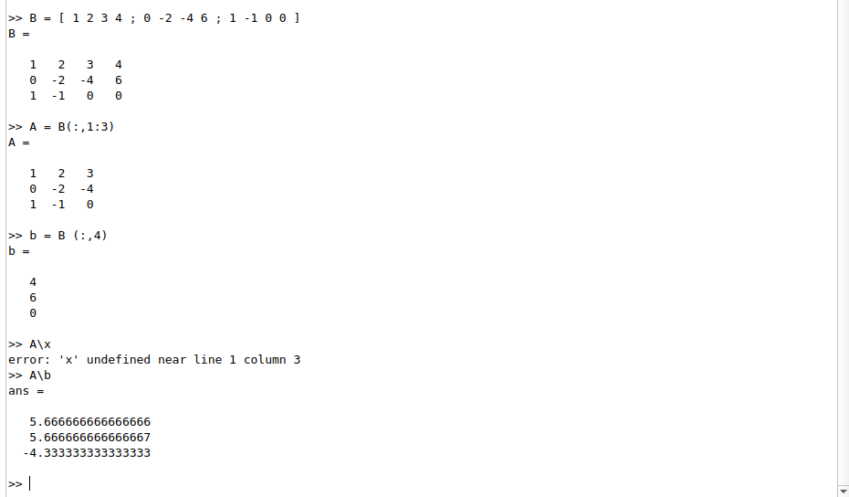
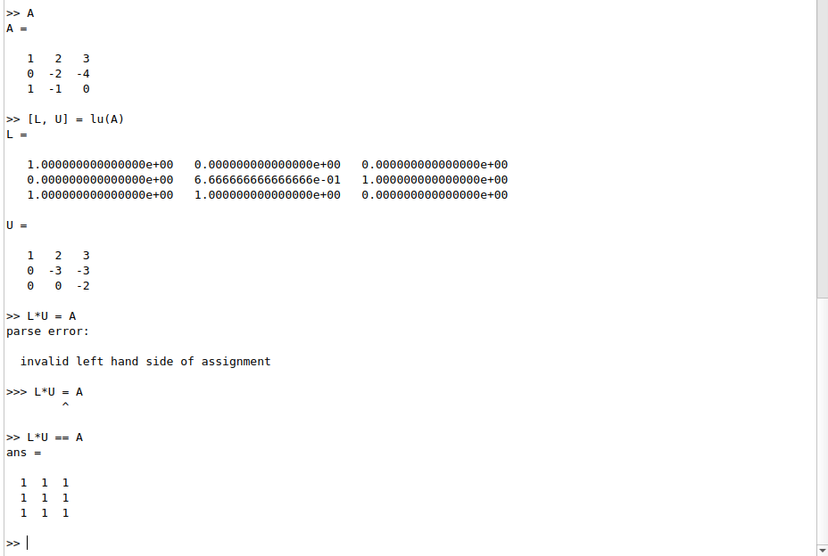
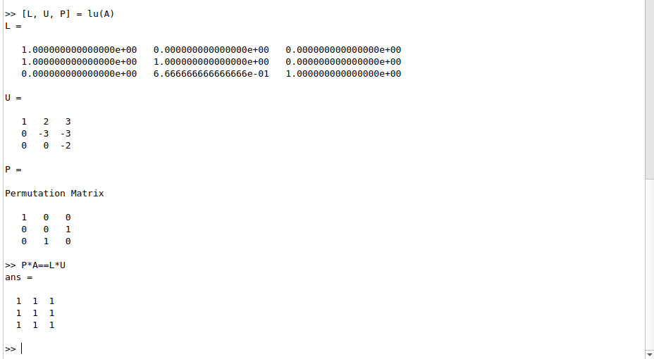

---
## Front matter
lang: ru-RU
title: Лабораторная работа №4
subtitle: Системы линейных уравнений
author:
  - Демидова Е. А.
institute:
  - Российский университет дружбы народов, Москва, Россия
date: 6 мая 2033

## i18n babel
babel-lang: russian
babel-otherlangs: english

## Formatting pdf
toc: false
toc-title: Содержание
slide_level: 2
aspectratio: 169
section-titles: true
theme: metropolis
header-includes:
 - \metroset{progressbar=frametitle,sectionpage=progressbar,numbering=fraction}
 - '\makeatletter'
 - '\beamer@ignorenonframefalse'
 - '\makeatother'
---

# Информация

## Докладчик

:::::::::::::: {.columns align=center}
::: {.column width="70%"}

  * Демидова Екатерина Алексеевна
  * студентка группы НКНбд-01-21
  * Российский университет дружбы народов
  * <https://github.com/eademidova>

:::
::: {.column width="30%"}

:::
::::::::::::::

# Введение

## Цель работы

Научиться решать системы линейных уравнениий с помощью системы для математических вычислений Oсtave.

## Задание

- Решить СЛАУ с помощью Метода Гаусса
- Решить СЛАУ, применив левое деление
- Найти LU-разложение
- Найти LUP-разложение

# Выполнение лабораторной работы

## Метод Гаусса

Решим систему уравнений с помощью метода Гаусса.

{ #fig:001 width=50% }

## Левое деление

строенная операция для решения линейных систем вида $Ax = b$ в Octave называется левым делением и записывается как A\b.

{ #fig:002 width=60% }

## LU-разложение

С помощью функции lu() d Octave распишем LU-разложение матрицы A

{ #fig:003 width=60% }

## LUP-разложение

С помощью функции lu() d Octave распишeм LUP-разложение матрицы A  

{ #fig:004 width=70% }

# Заключение

## Вывод

В результате выполнения работы научились решать системы линейных уравнениий с помощью системы для математических вычислений Oсtave.

## Список литературы

1. Метод Гаусса [Электронный ресурс]. Wikimedia Foundation, Inc., 2023. URL:
https://ru.wikipedia.org/wiki/%D0%9C%D0%B5%D1%82%D0%BE%D0%B4_%
D0%93%D0%B0%D1%83%D1%81%D1%81%D0%B0.
2. GNU Octave Documentation [Электронный ресурс]. Free Software Foundation, 2023. URL: https://docs.octave.org/latest/.
