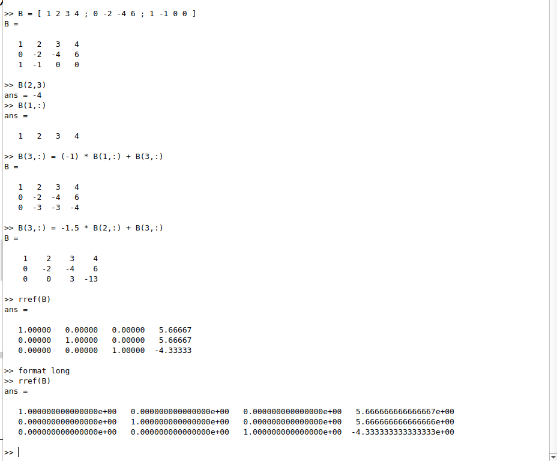
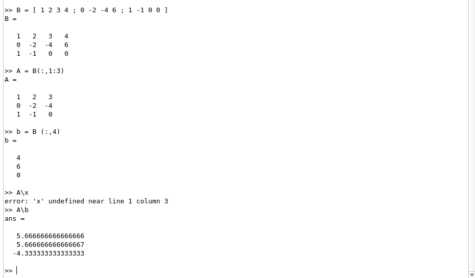
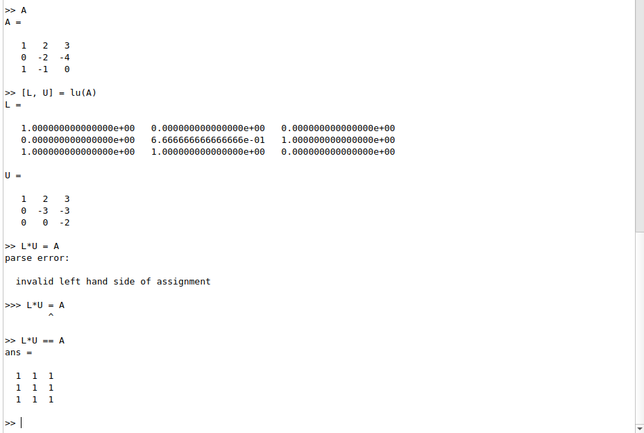
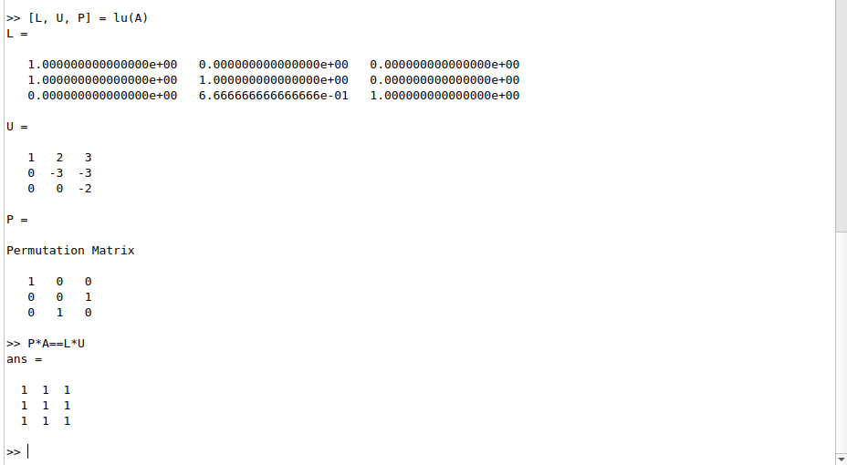

---
## Front matter
title: "Лабораторная работа №4"
subtitle: "Системы линейных уравнений"
author: "Демидова Екатерина Алексеевна"

## Generic otions
lang: ru-RU
toc-title: "Содержание"

## Bibliography
bibliography: bib/cite.bib
csl: pandoc/csl/gost-r-7-0-5-2008-numeric.csl

## Pdf output format
toc: true # Table of contents
toc-depth: 2
lof: true # List of figures
lot: false # List of tables
fontsize: 12pt
linestretch: 1.5
papersize: a4
documentclass: scrreprt
## I18n polyglossia
polyglossia-lang:
  name: russian
  options:
	- spelling=modern
	- babelshorthands=true
polyglossia-otherlangs:
  name: english
## I18n babel
babel-lang: russian
babel-otherlangs: english
## Fonts
mainfont: PT Serif
romanfont: PT Serif
sansfont: PT Sans
monofont: PT Mono
mainfontoptions: Ligatures=TeX
romanfontoptions: Ligatures=TeX
sansfontoptions: Ligatures=TeX,Scale=MatchLowercase
monofontoptions: Scale=MatchLowercase,Scale=0.9
## Biblatex
biblatex: true
biblio-style: "gost-numeric"
biblatexoptions:
  - parentracker=true
  - backend=biber
  - hyperref=auto
  - language=auto
  - autolang=other*
  - citestyle=gost-numeric
## Pandoc-crossref LaTeX customization
figureTitle: "Рис."
tableTitle: "Таблица"
listingTitle: "Листинг"
lofTitle: "Список иллюстраций"
lotTitle: "Список таблиц"
lolTitle: "Листинги"
## Misc options
indent: true
header-includes:
  - \usepackage{indentfirst}
  - \usepackage{float} # keep figures where there are in the text
  - \floatplacement{figure}{H} # keep figures where there are in the text
---

# Цель работы

Научиться решать системы линейных уравнениий с помощью системы для математических вычислений Oсtave.

# Задание

- Решить СЛАУ с помощью Метода Гаусса
- Решить СЛАУ, применив левое деление
- Найти LU-разложение
- Найти LUP-разложение

# Теоретическое введение

Система линейных уравнений в общем виде записывается следующим образом:

$$\begin{cases}
&a_{11}x_1 + a_{12}x_2 + \dots + a_{1n}x_n = b_1 \\
&a_{21}x_1 + a_{22}x_2 + \dots + a_{2n}x_n = b_2 \\
&\vdots \\
&a_{m1}x_1 + a_{m2}x_2 + \dots + a_{mn}x_n = b_m \\
\end{cases}$$

где $a_{ij}$ - коэффициенты при неизвестных переменных $x_i$, $x_j$ и т.д., $b_i$ - свободные члены.

Матрица $A$ называется основной матрицей системы, $b$ — столбцом свободных членов.
Алгоритм решения СЛАУ методом Гаусса подразделяется на два этапа [@wiki:bash].
– На первом этапе осуществляется так называемый прямой ход, когда путём элементар-
ных преобразований над строками систему приводят к ступенчатой или треугольной
форме, либо устанавливают, что система несовместна. А именно, среди элементов
первого столбца матрицы выбирают ненулевой, перемещают его на крайнее верхнее по-
ложение перестановкой строк и вычитают получившуюся после перестановки первую
строку из остальных строк, домножив её на величину, равную отношению первого
элемента каждой из этих строк к первому элементу первой строки, обнуляя тем самым
столбец под ним. После того, как указанные преобразования были совершены, первую
строку и первый столбец мысленно вычёркивают и продолжают пока не останется
матрица нулевого размера. Если на какой-то из итераций среди элементов первого
столбца не нашёлся ненулевой, то переходят к следующему столбцу и проделывают
аналогичную операцию.
– На втором этапе осуществляется так называемый обратный ход, суть которого заключается в том, чтобы выразить все получившиеся базисные переменные через небазисные и построить фундаментальную систему решений, либо, если все переменные являются базисными, то выразить в численном виде единственное решение системы линейных уравнений. Эта процедура начинается с последнего уравнения, из которого выражают соответствующую базисную переменную (а она там всего одна) и подставляют
в предыдущие уравнения, и так далее, поднимаясь наверх. Каждой строчке соответ-
ствует ровно одна базисная переменная, поэтому на каждом шаге, кроме последнего
(самого верхнего), ситуация в точности повторяет случай последней строки.

Приведём пример использования Octave[@octave-doc:bash]:

Решение систем уравнений с помощью операций линейной алгебры над векторами и матрицами.

```

b = [4; 9; 2] # Column vector
A = [ 3 4 5;
      1 3 1;
      3 5 9 ]
x = A \ b     # Solve the system Ax = b

```

Кроме того, в Octave есть функция для LU- и  LUP-разложений: `lu(A)`

# Выполнение лабораторной работы

Для данной в задании системы линейных уравнений построим расширенную матрицу и передадим её в переменную B. Затем попробуем получить конкретный элемент матрицы и строку. С помощью этой функции Octave сможем реализовать явно метод Гаусса. Сначала добавим к третьей строке первую строку, умноженную на −1, далее добавим к третьей строке вторую строку, умноженную на −1.5. Матрица теперь имеет треугольный вид. Получим ответ, выразив сначала базисную переменную в последней строке, поделив четвертый элемент на 3, затем подставив полученное значение в предпоследнюю строку и так далее. также решим эту СЛАУ с помощью функции `rref(B)`. Чтобы увеличить количество отображаемых знаков после запятой используем функцию `format long`.  (рис. [-@fig:001])

{ #fig:001 width=70% }

строенная операция для решения линейных систем вида
$$
Ax = b
$$
в Octave называется левым делением и записывается как A\b. Это концептуально
эквивалентно выражению $A^{-1}b$. Снова введём расширенную матрицу, выделим из неё квадратную матрицу A и вектор b, а затем найдём вектор $x$ с помощью левого деления (рис. [-@fig:002])

{ #fig:002 width=70% }

С помощью функции lu() d Octave распишем LU-разложение матрицы A (рис. [-@fig:003]):

{ #fig:003 width=70% }

С помощью функции lu() d Octave распишeм LUP-разложение матрицы A  (рис. [-@fig:004])

{ #fig:004 width=70% }


# Выводы

В результате выполнения работы научились решать системы линейных уравнениий с помощью системы для математических вычислений Oсtave.

# Список литературы{.unnumbered}

::: {#refs}
:::
