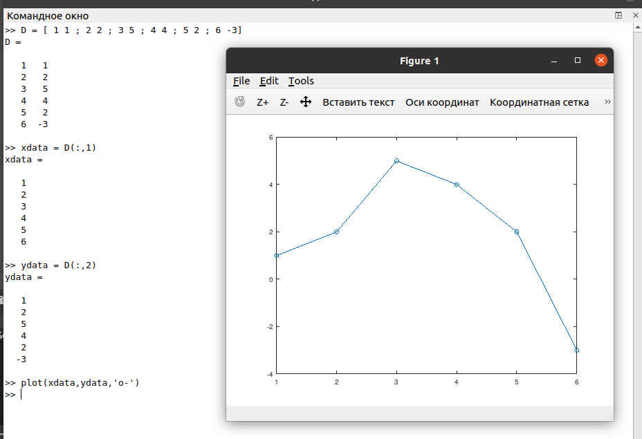
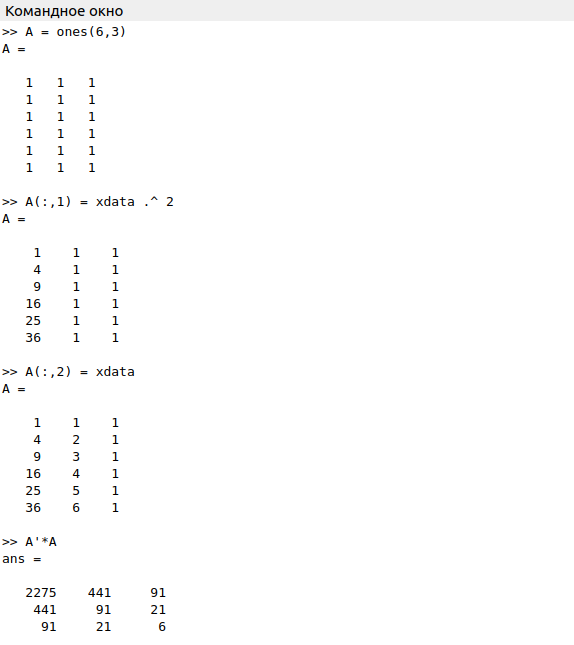
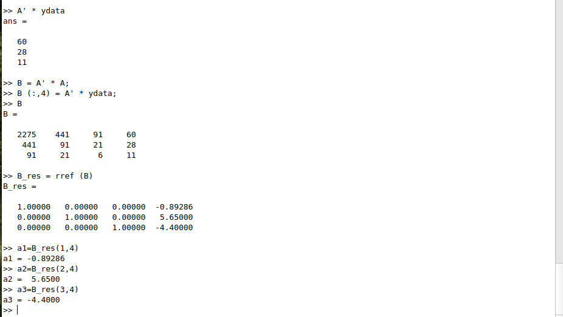
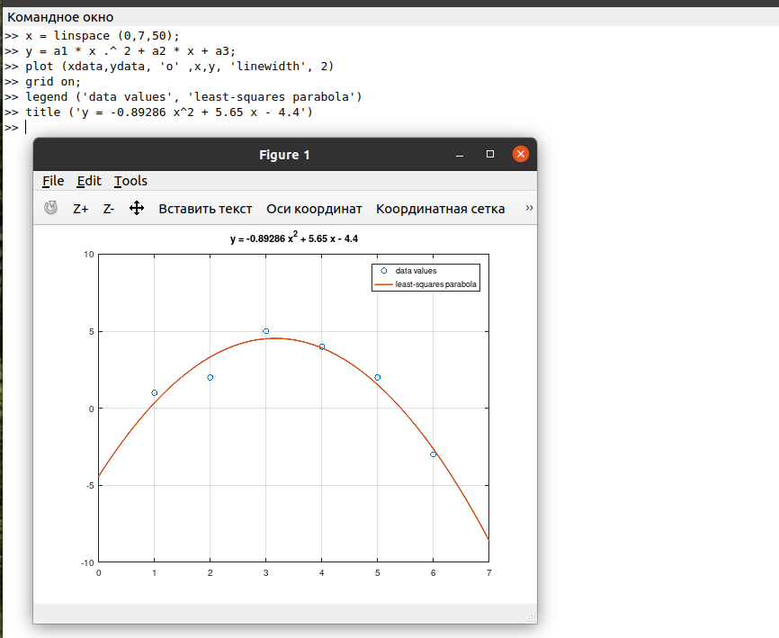
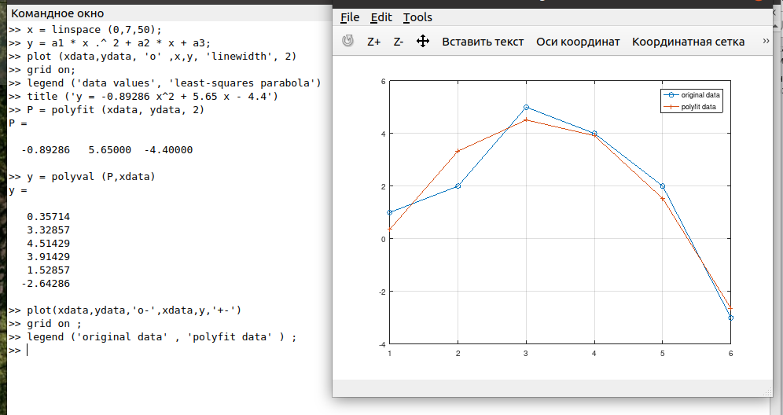
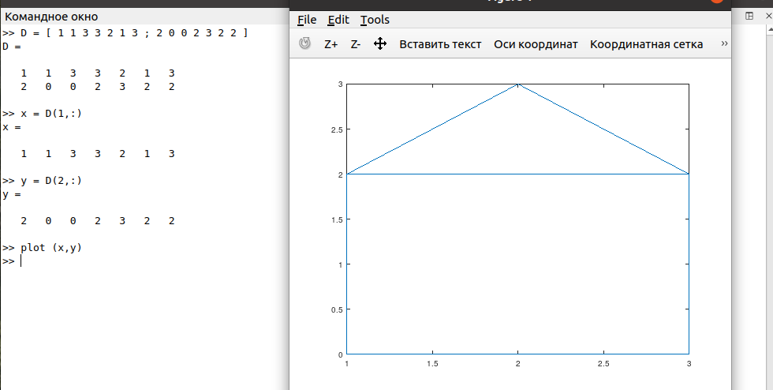
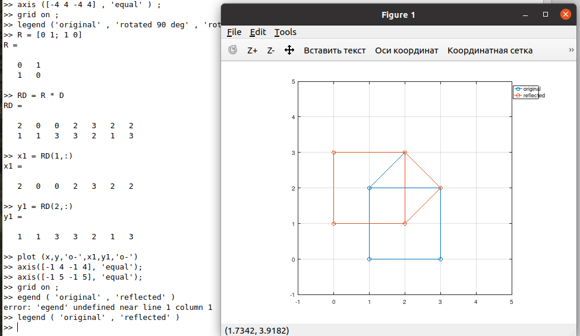
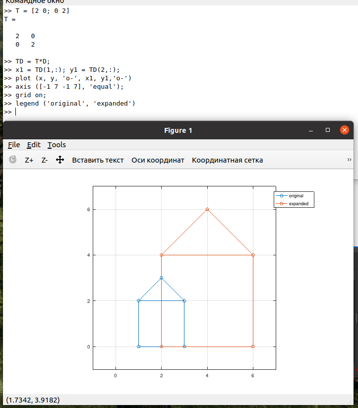

---
## Front matter
lang: ru-RU
title: Лабораторная работа №5
subtitle: Работа с матрицами
author:
  - Демидова Е. А.
institute:
  - Российский университет дружбы народов, Москва, Россия
date: 18 мая 2023

## i18n babel
babel-lang: russian
babel-otherlangs: english

## Formatting pdf
toc: false
toc-title: Содержание
slide_level: 2
aspectratio: 169
section-titles: true
theme: metropolis
header-includes:
 - \metroset{progressbar=frametitle,sectionpage=progressbar,numbering=fraction}
 - '\makeatletter'
 - '\beamer@ignorenonframefalse'
 - '\makeatother'
---

# Информация

## Докладчик

:::::::::::::: {.columns align=center}
::: {.column width="70%"}

  * Демидова Екатерина Алексеевна
  * студентка группы НКНбд-01-21
  * Российский университет дружбы народов
  * <https://github.com/eademidova>

:::
::: {.column width="30%"}

:::
::::::::::::::

# Введение

## Цель работы

Научиться подгонять полиномиальные кривые и выполнять различные матричные преобразования с помощью системы для математических вычислений Oсtave.

## Задание

- Выполнить подгонку полиномиальной кривой с помощью Octave.
- Представить изображение с помощью матрицы.
- Перевернуть изображение на определённый угол.
- Отразить изображение относительно прямой.
- Выполнить преобразование делитации.

# Выполнение лабораторной работы

## График точек, заданных матрицей D

Нарисуем точки, заданные матрицей, на графике.

{ #fig:001 width=50% }

## Построение матрицы коэффициентов

Построим уравнение вида $y = ax^2 + bx + c$.

{ #fig:002 width=30% }

## Нахождение коэффициентов

Искомое квадратное уравнение имеет вид $y = - 0.89286x^2 + 5.65x - 4.4$

{ #fig:003 width=50% }

## Построение графика параболы

Построим соответствующий график параболы.

{ #fig:004 width=50% }

## Построение графика исходных и подгоночных даннных

{ #fig:005 width=50% }

## Граф-домик

Закодируем граф-домик с помощью матрицы.

{ #fig:006 width=50% }

## Построение повёрнутого графика дома

Повернём граф дома на 90 и 225 градусов.

{ #fig:007 width=50% }

## График домика, отраженный относительно прямой $y = x$

Отразим граф дома относительно прямой $y = x$.

{ #fig:008 width=50% }

## Увеличинный в 2 раза график домика

Увеличим граф дома в 2 раза, используя матрицу для делитации.

{ #fig:009 width=30% }

# Заключение

## Вывод

В результате выполнения работы научились подгонять полиномиальные кривые и выполнять различные матричные преобразования с помощью системы для математических вычислений Oсtave.

## Список литературы

1. Подгонка кривой [Электронный ресурс]. Wikimedia Foundation, Inc., 2023.
URL: https://wikipredia.net/ru/Model_fitting#cite_note-3.
2. Умнов А.Е. АНАЛИТИЧЕСКАЯ ГЕОМЕТРИЯ И ЛИНЕЙНАЯ АЛГЕБРА. МФТИ, 2011. 544 с
