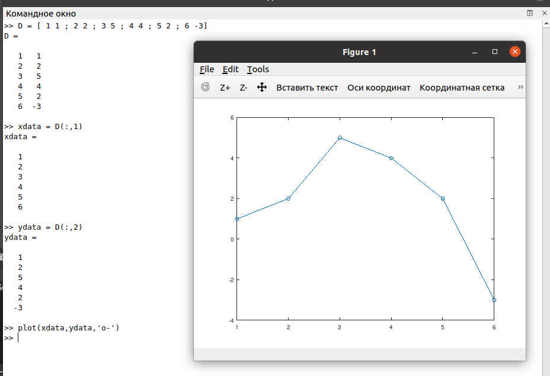
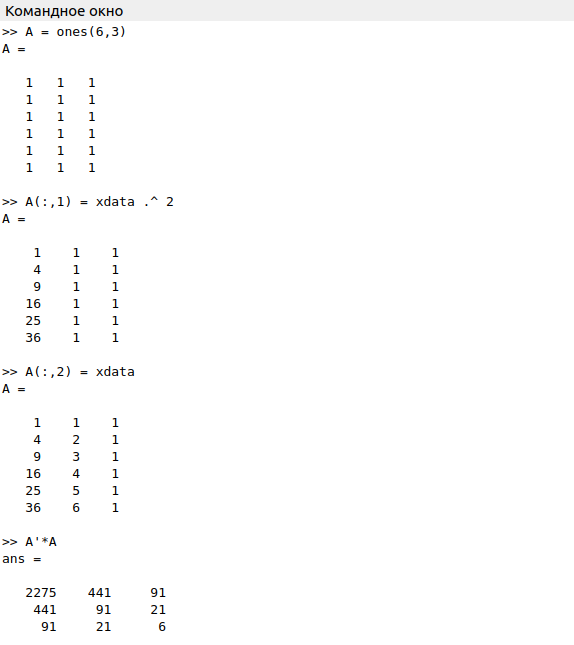
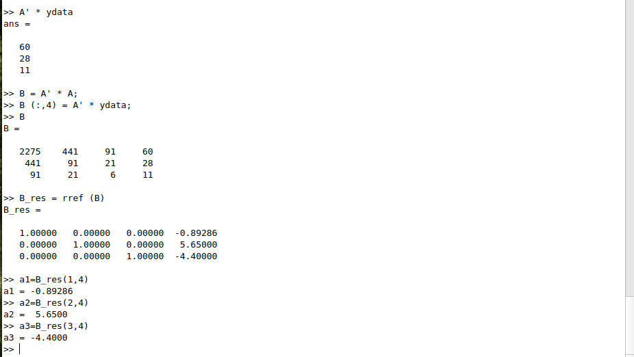
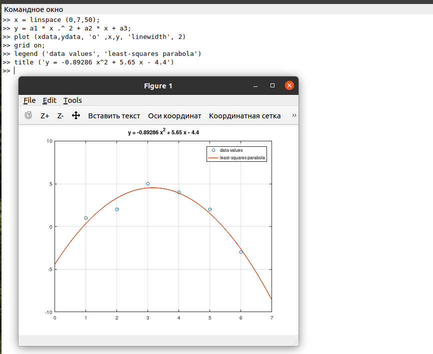
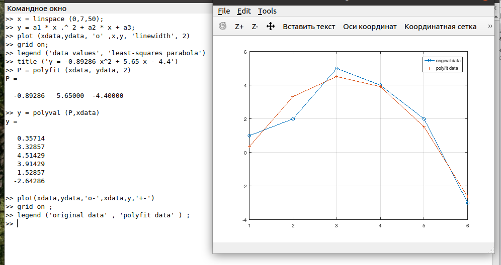
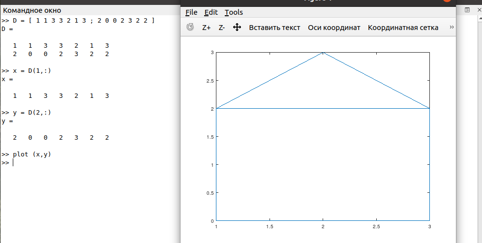
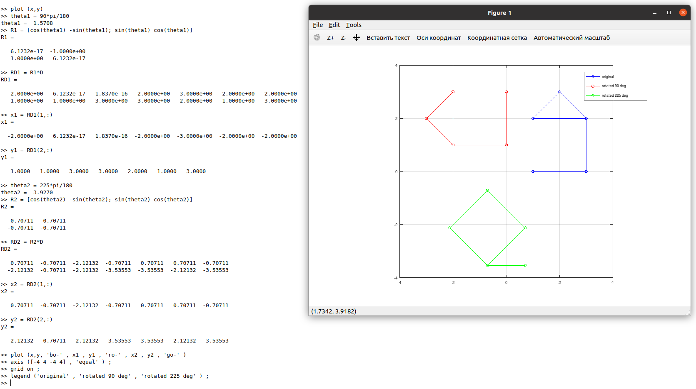
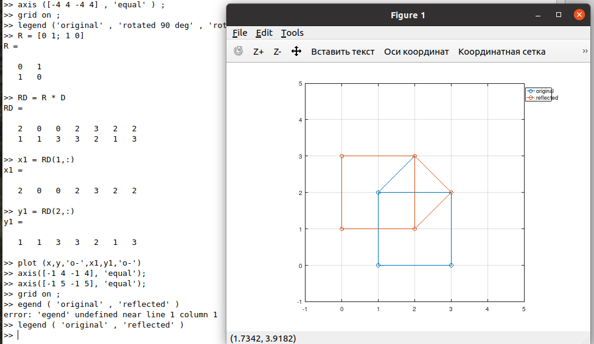
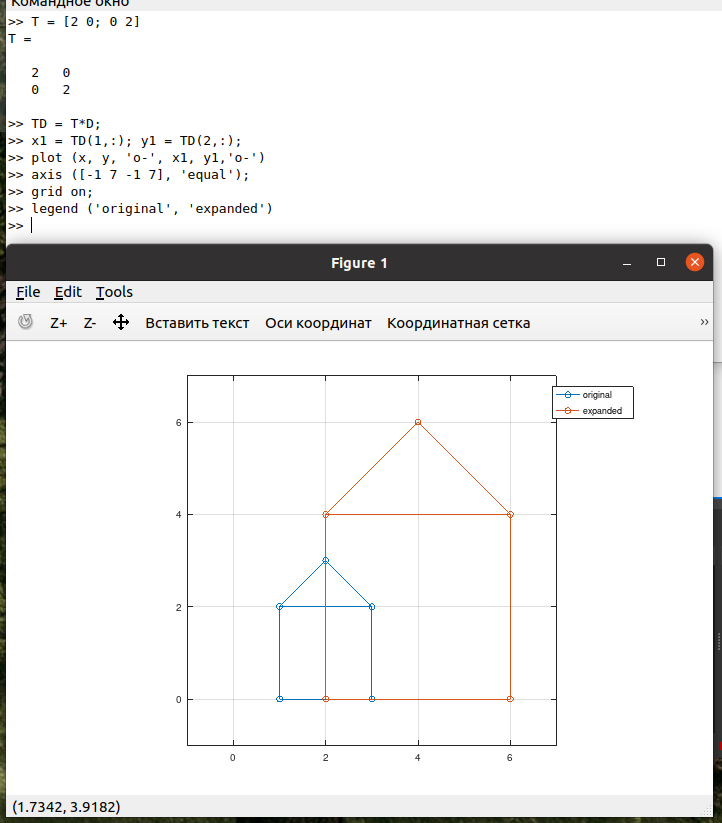

---
## Front matter
title: "Лабораторная работа №5"
subtitle: "Работа с матрицами"
author: "Демидова Екатерина Алексеевна"

## Generic otions
lang: ru-RU
toc-title: "Содержание"

## Bibliography
bibliography: bib/cite.bib
csl: pandoc/csl/gost-r-7-0-5-2008-numeric.csl

## Pdf output format
toc: true # Table of contents
toc-depth: 2
lof: true # List of figures
lot: false # List of tables
fontsize: 12pt
linestretch: 1.5
papersize: a4
documentclass: scrreprt
## I18n polyglossia
polyglossia-lang:
  name: russian
  options:
	- spelling=modern
	- babelshorthands=true
polyglossia-otherlangs:
  name: english
## I18n babel
babel-lang: russian
babel-otherlangs: english
## Fonts
mainfont: PT Serif
romanfont: PT Serif
sansfont: PT Sans
monofont: PT Mono
mainfontoptions: Ligatures=TeX
romanfontoptions: Ligatures=TeX
sansfontoptions: Ligatures=TeX,Scale=MatchLowercase
monofontoptions: Scale=MatchLowercase,Scale=0.9
## Biblatex
biblatex: true
biblio-style: "gost-numeric"
biblatexoptions:
  - parentracker=true
  - backend=biber
  - hyperref=auto
  - language=auto
  - autolang=other*
  - citestyle=gost-numeric
## Pandoc-crossref LaTeX customization
figureTitle: "Рис."
tableTitle: "Таблица"
listingTitle: "Листинг"
lofTitle: "Список иллюстраций"
lotTitle: "Список таблиц"
lolTitle: "Листинги"
## Misc options
indent: true
header-includes:
  - \usepackage{indentfirst}
  - \usepackage{float} # keep figures where there are in the text
  - \floatplacement{figure}{H} # keep figures where there are in the text
---

# Цель работы

Научиться подгонять полиномиальные кривые и выполнять различные матричные преобразования с помощью системы для математических вычислений Oсtave.

# Задание

- Выполнить подгонку полиномиальной кривой с помощью Octave.
- Представить изображение с помощью матрицы.
- Перевернуть изображение на определённый угол.
- Отразить изображение относительно прямой.
- Выполнить преобразование делитации.

# Теоретическое введение

**Подгонка кривой** — это процесс построения кривой или математической функции, которая наилучшим образом соответствует ряду точек данных, возможно, с учетом ограничений[@wiki:bash]. Подгонка кривой может включать либо интерполяцию, где требуется точная подгонка к данным, либо сглаживание, при котором строится «гладкая» функция, которая приблизительно соответствует данные.

Если $l$ – прямая, проходящая через начало координат, то **отражение** точки
$(x, y)$ относительно прямой $l$ определяется как [@linal:2011:bash]

$$\begin{pmatrix}
cos(\theta)& -sin(\theta)\\
sin(\theta)& cos(\theta) \\
\end{pmatrix}$$

**Дилатация** (то есть расширение или сжатие) также может быть выполнено
путём умножения матриц. Матричное произведение $TD$ будет преобразованием дилатации
$D$ с коэффициентом $k$, где

$$\begin{pmatrix}
k &0\\
0 &k \\
\end{pmatrix}$$

# Выполнение лабораторной работы

Решим более общую проблему подгонки полинома к
множеству точек. Пусть нам нужно найти параболу по методу наименьших
квадратов для набора точек, заданных матрицей

$$ D =
\begin{pmatrix}
1 &1\\
2 &2 \\
3 &5 \\
4 &4 \\
5 &2 \\
6 &-3 \\
\end{pmatrix}$$

В матрице заданы значения $x$ в столбце 1 и значения $y$ в столбце 2.
Введём матрицу данных в Octave и извлечём вектора $x$ и $y$. Нарисуем точки на графике.(рис. [-@fig:001])

{ #fig:001 width=70% }

Построим уравнение вида $y = ax^2 + bx + c$. Для построения матрицы коэффициентов используем команду `ones` для создания матрицы единиц соответствующего размера, а затем перезапишем первый и второй столбцы необходимыми данными.(рис. [-@fig:002])

{ #fig:002 width=70% }

Решение по методу наименьших квадратов получается из решения уравнения $A^TAb = A^Ty$, где $b$ – вектор коэффициентов полинома. Используем Octave для построения уравнений. Решим задачу методом Гаусса. Запишем расширенную матрицу $B$. Таким образом, искомое квадратное уравнение имеет вид
$$ y = - 0.89286x^2 + 5.65x - 4.4$$ 
(рис. [-@fig:003])

{ #fig:003 width=70% }

Построим соответствующий график параболы (рис. [-@fig:004])

{ #fig:004 width=70% }

Процесс подгонки может быть автоматизирован встроенными функциями Octave. Для этого мы можем использовать встроенную функцию для подгонки полинома `polyfit`. Синтаксис: `polyfit (x, y, order)`, где `order` – это степень полинома. Значения полинома P в точках, задаваемых вектором-строкой x можно получить с помощью функции `polyval`. Синтаксис: `polyval (P, x)`.
Получим подгоночный полином. Рассчитаем значения полинома в точках, построим исходные и подгоночные данные(рис. [-@fig:005])

{ #fig:005 width=70% }

Попробуем закодировать граф-домик. Есть много способов закодировать это как матрицу. Эффективный метод состоит в том, чтобы выбрать путь, который проходит по каждому ребру ровно один раз (цикл Эйлера). (рис. [-@fig:006])

{ #fig:006 width=70% }

Повернём граф дома на 90 и 225 градусов. Вначале переведём угол в радианы, а затем воспользовавшись матрицей поворота повернём домик. (рис. [-@fig:007])

{ #fig:007 width=70% }

Отразим граф дома относительно прямой $y = x$. Зададим матрицу отражения, подставив угол 45 градусов, так как именно под таким углом относительно оси абсцисс проходит прямая $y = x$. (рис. [-@fig:008])

{ #fig:008 width=70% }

Увеличим граф дома в 2 раза, используя матрицу для делитации (рис. [-@fig:009])

{ #fig:009 width=70% }

# Выводы

В результате выполнения работы научились подгонять полиномиальные кривые и выполнять различные матричные преобразования с помощью системы для математических вычислений Oсtave.

# Список литературы{.unnumbered}

::: {#refs}
:::
