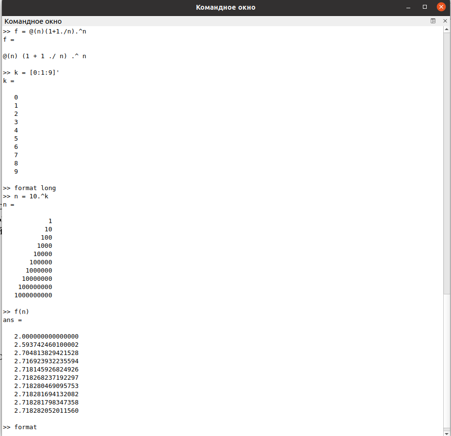
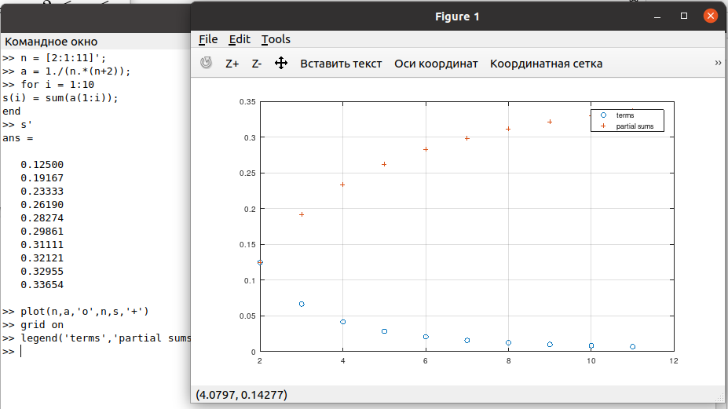
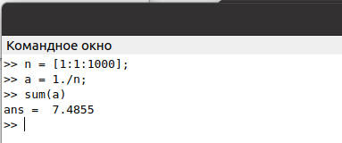
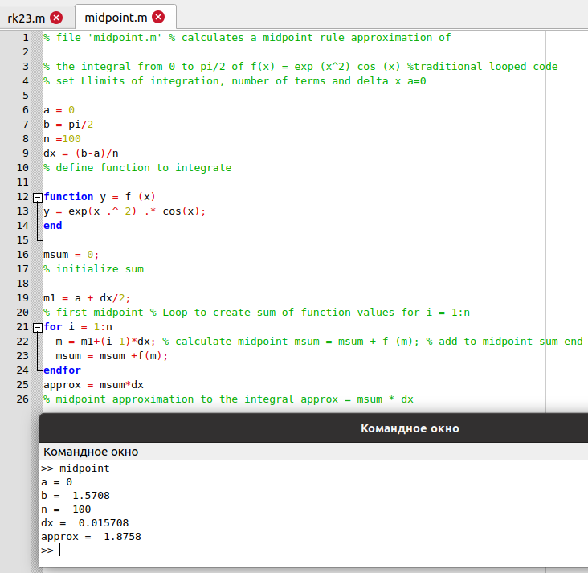
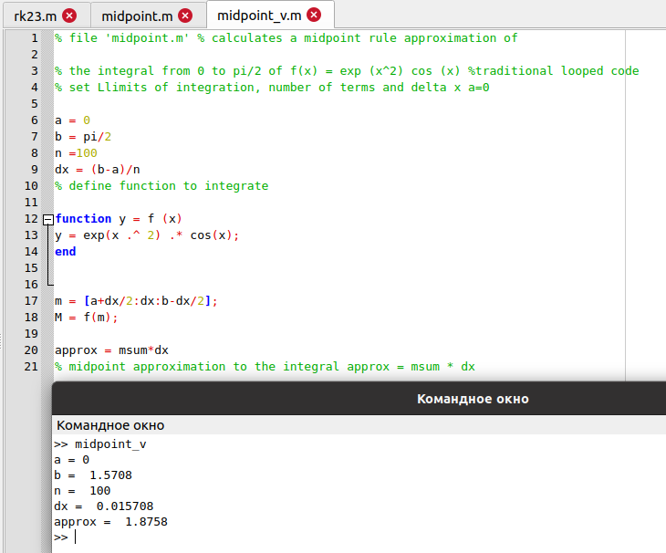
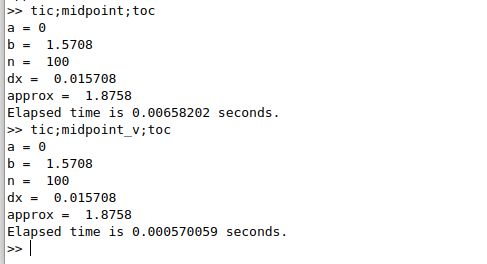

---
## Front matter
lang: ru-RU
title: Лабораторная работа №6
subtitle: Пределы, последовательности, ряды и численное интегрирование в Octave
author:
  - Демидова Е. А.
institute:
  - Российский университет дружбы народов, Москва, Россия
date: 02 мая 2003

## i18n babel
babel-lang: russian
babel-otherlangs: english

## Formatting pdf
toc: false
toc-title: Содержание
slide_level: 2
aspectratio: 169
section-titles: true
theme: metropolis
header-includes:
 - \metroset{progressbar=frametitle,sectionpage=progressbar,numbering=fraction}
 - '\makeatletter'
 - '\beamer@ignorenonframefalse'
 - '\makeatother'
---

# Информация

## Докладчик

:::::::::::::: {.columns align=center}
::: {.column width="70%"}

  * Демидова Екатерина Алексеевна
  * студентка группы НКНбд-01-21
  * Российский университет дружбы народов
  * <https://github.com/eademidova>

:::
::: {.column width="30%"}

:::
::::::::::::::

# Введение

## Цель работы

Научиться работать с пределами, последовательностями, рядами и выполнять численное интегрирование в Octave.

## Задание

- Оценить предел.
- Найти частичные суммы.
- Найти сумму ряда.
- Вычислить интеграл встроенной функцией.
- Вычислить интеграл по правилу средней точки.

# Выполнение лабораторной работы

## Оценка предела

Рассмотрим предел:
$$
\lim_{n\to\infty}(1+\frac{1}{n})^n
$$

## Оценка предела

Предел сходится к значению, которое составляет приблизительно 2,71828...

{ #fig:001 width=40% }

## Частичные суммы

Найдем частичные суммы ряда:

$$
\sum_{n=2}^{\infty} \frac{1}{n(n+2)}
$$

## Частичные суммы

Для получения последовательности частичных сумм используем цикл и цункцию `sum()`.

{ #fig:002 width=70% }

## Сумма ряда

Найдём сумму первых 1000 членов гармонического ряда:

$$
\sum_{n=1}^{1000} \frac{1}{n}
$$

## Сумма ряда

{ #fig:003 width=70% }

## Вычисление интеграла. Функция `quad()`

Вычислим интеграл:

$$
\int_{0}^{\pi/2} e^{x^2}cos(x)dx
$$

## Вычисление интеграла. Функция `quad()`

Используем команду `quad('f',a,b)`.

{ #fig:004 width=40% }

## Вычисление интеграла по правилу средней точки.

Напишем скрипт, чтобы вычислить интеграл по правилу средней точки для n = 100.

{ #fig:005 width=40% }

## Вычисление интеграла по правилу средней точки.

Написали векторизированный код для вычисления интеграла по правилу средней точки. 

{ #fig:006 width=50% }

## Вычисление интеграла по правилу средней точки.

Сравним время выполнения для каждой реализации

{ #fig:007 width=60% }

# Заключение

## Вывод

В результате выполнения работы научились работать с пределами, последовательностями, рядами и выполнять численное интегрирование в Octave.

## Список литературы

1. GNU Octave [Электронный ресурс]. Free Software Foundation, 2023. URL:
https://octave.org/.
2. GNU Octave Documentation [Электронный ресурс]. Free Software Foundation, 2023. URL: https://docs.octave.org/latest/.
