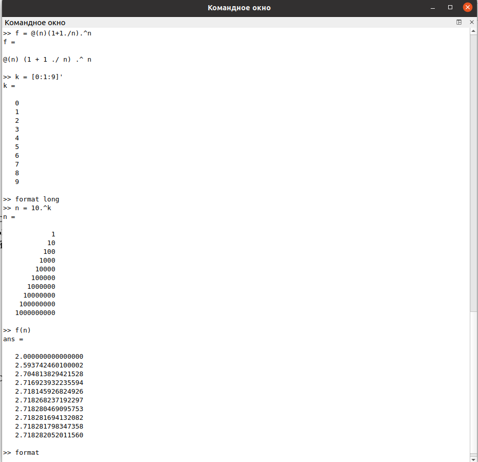
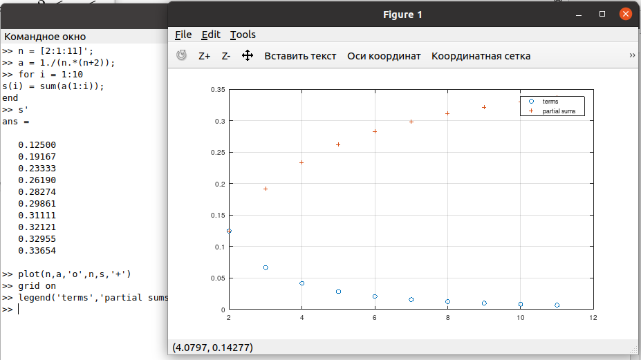
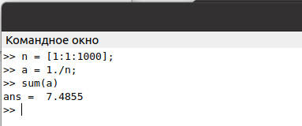
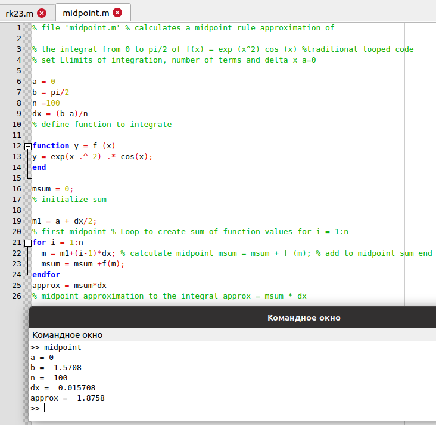
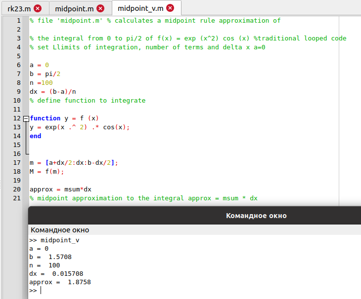
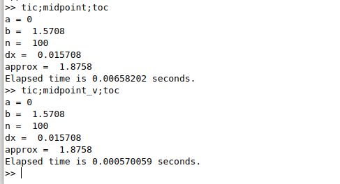

---
## Front matter
title: "Лабораторная работа №6"
subtitle: "Пределы, последовательности, ряды и численное интегрирование в Octave"
author: "Демидова Екатерина Алексеевна"

## Generic otions
lang: ru-RU
toc-title: "Содержание"

## Bibliography
bibliography: bib/cite.bib
csl: pandoc/csl/gost-r-7-0-5-2008-numeric.csl

## Pdf output format
toc: true # Table of contents
toc-depth: 2
lof: true # List of figures
lot: false # List of tables
fontsize: 12pt
linestretch: 1.5
papersize: a4
documentclass: scrreprt
## I18n polyglossia
polyglossia-lang:
  name: russian
  options:
	- spelling=modern
	- babelshorthands=true
polyglossia-otherlangs:
  name: english
## I18n babel
babel-lang: russian
babel-otherlangs: english
## Fonts
mainfont: PT Serif
romanfont: PT Serif
sansfont: PT Sans
monofont: PT Mono
mainfontoptions: Ligatures=TeX
romanfontoptions: Ligatures=TeX
sansfontoptions: Ligatures=TeX,Scale=MatchLowercase
monofontoptions: Scale=MatchLowercase,Scale=0.9
## Biblatex
biblatex: true
biblio-style: "gost-numeric"
biblatexoptions:
  - parentracker=true
  - backend=biber
  - hyperref=auto
  - language=auto
  - autolang=other*
  - citestyle=gost-numeric
## Pandoc-crossref LaTeX customization
figureTitle: "Рис."
tableTitle: "Таблица"
listingTitle: "Листинг"
lofTitle: "Список иллюстраций"
lotTitle: "Список таблиц"
lolTitle: "Листинги"
## Misc options
indent: true
header-includes:
  - \usepackage{indentfirst}
  - \usepackage{float} # keep figures where there are in the text
  - \floatplacement{figure}{H} # keep figures where there are in the text
---

# Цель работы

Научиться работать с пределами, последовательностями, рядами и выполнять численное интегрирование в Octave.

# Задание

- Оценить предел.
- Найти частичные суммы.
- Найти сумму ряда.
- Вычислить интеграл встроенной функцией.
- Вычислить интеграл по правилу средней точки.

# Теоретическое введение

Дадим определение GNU Octave. GNU Octave — свободная программная система для математических вычислений, использующая совместимый с MATLAB язык высокого уровня [@octave:bash].

На официальном сайте Octave даётся следующая характеристика этого научного языка программирования[]:

- Мощный синтаксис, ориентированный на математику, со встроенными инструментами 2D/3D-графики и визуализации.
- Бесплатное программное обеспечение, работающее на GNU/Linux, macOS, BSD и Microsoft Windows.
- Вставка, совместимая со многими скриптами Matlab

Приведём некоторые примеры использования Octave[@octave-doc:bash]:

1. Решение систем уравнений с помощью операций линейной алгебры над векторами и матрицами.

```

b = [4; 9; 2] # Column vector
A = [ 3 4 5;
      1 3 1;
      3 5 9 ]
x = A \ b     # Solve the system Ax = b

```

2. Визуализация данных с помощью высокоуровневых графических команд в 2D и 3D.

```

x = -10:0.1:10; # Create an evenly-spaced vector from -10..10
y = sin (x);    # y is also a vector
plot (x, y);
title ("Simple 2-D Plot");
xlabel ("x");
ylabel ("sin (x)");

```

# Выполнение лабораторной работы

Рассмотрим предел:
$$
\lim_{n\to\infty}(1+\frac{1}{n})^n
$$
Оценим это выражение. Для этого определим анонимную функцию `f` равную выражению, предел которого мы ищем. Затем создадим интексную переменную из целых числел от 0 до 9 и возьмём стемени 10, которые будут входными значениями. Наконец оценим `f(n)` и получим, что предел сходится к значению, которое составляет приблизительно 2,71828...
(рис. [-@fig:001])

{ #fig:001 width=70% }

Найдем частичные суммы ряда:

$$
\sum_{n=2}^{\infty} \frac{1}{n(n+2)}
$$

Определим индексный вектор от 2 до 11, а затем вычислим члены суммы.
Для получения последовательности частичных сумм используем цикл и цункцию `sum()`. Затем отобразим слагаемые и частичные суммы на графике (рис. [-@fig:002]).

{ #fig:002 width=70% }

Найдём сумму первых 1000 членов гармонического ряда:

$$
\sum_{n=1}^{1000} \frac{1}{n}
$$

Для этого сгенерируем члены ряда как вектор и возьмём их сумму (рис. [-@fig:003]).

{ #fig:003 width=70% }

Вычислим интеграл:

$$
\int_{0}^{\pi/2} e^{x^2}cos(x)dx
$$

Для этого используем команду `quad('f',a,b)`. Задаим подынтегральную функцию используя конструкцию `function...end` и анонимную функци. (рис. [-@fig:004])

{ #fig:004 width=70% }

Напишем скрипт, чтобы вычислить интеграл по правилу средней точки для n = 100. Будем использовать цикл, который добавляет значение функции к промежуточной сумме в каждой итерации. В конце сумма умножается на $\Delta x$ (рис. [-@fig:005])

{ #fig:005 width=70% }

Напишем векторизированный код для вычисления интеграла по правилу средней точки. Создадим вектор $x$-координат средних точек. Затем оценим `f` по этому вектору средней точки, чтобы получить вектор значений фнукции. Аппроксимация средней точки  - это сумма компонент вектора, умноженная на $\Delta x$ (рис. [-@fig:006]).

{ #fig:006 width=70% }

Реузльтаты были получены одинаковые. Сравним время выполнения для каждой реализации(рис. [-@fig:007]).

{ #fig:007 width=70% }


# Выводы

В результате выполнения работы научились работать с пределами, последовательностями, рядами и выполнять численное интегрирование в Octave.

# Список литературы{.unnumbered}

::: {#refs}
:::
