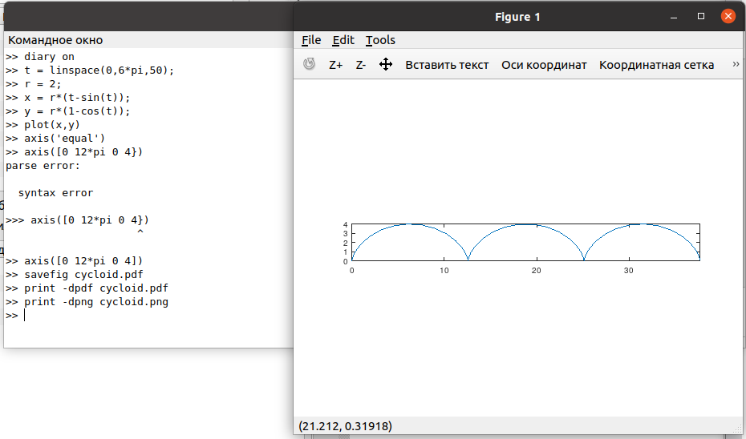
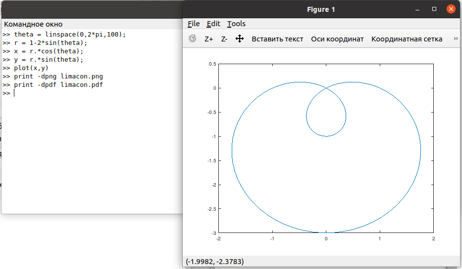
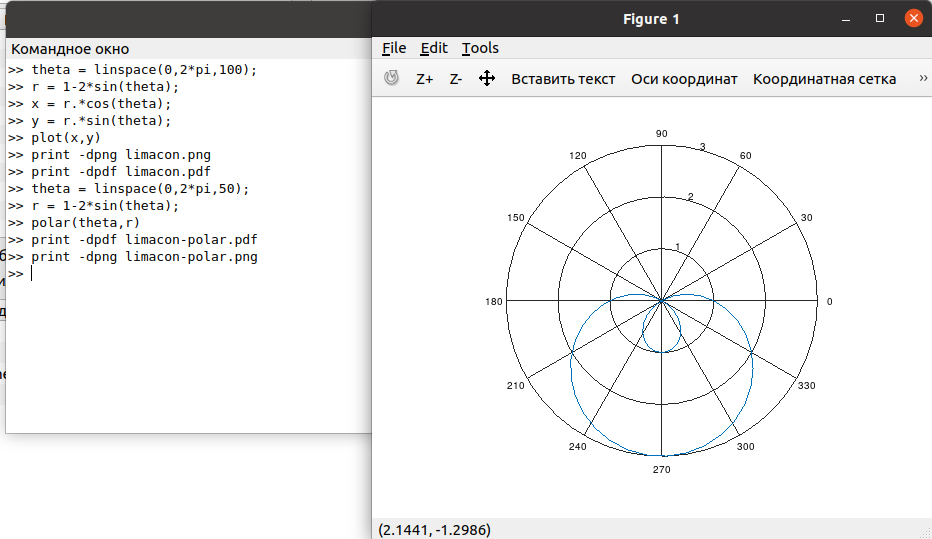
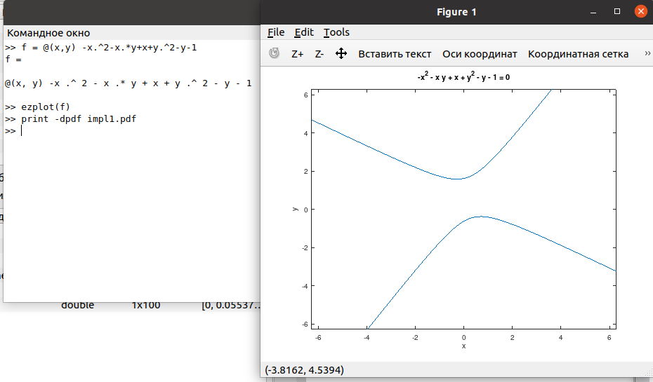
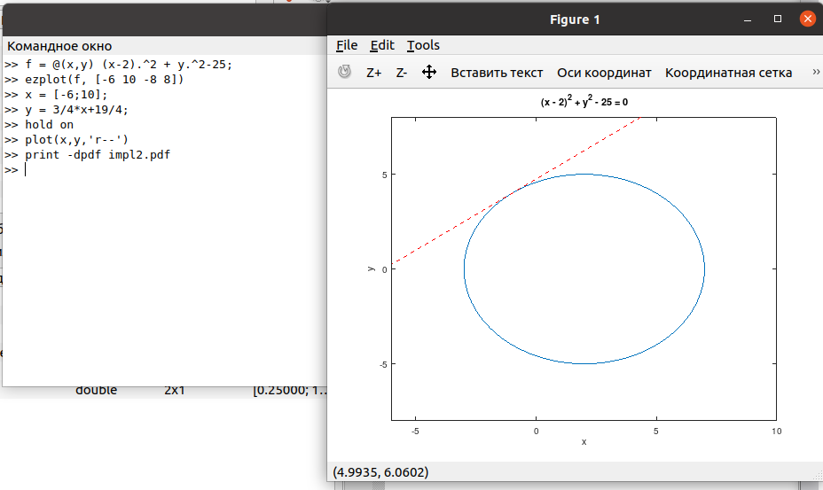
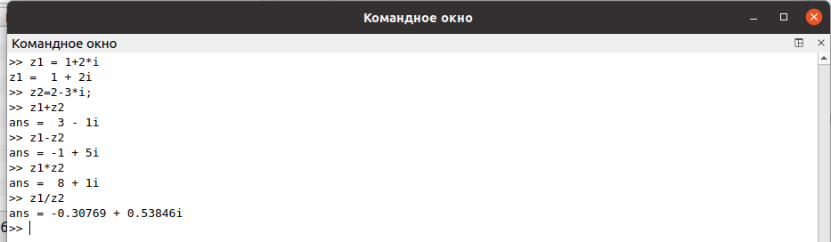
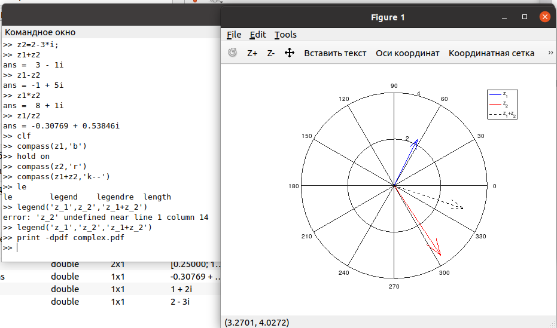
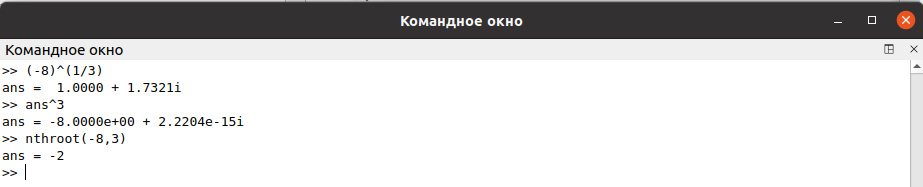
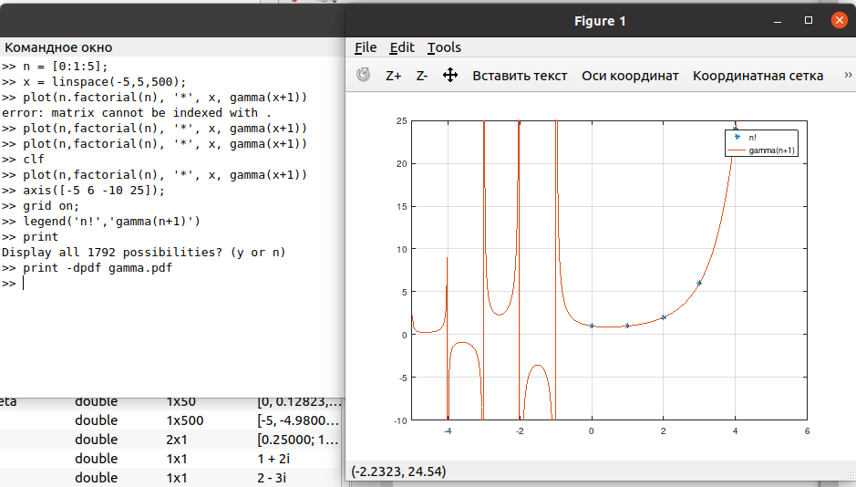
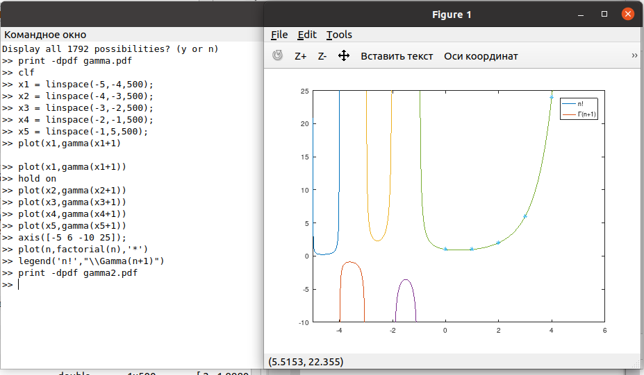

---
## Front matter
title: "Лабораторная работа №7"
subtitle: "Графики в Octave"
author: "Демидова Екатерина Алексеевна"

## Generic otions
lang: ru-RU
toc-title: "Содержание"

## Bibliography
bibliography: bib/cite.bib
csl: pandoc/csl/gost-r-7-0-5-2008-numeric.csl

## Pdf output format
toc: true # Table of contents
toc-depth: 2
lof: true # List of figures
lot: false # List of tables
fontsize: 12pt
linestretch: 1.5
papersize: a4
documentclass: scrreprt
## I18n polyglossia
polyglossia-lang:
  name: russian
  options:
	- spelling=modern
	- babelshorthands=true
polyglossia-otherlangs:
  name: english
## I18n babel
babel-lang: russian
babel-otherlangs: english
## Fonts
mainfont: PT Serif
romanfont: PT Serif
sansfont: PT Sans
monofont: PT Mono
mainfontoptions: Ligatures=TeX
romanfontoptions: Ligatures=TeX
sansfontoptions: Ligatures=TeX,Scale=MatchLowercase
monofontoptions: Scale=MatchLowercase,Scale=0.9
## Biblatex
biblatex: true
biblio-style: "gost-numeric"
biblatexoptions:
  - parentracker=true
  - backend=biber
  - hyperref=auto
  - language=auto
  - autolang=other*
  - citestyle=gost-numeric
## Pandoc-crossref LaTeX customization
figureTitle: "Рис."
tableTitle: "Таблица"
listingTitle: "Листинг"
lofTitle: "Список иллюстраций"
lotTitle: "Список таблиц"
lolTitle: "Листинги"
## Misc options
indent: true
header-includes:
  - \usepackage{indentfirst}
  - \usepackage{float} # keep figures where there are in the text
  - \floatplacement{figure}{H} # keep figures where there are in the text
---

# Цель работы

Научиться строить графики разных функций в Octave.

# Задание

- Построить параметрический графики
- Построить график в полярных координатах
- Построить график неявной функции
- Построить график в комплексной области
- Построить график специальной функции

# Теоретическое введение

Дадим определение GNU Octave. GNU Octave — свободная программная система для математических вычислений, использующая совместимый с MATLAB язык высокого уровня [@octave:bash].

На официальном сайте Octave даётся следующая характеристика этого научного языка программирования[]:

- Мощный синтаксис, ориентированный на математику, со встроенными инструментами 2D/3D-графики и визуализации.
- Бесплатное программное обеспечение, работающее на GNU/Linux, macOS, BSD и Microsoft Windows.
- Вставка, совместимая со многими скриптами Matlab

Приведём некоторые примеры использования Octave[@octave-doc:bash]:

1. Решение систем уравнений с помощью операций линейной алгебры над векторами и матрицами.

```

b = [4; 9; 2] # Column vector
A = [ 3 4 5;
      1 3 1;
      3 5 9 ]
x = A \ b     # Solve the system Ax = b

```

2. Визуализация данных с помощью высокоуровневых графических команд в 2D и 3D.

```

x = -10:0.1:10; # Create an evenly-spaced vector from -10..10
y = sin (x);    # y is also a vector
plot (x, y);
title ("Simple 2-D Plot");
xlabel ("x");
ylabel ("sin (x)");

```

# Выполнение лабораторной работы

## Параметрические графики

Построим график трёъ периодов циклоиды радиуса 2. Поскольку период $2\pi$, зададим параметр в пределах $0 \leq t\leq 6\pi$ для трёх полных циклов. Определим  $t$ как вектор в этом диапазоне, затем вычислим $x$ и $y$(рис. [-@fig:001]).

{ #fig:001 width=70% }

## Полярные координаты

Определим независимую переменную $\theta$, а затем вычислим $r$. Чтобы построить график $x$ и $y$, используем стандартное преобразование координат, затем построим график в осях $xy$.

Построим улитку Паскаля(рис. [-@fig:002]).

{ #fig:002 width=70% }

Построим этот же график в полярных координаха, используя фуекцию `polar`(рис. [-@fig:003]).

{ #fig:003 width=70% }

## Грфики неявных функций

Построим функцию, неявно определённую уравнением вида:
$$
f(x,y) = 0
$$
Для этого используем функцию `ezplot`. 
Будем строить кривую, заданную уравнением:
$$
-x^2-xy+x+y^2-y=1
$$

Чтобы определить функцию в неявном виде, вычтем 1 из обеих частей уравнения. Зададим функцию в виде $\lambda$-функции (рис. [-@fig:004]).

{ #fig:004 width=70% }

Найдём уравнение касательной к графику окружности:
$$
(x-2)^2 + y^2 = 25
$$
в точке $(-1,4)$ 

Сначала построим круг, затем продиффиринцировав функцию в точке (-1,4) найдём коэффициент наклона касательной, который равен $\dfrac{4}{4}$. Таким образом, уравнение касательной будет иметь вид:
$$
y = \frac{3}{4}x+\frac{19}{4}
$$
Построим график (рис. [-@fig:005]).

{ #fig:005 width=70% }

## Комплексные числа

Зададим комплексные числа и выполним основные арифметические операции с ними (рис. [-@fig:006]).

{ #fig:006 width=70% }

Построим график в комплексной плоскости, используя команду `compass`(рис.[-@fig:007]).

{ #fig:007 width=70% }

Вычислим $\sqrt[3]{-8}$. Делая это обычным образом сталкнёмся с неожиданным ответом, не равным -2. Для того чтобы получить действительный корень используем функцию `nthroot`(рис. [-@fig:008]).

{ #fig:008 width=70% }

## Специальные функции

Построим функции $\Gamma(x+1)$ и $n!$ на одном графике(рис. [-@fig:009]).

{ #fig:009 width=70% }

Уберём вертикальные асимптоты из графика в районе отрицательных чисел, для этого разделем область значений(рис. [-@fig:010]).

{ #fig:010 width=70% }


# Выводы

В результате выполнения работы научились строить графики разных функций в Octave.

# Список литературы{.unnumbered}

::: {#refs}
:::
