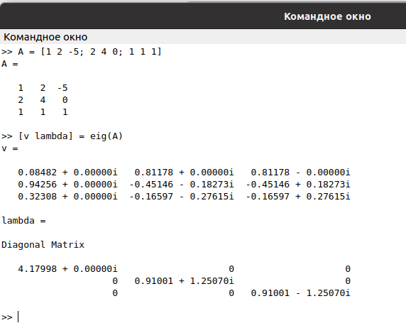
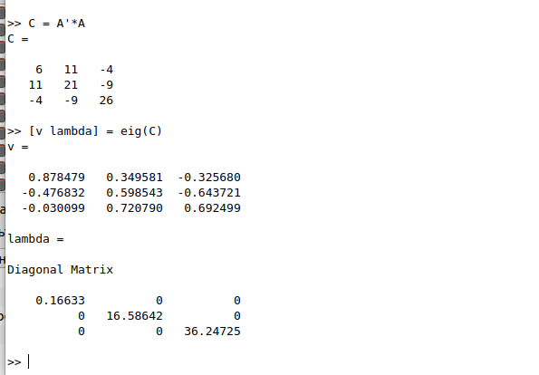
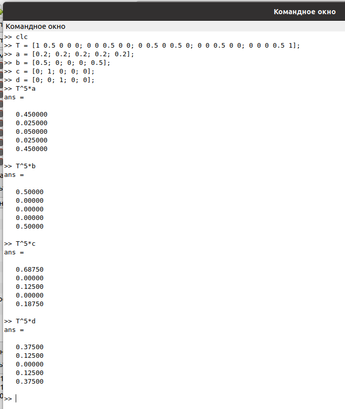
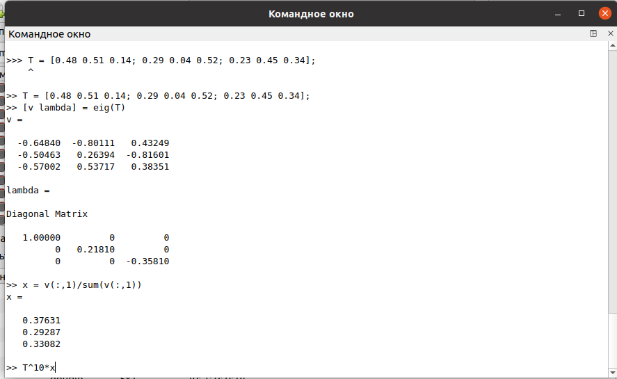
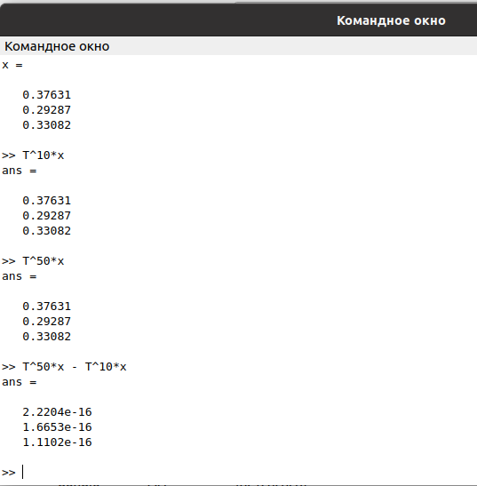

---
## Front matter
lang: ru-RU
title: Лабораторная работа №8
subtitle: Задача на собственные значения
author:
  - Демидова Е. А.
institute:
  - Российский университет дружбы народов, Москва, Россия
date: 1 июня 2023

## i18n babel
babel-lang: russian
babel-otherlangs: english

## Formatting pdf
toc: false
toc-title: Содержание
slide_level: 2
aspectratio: 169
section-titles: true
theme: metropolis
header-includes:
 - \metroset{progressbar=frametitle,sectionpage=progressbar,numbering=fraction}
 - '\makeatletter'
 - '\beamer@ignorenonframefalse'
 - '\makeatother'
---

# Информация

## Докладчик

:::::::::::::: {.columns align=center}
::: {.column width="70%"}

  * Демидова Екатерина Алексеевна
  * студентка группы НКНбд-01-21
  * Российский университет дружбы народов
  * <https://github.com/eademidova>

:::
::: {.column width="30%"}

:::
::::::::::::::

# Введение

## Цель работы

Научиться решать задачи на собственные значения.

## Задание

- Научиться находить собственные значения и собственные векторы с помощью Octave
- Решить задачу о случайном блуждании с помощью Octave
- Найти вектор равновесного состояния для цепи Маркова

# Выполнение лабораторной работы

## Собственные значения и собственные векторы

{ #fig:001 width=60% }

## Собственные значения и собственные векторы

{ #fig:002 width=70% }

## Марковские цепи

{ #fig:003 width=40% }

## Марковские цепи

{ #fig:004 width=70% }

## Марковские цепи

{ #fig:005 width=45% }

# Заключение

## Вывод

В результате выполнения работы научилась решать задачи на собственные значения в Octave.

## Список литературы

1. GNU Octave [Электронный ресурс]. Free Software Foundation, 2023. URL:
https://octave.org/.
2. GNU Octave Documentation [Электронный ресурс]. Free Software Foundation, 2023. URL: https://docs.octave.org/latest/.
