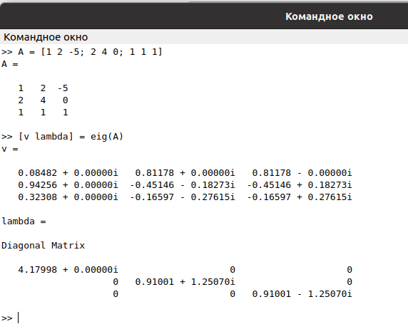
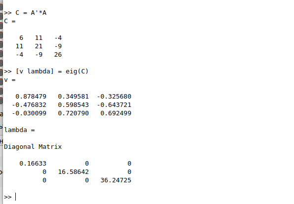
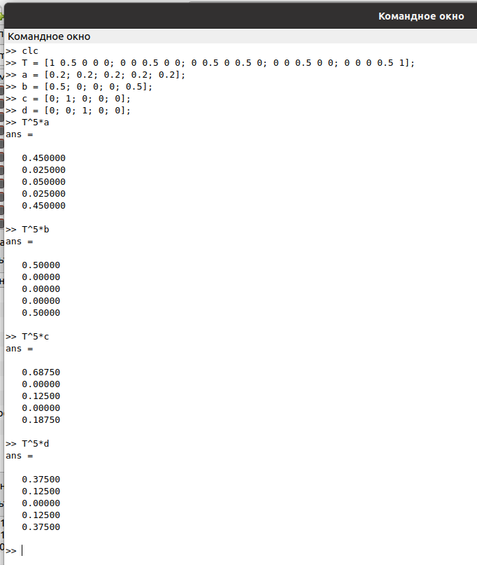
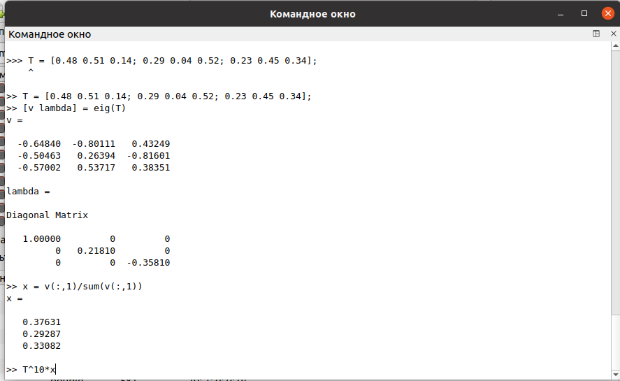
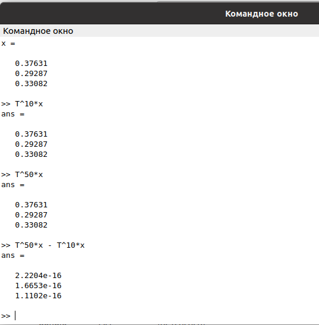

---
## Front matter
title: "Лабораторная работа №8"
subtitle: "Задача на собственные значения"
author: "Демидова Екатерина Алексеевна"

## Generic otions
lang: ru-RU
toc-title: "Содержание"

## Bibliography
bibliography: bib/cite.bib
csl: pandoc/csl/gost-r-7-0-5-2008-numeric.csl

## Pdf output format
toc: true # Table of contents
toc-depth: 2
lof: true # List of figures
lot: false # List of tables
fontsize: 12pt
linestretch: 1.5
papersize: a4
documentclass: scrreprt
## I18n polyglossia
polyglossia-lang:
  name: russian
  options:
	- spelling=modern
	- babelshorthands=true
polyglossia-otherlangs:
  name: english
## I18n babel
babel-lang: russian
babel-otherlangs: english
## Fonts
mainfont: PT Serif
romanfont: PT Serif
sansfont: PT Sans
monofont: PT Mono
mainfontoptions: Ligatures=TeX
romanfontoptions: Ligatures=TeX
sansfontoptions: Ligatures=TeX,Scale=MatchLowercase
monofontoptions: Scale=MatchLowercase,Scale=0.9
## Biblatex
biblatex: true
biblio-style: "gost-numeric"
biblatexoptions:
  - parentracker=true
  - backend=biber
  - hyperref=auto
  - language=auto
  - autolang=other*
  - citestyle=gost-numeric
## Pandoc-crossref LaTeX customization
figureTitle: "Рис."
tableTitle: "Таблица"
listingTitle: "Листинг"
lofTitle: "Список иллюстраций"
lotTitle: "Список таблиц"
lolTitle: "Листинги"
## Misc options
indent: true
header-includes:
  - \usepackage{indentfirst}
  - \usepackage{float} # keep figures where there are in the text
  - \floatplacement{figure}{H} # keep figures where there are in the text
---

# Цель работы

Научиться решать задачи на собственные значения.

# Задание

- Научиться находить собственные значения и собственные векторы с помощью Octave
- Решить задачу о случайном блуждании с помощью Octave
- Найти вектор равновесного состояния для цепи Маркова

# Теоретическое введение

Дадим определение GNU Octave. GNU Octave — свободная программная система для математических вычислений, использующая совместимый с MATLAB язык высокого уровня [@octave:bash].

На официальном сайте Octave даётся следующая характеристика этого научного языка программирования[]:

- Мощный синтаксис, ориентированный на математику, со встроенными инструментами 2D/3D-графики и визуализации.
- Бесплатное программное обеспечение, работающее на GNU/Linux, macOS, BSD и Microsoft Windows.
- Вставка, совместимая со многими скриптами Matlab

Приведём некоторые примеры использования Octave[@octave-doc:bash]:

1. Решение систем уравнений с помощью операций линейной алгебры над векторами и матрицами.

```

b = [4; 9; 2] # Column vector
A = [ 3 4 5;
      1 3 1;
      3 5 9 ]
x = A \ b     # Solve the system Ax = b

```

2. Визуализация данных с помощью высокоуровневых графических команд в 2D и 3D.

```

x = -10:0.1:10; # Create an evenly-spaced vector from -10..10
y = sin (x);    # y is also a vector
plot (x, y);
title ("Simple 2-D Plot");
xlabel ("x");
ylabel ("sin (x)");

```

# Выполнение лабораторной работы

## Собственные значения и собственные векторы

Зададим матрицу A и найдём собственные значения и собственные векторы этой матрицы. Для нахождения используем команду eig с двумя выходными аргументами.(рис. [-@fig:001]).

{ #fig:001 width=70% }

Для того, чтобы получить матрицу с действительными собственными значениями, мы создадим симметричную матрицу (имеющую действительные собственные значения) путём умножения матрицы и на транспонированную матрицу(рис. [-@fig:002]).

{ #fig:002 width=70% }

## Марковские цепи

Рассмотрим задачу на случайное блуждание. Зададим 4 начальных вектора вероятности,сформируем матрицу переходов и найдём вектор вероятности после 5 шагов для каждого из начальных векторов вероятности (рис. [-@fig:003]).

{ #fig:003 width=70% }

Найдём равновесное состояние для цепи Маркова. Для этого зададим матрицу перехода, её собсвенные векторы и собственные числа, а затем найдём вектор равновесного состояния разделив собственный вектор, соответствующий собственному числу 1, на сумму элементов этого вектора (рис. [-@fig:004]).

{ #fig:004 width=70% }

Проверим, что мы действительно нашли вектор равновесного состояния (рис.[-@fig:005]).

{ #fig:005 width=70% }

# Выводы

В результате выполнения работы научилась решать задачи на собственные значения в Octave.

# Список литературы{.unnumbered}

::: {#refs}
:::
