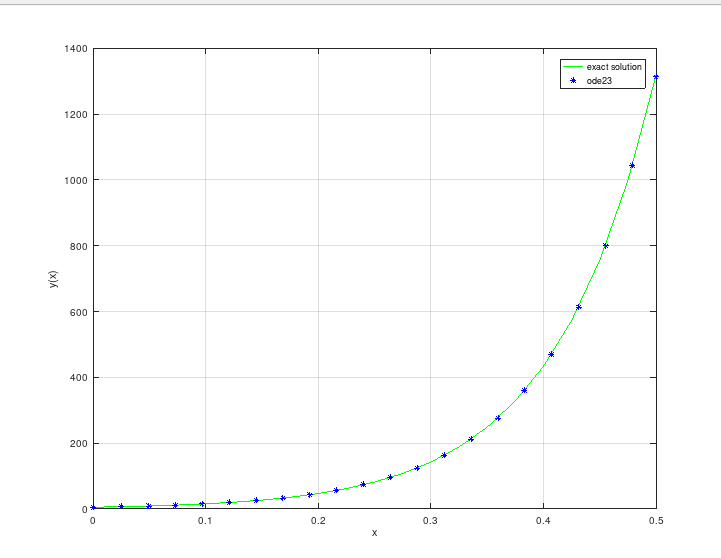
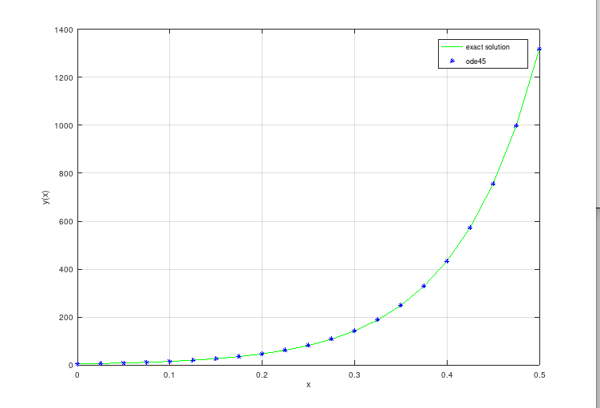
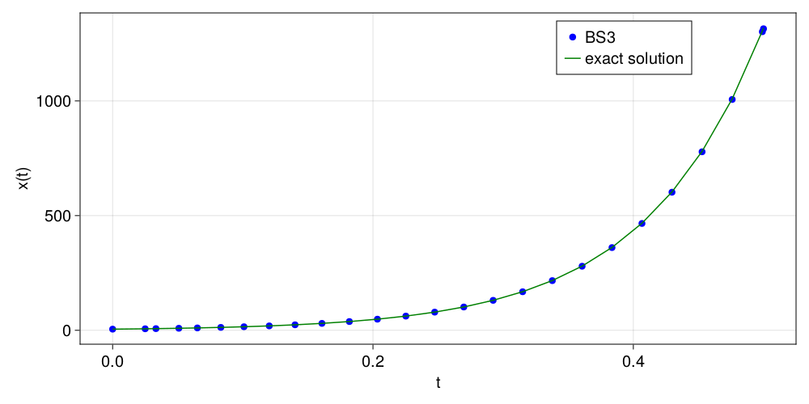
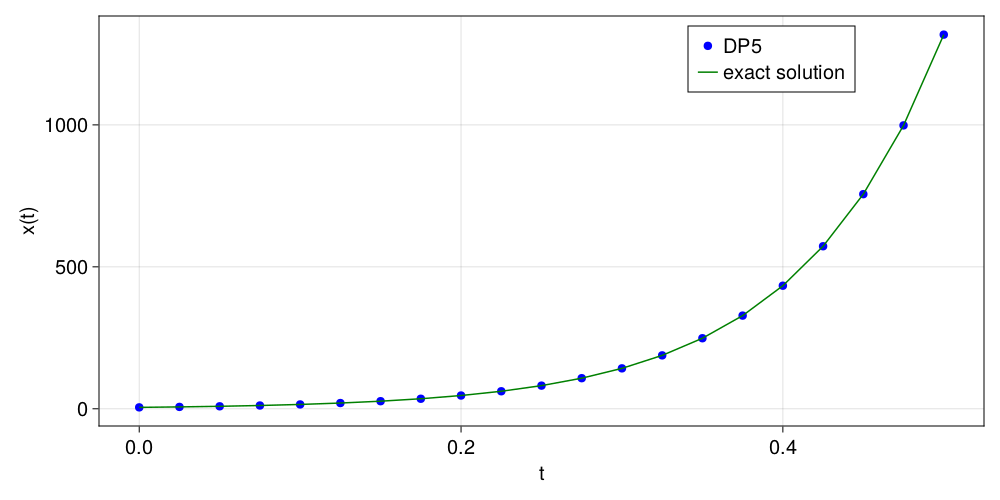
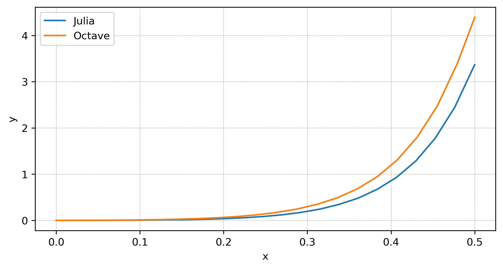
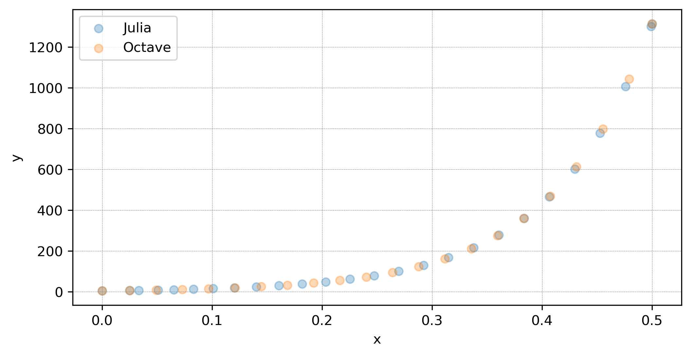
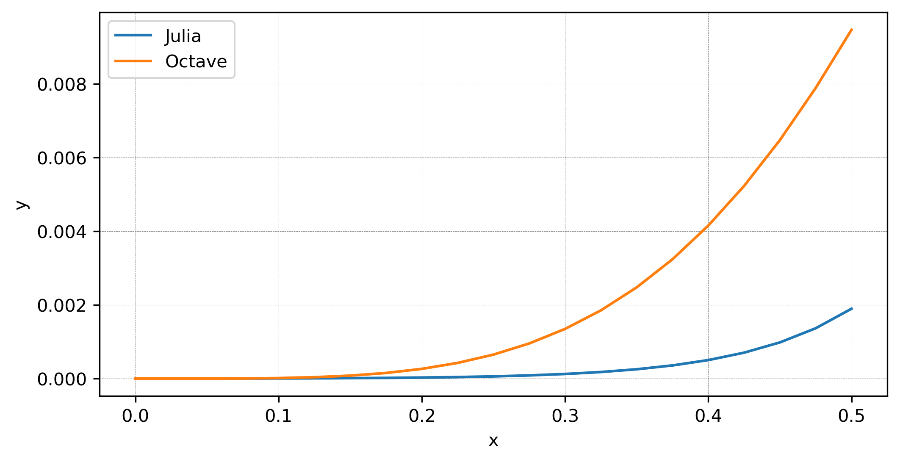
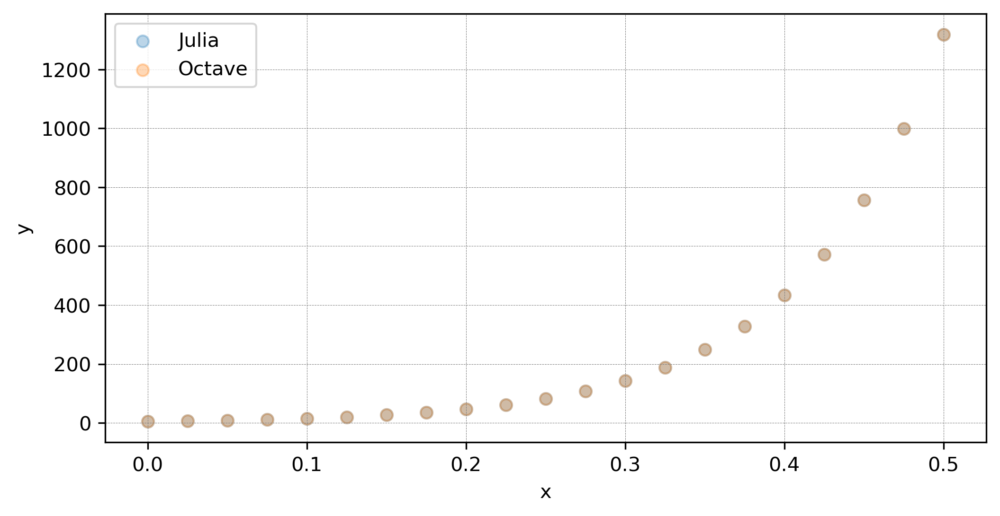
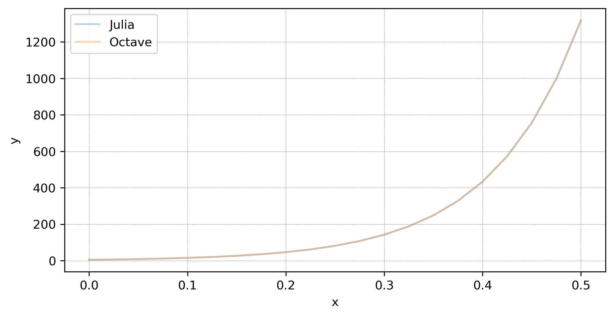

---
## Front matter
title: "Доклад"
subtitle: "Программное решение обыкновенных дифференциальных уравнений"
author: "Демидова Екатерина Алексеевна"

## Generic otions
lang: ru-RU
toc-title: "Содержание"

## Bibliography
bibliography: bib/cite.bib
csl: pandoc/csl/gost-r-7-0-5-2008-numeric.csl

## Pdf output format
toc: true # Table of contents
toc-depth: 2
lof: true # List of figures
lot: true # List of tables
fontsize: 12pt
linestretch: 1.5
papersize: a4
documentclass: scrreprt
## I18n polyglossia
polyglossia-lang:
  name: russian
  options:
	- spelling=modern
	- babelshorthands=true
polyglossia-otherlangs:
  name: english
## I18n babel
babel-lang: russian
babel-otherlangs: english
## Fonts
mainfont: PT Serif
romanfont: PT Serif
sansfont: PT Sans
monofont: PT Mono
mainfontoptions: Ligatures=TeX
romanfontoptions: Ligatures=TeX
sansfontoptions: Ligatures=TeX,Scale=MatchLowercase
monofontoptions: Scale=MatchLowercase,Scale=0.9
## Biblatex
biblatex: true
biblio-style: "gost-numeric"
biblatexoptions:
  - parentracker=true
  - backend=biber
  - hyperref=auto
  - language=auto
  - autolang=other*
  - citestyle=gost-numeric
## Pandoc-crossref LaTeX customization
figureTitle: "Рис."
tableTitle: "Таблица"
listingTitle: "Листинг"
lofTitle: "Список иллюстраций"
lotTitle: "Список таблиц"
lolTitle: "Листинги"
## Misc options
indent: true
header-includes:
  - \usepackage{indentfirst}
  - \usepackage{float} # keep figures where there are in the text
  - \floatplacement{figure}{H} # keep figures where there are in the text
---

# Цель работы

Исследовать программные решения обыкновенных дифференциальных уравнений.

# Задачи

- Описать метод Эйлера и методы Рунге-Кутты
- Исследовать возможности Octave и Julia для решения ОДУ
- Решить конкретную задачу Коши с помощью Octave и Julia
- Провести сравнительный анализ результатов

# Общие сведения о дифференциальных уравнениях

Дифференциальным уравнением n-го порядка называется соотношение вида[@pont:1988:bash]:
$$F(x,y,y',y'',\dots,y^{(n)}) = 0$$
Решением дифференциального уравнения называется функция $y(x)$, которая обращает уравнение в тождество.

Системой дифференциальных уравнений n-го порядка называется система вида:

$$\begin{cases}
&x_1' = f_{1}(t,x_1,x_2,\dots,x_n) \\
&x_2' = f_{2}(t,x_1,x_2,\dots,x_n) \\
&\vdots \\
&x_n' = f_{n}(t,x_1,x_2,\dots,x_n) \\
\end{cases}$$

Произвольную систему дифференциальных уравнений любого порядка можно заменить некоторой эквивалентной системой уравнений первого порядка:
$$
y'(x) = f_k(x,y(x)),\tag{1}
$$
$$
y = {y_1,y_2,\dots,y_n}, f = {f_1,f_2,\dots,f_n}.
$$

Каждое дифференциальное уравнение, а также система, имеют бесконечное количество решений, которые различаются друг от друга только константами. Чтобы однозначно определить решение, необходимо указать дополнительные начальные или граничные условия. Количество таких условий должно соответствовать порядку дифференциального уравнения или системы. В зависимости от формы дополнительных условий, дифференциальные уравнения классифицируются на:

- задачу Коши, в случае если все дополнительные условия заданы в одной (чаще начальной) точке интервала;
- краевую задачу, в случае, когда дополнительные условия заданы на границах интервала

Существуют два типа методов решения дифференциальных уравнений: точные (аналитические) и приближенные (численные). Классы уравнений, для которых разработаны методы получения точных рещений, сравнительно узки и охватывают только малую часть возникающих на практике задач.

Численные методы - это алгоритмы вычисления приближенных значений искомого решения $y(x)$ уравнения (1) на некоторой равномерной выбранной сетке по $x$. Решение при этом получается в виде таблицы. Численные методы не позволяют найти общее решение системы (1). Они могут дать только частное решение, например решение задачи Коши.

# Метод Эйлера

Метод Эйлера играет важную роль в теории численных методов решения ОДУ, хотя и не часто используется в практических расчетах из-за невысокой точности.

Рассмотрим задачу Коши для дифференциального уравнения
$$
y'(x)=f(x,y) \tag{2}
$$
удовлетворяющее начальному условию
$$
y(x_0) = y_0 \tag{3}
$$

Требуется найти численное решение уравнения (2) на интервале $(x_0; x_n)$, которое удовлетворяет начальному условию (3).

Проведём разбиение отрезка $[x_0;x_n]$ на $n$ равных частей:

$$
x_i = x_0 + ih,  i = \overline{1,n}
$$
$$
h = \frac{x_n - x_0}{n}
$$

Для вычисления значения функции в точке $x_1$ разложим функцию $y = y(x)$ в окрестности точки $x_0$ в ряд Тейлора:

$$
y(x_1) = y(x_0 + h) = y(x_0) + y'(x_0)h+y''(x_0)\frac{h^2}{2}+\dots
$$

При достаточном малом значении $h$ членами выше второго порядка можно пренебречь и с учетом $y'(x_0) = f(x_0, y_0)$ получим следующую формулу для вычисления приближенного значения функции $y(x)$ в точке $x_1$:
$$
y_2 = y_1+hf(x_1,y_1)
$$

Повторяя этот процесс, сформируем последовательность значений $x_i$ в точках $t_i$ по формуле:
$$
y_{i+1} = y_i + hf(x_i, y_i) \tag{4}
$$

Процесс нахождения значений функции $x_i$ в узловых точках $t_i$ по формуле (3) называется методом Эйлера[@kalit:1978:bash]. Так как точность определяется отброшенными членами ряда, то точность метода Эйлера на каждом шаге составляет $O(h^2)$. в целом точность этого метода $O(h)$.

# Методы Рунге-Кутты

Семейство явных методов Рунге — Кутты задаётся формулами:

$$
 \textbf{y}_{n+1} = \textbf{y}_n + h\sum_{i=1}^n b_i \textbf{k}_i,
$$

$$
\begin{cases}
&\textbf{k}_1 = \textbf{f}(x_n, \textbf{y}_n),\\
&\textbf{k}_2 = \textbf{f}(x_n+c_2h, \textbf{y}_n+a_{21}h\textbf{k}_1),\\
&\dots\\
&\textbf{k}_s = \textbf{f}(x_n+c_sh, \textbf{y}_n+a_{s1}h\textbf{k}_1+a_{s2}h\textbf{k}_2+\cdots+a_{s,s-1}h\textbf{k}_{s-1}).
\end{cases}
$$
Конкретный метод определяется числом $s$ и коэффициентами $b_{i}$, $a_{ij}$ и $c_i$. Эти коэффициенты часто упорядочивают в таблицу Бутчера.

: Таблица Бутчера {#tbl:std-dir}

| $c_1$ | $a_{11}$ | $a_{12}$ | $\dots$ | $a_{1s}$ |
|-------|----------|----------|---------|----------|
| $c_2$ | $a_{21}$ | $a_{22}$ | $\dots$ | $a_{2s}$ |
| $\vdots$ | $\vdots$ | $\vdots$ | $\ddots$ | $\vdots$ |  
| $c_s$ | $a_{s1}$ | $a_{s2}$ | $\dots$ | $a_{ss}$ |
|       | $b_1$    | $b_2$    | $\dots$ | $b_s$    | 

Для коэффициентов метода Рунге — Кутты должны быть выполнены условия $\sum_{j=1}^{i-1} a_{ij} = c_i$ для  $i=2,\ldots,s$.

Методы Рунге-Кутты имеют ряд достоинтв.

- Позволяют получить приближенное решение с хорошей точностью.
- Являются явными, то есть значение $y_{n+1}$ вычисляется по ранее найденным значениям за определённое число действий по определённым формулам.
- Допускают расчет переменным шагом, то есть можно уменьшить шаг там, где функция быстро меняется, и увеличить его в обратном случае.

В работе будут использоваться методы Богацки-Шампина и Дорманда Принса из семейства методов Рунге-Кутты.

: Таблица Бутчера для метода Богацки-Шампина {#tbl:std-dir}

| $0$ |       |    |   |     |
| --- |---|---|---|---|
|$\frac{1}{2}$| $\frac{1}{2}$|       |       |      |
|$\frac{3}{4}$|$0$|$\frac{3}{4}$|      |        |
|$1$| $\frac{2}{9}$|$\frac{1}{3}$|$\frac{4}{9}$|       |
| |$\frac{2}{9}$|$\frac{1}{3}$|$\frac{4}{9}$|$0$|
| |$\frac{7}{24}$|$\frac{1}{4}$|$\frac{1}{3}$|$\frac{1}{8}$|


# Решение задачи Коши с помощью программных средств

Рассмотрим задачу Коши:
$$\begin{cases}
&y'(x) = 11y +e^{10x}+x^4+x^3-sin(x)\\
&y(0) = 5 \tag{5}
\end{cases}$$

Известно точное решение задачи (5):

$$y(x) = - \dfrac{x^4}{11} - \dfrac{15x^3}{121} - \dfrac{45x^2}{1331} - \dfrac{90x}{14641} + \dfrac{cos(x)}{122} + \dfrac{11sin(x)}{122} + \dfrac{117739261e^{11x}}{19648222} - e^{10x} -\dfrac{90}{161051}$$


## Решение задачи Коши с помощью Octave

В Octave нет метода Эйлера, однако есть методы Рунге-Кутты[@octave-doc:bash].

`ode23(@f, interval, X0, options)`, `ode45(@f, interval, X0, options)` --- функции решений обыкновенных нежёстких дифференциальных уравнений (или систем) методом Рунге-Кутта 2-3-го и 4-5-го порядка точности соответственно.

Функции решают систему дифференциальных уравнений, автоматически подбирая шаг для достижения необходимой точности.
Входными параметрами этих функций являются:

- `f` -- вектор-функция для вычисления правой части дифференциального уравнения или системы;
- `interval` -- массив из двух чисел, определяющий интервал интегрирования дифференциального уравнения или системы;
- `X0` -- вектор начальных условий системы дифференциальных систем;
- `option` -- параметры управления ходом решения дифференциального уравнения или системы.

При решении дифференциальных уравнений необходимо определить следующие параметры:
- `RelTol` -- относительная точность решения, значение по умолчанию 10−3;
- `AbsTol` -- абсолютная точность решения, значение по умолчанию 10−3;
- `InitialStep` -- начальное значение шага изменения независимой переменной, значение по умолчанию 0.025;
- `MaxStep` -- максимальное значение шага изменения независимой переменной, значение по умолчанию 0.025.

Все функции возвращают:
- массив T - координат узлов сетки, в которых ищется решение;
- матрицу X, i-й столбец которой является значением вектор-функции решения в узле Тi.

```
function dydx = f(x,y)
  dydx = y*11 +exp(10*x)+(x^4+x^3)-sin(x);
endfunction

[X23,Y23]=ode23(@f,[0 0.5],5);
```

При решении методом ode23() найдено 22 точки, приведём графики реального решения задачи (5) и численного(рис. @fig:001).

{#fig:001 width=70%}

```
function dydx = f(x,y)
  dydx = y*11 +exp(10*x)+(x^4+x^3)-sin(x);
endfunction

[X45,Y45]=ode45(@f,[0 0.5],5);
```

При решении методом ode45() найдена 21 точка, приведём графики реального решения задачи (5) и численного(рис. @fig:002).

{#fig:002 width=70%}

## Решение задачи Коши с помощью Julia

Для того чтобы задать ОДУ используется конструктор ODEProblem[@julia-doc:bash]:

`ODEProblem(f::ODEFunction,u0,tspan,p=NullParameters();kwargs...)`

Входными параметрами этого конструктора являются:

- `f` -- функция в ОДУ;
- `u0` -- начальное состояние;
- `tspan` - временной интервал;
- `р` -- параметры ОДУ;
- `kwargs` -- параметры управления ходом решения.

Функция in-place — f!(du,u,p,t), где возвращаемое значение игнорируется, и ожидается, что результат будет преобразован в значение du. Функция out-place - du=f(u,p,t)

Для решения ОДУ используется функция `solve`, на вход которой подаётся ODEProblem c разными параметрами. Наиболее полезными параметрами являются `abstol` -- абсолютная точность, `reltol` -- относительная точность, `saveat` - шаг метода. По умолчанию `abstol=1e-6`, `reltol=1e-3`. `dt` - начальное значение шага изменения независимой переменной, `dtmax` --  максимальное значение шага изменения независимой переменной. Также на вход подаётся метод решения, мы рассмотрим метод `BS3()` - метод Рунге-Куты 2-го, 3-го порядка, эта функция соответствует `ode23()` из Matlab и `DP5()` - метод Рунге-Куты 4-го, 5-го порядка, эта функция соответствует `ode45()` из Matlab.

При решении задачи (5) было найдено решение при следующих парметрах: абсолютная точность -- 1e-3, относительная точность - 1e-3, начальное значение шага - 0.025, максимальное значение шага -- 0.025.

```
function F!( y, p, x)
 	dydx = x*11+exp(10*x)+(x.^4+x.^3)-sin(x);
end

begin
	x0 = 5.0
	X = (0.0, 0.5)
	prob = ODEProblem(F!, y0, x)
end

sol = solve(prob, BS3(), dtmax=0.025, dt=0.025, abstol = 1e-3, reltol = 1e-3);

```

При решении методом BS3() найдено 24 точки, приведём графики реального решения задачи (5) и численного(рис. @fig:003).

{#fig:003 width=70%}

```
function F!( y, p, x)
 	dydx = x*11+exp(10*x)+(x.^4+x.^3)-sin(x);
end

begin
	x0 = 5.0
	X = (0.0, 0.5)
	prob = ODEProblem(F!, y0, x)
end

sol = solve(prob, DP5(), dtmax=0.025, dt=0.025, abstol = 1e-3, reltol = 1e-3);

```
При решении методом DP5() найдена 21 точка, приведём графики реального решения задачи (5) и численного(рис. @fig:004).

{#fig:004 width=70%}

# Сравненительный анализ решений

Абсолютная погрешность решения в Julia оказалась меньше, чем в Octave. Система Julia при решении нашла 26 точек и минимальный подобранный шаг оказался приблизительно равен 0.000889. Система Octave нашла решение в 22 точках, а минимальный шаг приблизительно равен 0.020739 (рис. @fig:005).

{#fig:005 width=70%}

При построении решений, найденных обеими рассматриваемыми системами, можно заметить, что такая погрешность практически не влияет на построение графика по этим точкам. (рис. @fig:006, @fig:007).

{#fig:006 width=70%}

{#fig:007 width=70%}

Абсолютная погрешность решения в Julia оказалась меньше, чем в Octave, однако незначительно, на последнем шаге разница в абсолютной прогрешности приблизительно 0.0075. В обеих системах шаг был равен 0.025 и не менялся. (рис. @fig:008).

{#fig:008 width=70%}

При построении решений, найденных обеими рассматриваемыми системами, можно заметить, что такая погрешность не влияет на построение графика по этим точкам. (рис. @fig:009, @fig:010).

{#fig:009 width=70%}

{#fig:010 width=70%}

# Выводы

В работе были исследованы программные решения обыкновенных дифференциальных уравнений с помощью Octave и Julia. С помощью методов Богацки-Шампина и Дорманда-Принса были получены решения конкретной Задачи Коши, при сравнении Julia показала большую точность, чем Octave, но не значительно. Все графики решений совпали с точным решением рассматриваемой задачи.

# Список литературы{.unnumbered}

::: {#refs}
:::
