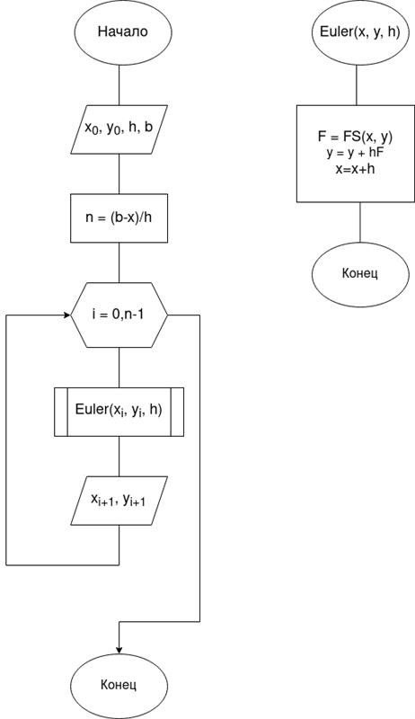
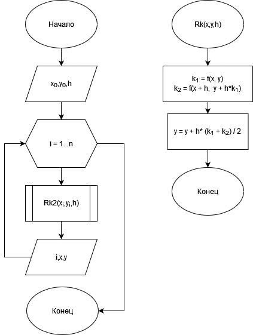
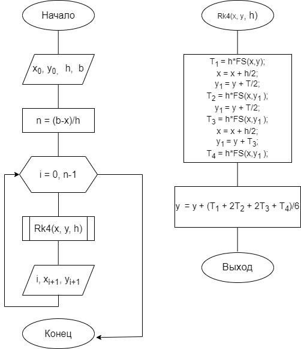

---
## Front matter
lang: ru-RU
title: Групповой проект Хищник-жертва
subtitle: Алгоритмы решения задачи
author:
  - Беличева Д. М.,
  - Демидова Е. А.,
  - Самигуллин Э. А.,
  - Смирнов-Мальцев Е. Д.
institute:
  - Российский университет дружбы народов, Москва, Россия

date: 20 мая 2023

## i18n babel
babel-lang: russian
babel-otherlangs: english

## Formatting pdf
toc: false
toc-title: Содержание
slide_level: 2
aspectratio: 169
section-titles: true
theme: metropolis
header-includes:
 - \metroset{progressbar=frametitle,sectionpage=progressbar,numbering=fraction}
 - '\makeatletter'
 - '\beamer@ignorenonframefalse'
 - '\makeatother'
---

# Информация

## Состав исследовательской команды

Студенты группы НКНбд-01-21

- Беличева Дарья Михайловна
- Демидова Екатерина Алексеевна
- Самигуллин Эмиль Артурович
- Смирнов-Мальцев Егор Дмитриевич

# Вводная часть

## Цель работы

Рассмотреть численные методы решения дифференциальных уравнений для построения модели Хищник-жертва и обосновать выбор Octave для программной реализации.

## Задачи

- Описать метод Эйлера
- Описать метод Рунге-Кутта второго порядка
- Описать метод Рунге-Кутта четвёртого порядка
- Обосновать выбор системы для математических вычислений

# Описание численных методов

## Метод Эйлера

Требуется найти функцию $y=y(x)$, являющуюся решением задачи Коши (1),(2) на $(x_0)$.

$$
y'(x)=f(x,y) \tag{1}
$$
$$
y(x_0) = y_0 \tag{2}
$$

## Метод Эйлера

Проведём разбиение отрезка $[x_0;x_n]$.

$$
x_i = x_0 + ih,  i = \overline{1,n}
$$
$$
h = \frac{x_n - x_0}{n}
$$

## Метод Эйлера

$$
y(x_1) = y(x_0 + h) = y(x_0) + y'(x_0)h+y''(x_0)\frac{h^2}{2}+\dots
$$

$$
y_2 = y_1+hf(x_1,y_1)
$$

$$
y_{i+1} = y_i + hf(x_i, y_i)
$$

Ошибка на одном шаге - $O(h^2)$, суммарная ошибка - $O(h)$.

## Метод Эйлера

{#fig:001 width=28%}

## Метод Рунге-Кутта второго порядка

$$\begin{cases}
&x_{i+1} = x_i + \Delta{x_i}, i=\overline{1,n}\\
&\Delta{x_i} = \frac{h}{2}(K^i_1+ K^i_2) \\
&K^i_1=f(x_i,y_i)\\
&K^i_2=f(x_i+\frac{h}{2},y_i+\frac{h}{2}K^i_1)\\
\end{cases}$$

Ошибка на одном шаге - $O(h^3)$, суммарная ошибка - $O(h^2)$.

## Метод Рунге-Кутта второго порядка

{#fig:002 width=35%}

## Метод Рунге-Кутта четвёртого порядка

$$\begin{cases}
&x_{i+1} = x_i + \Delta{x_i}, i=\overline{1,n}\\
&\Delta{x_i} = \frac{h}{6}(K^i_1+ 2K^i_2+2K^i_3+K^i_4) \\
&K^i_1=f(x_i,y_i)\\
&K^i_2=f(x_i+\frac{h}{2},y_i+\frac{h}{2}K^i_1)\\
&K^i_3=f(x_i+\frac{h}{2},y_i+\frac{h}{2}K^i_2)\\
&K^i_4=f(x_i+\frac{h}{2},y_i+\frac{h}{2}K^i_3)\\
\end{cases}$$

Ошибка на одном шаге - $O(h^5)$, суммарная ошибка - $O(h^4)$.

## Метод Рунге-Кутта четвёртого порядка

{#fig:003 width=40%}

# Выбор системы для математических вычислений

## Причины выбора Octave

- Совместимость с Matlab
- Есть все базовые функции Matlab
- Совместимость как с Linux, так и с Window
- Есть программная реализация метода Эйлера и методов Рунге-Кутта

# Заключение

## Выводы

Для исследования модели Хищник-жертва в нашей работе будут использованы метод Эйлера и методы Рунге-Кутта, а программная реализация будет выполнена в системе математических вычисленый Octave.

## Список литературы

1. Кулакова С.В. Численные методы. гос. хим.-технол. ун-т. Иваново, 2018. 124 с.
2. GNU Octave Documentation [Электронный ресурс]. Free Software Foundation, 2023. URL: https://docs.octave.org/latest/.
3. Sharma N., Gobbert M.K. A comparative evaluation of Matlab, Octave, Freemat, 
and Scilab for research and teaching. Department of Mathematics; Statistics University of Maryland, Baltimore County, 2010. 37 с.
