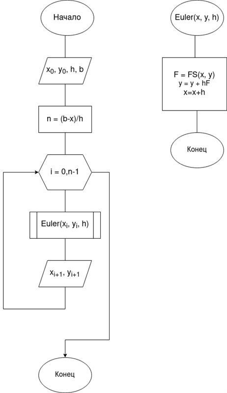
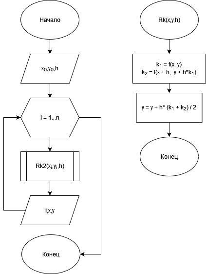
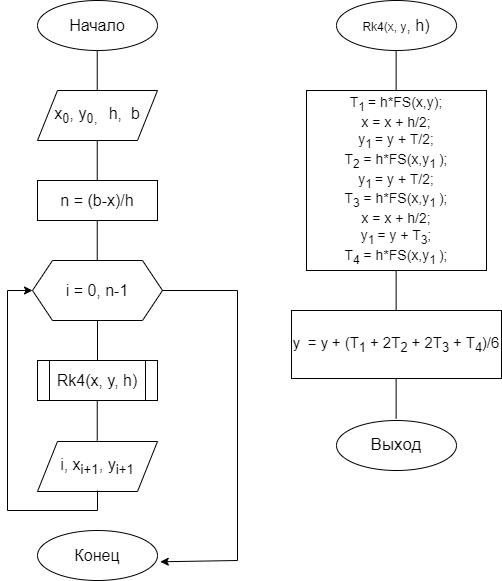

---
## Front matter
title: "Групповой проект Хищник-жертва"
subtitle: "Алгоритмы решения задачи"
author: 
  - Беличева Д. М.,
  - Демидова Е. А.,
  - Самигуллин Э. А.,
  - Смирнов-Мальцев Е. Д.

## Generic otions
lang: ru-RU
toc-title: "Содержание"

## Bibliography
bibliography: bib/cite.bib
csl: pandoc/csl/gost-r-7-0-5-2008-numeric.csl

## Pdf output format
toc: true # Table of contents
toc-depth: 2
lof: true # List of figures
lot: false # List of tables
fontsize: 12pt
linestretch: 1.5
papersize: a4
documentclass: scrreprt
## I18n polyglossia
polyglossia-lang:
  name: russian
  options:
	- spelling=modern
	- babelshorthands=true
polyglossia-otherlangs:
  name: english
## I18n babel
babel-lang: russian
babel-otherlangs: english
## Fonts
mainfont: PT Serif
romanfont: PT Serif
sansfont: PT Sans
monofont: PT Mono
mainfontoptions: Ligatures=TeX
romanfontoptions: Ligatures=TeX
sansfontoptions: Ligatures=TeX,Scale=MatchLowercase
monofontoptions: Scale=MatchLowercase,Scale=0.9
## Biblatex
biblatex: true
biblio-style: "gost-numeric"
biblatexoptions:
  - parentracker=true
  - backend=biber
  - hyperref=auto
  - language=auto
  - autolang=other*
  - citestyle=gost-numeric
## Pandoc-crossref LaTeX customization
figureTitle: "Рис."
tableTitle: "Таблица"
listingTitle: "Листинг"
lofTitle: "Список иллюстраций"
lotTitle: "Список таблиц"
lolTitle: "Листинги"
## Misc options
indent: true
header-includes:
  - \usepackage{indentfirst}
  - \usepackage{float} # keep figures where there are in the text
  - \floatplacement{figure}{H} # keep figures where there are in the text
---

# Цель работы

Рассмотреть численные методы решения дифференциальных уравнений для построения модели Хищник-жертва и обосновать выбор Octave для программной реализации.

# Задачи

- Описать метод Эйлера
- Описать метод Рунге-Кутта второго порядка
- Описать метод Рунге-Кутта четвёртого порядка
- Сравнить рассматриваемые методы

# Метод Эйлера

Метод Эйлера играет важную роль в теории численных методов решения ОДУ, хотя и не часто используется в практических расчетах из-за невысокой точности.

Рассмотрим задачу Коши для дифференциального уравнения
$$
y'(x)=f(x,y) \tag{1}
$$
удовлетворяющее начальному условию
$$
y(x_0) = y_0 \tag{2}
$$

Требуется найти функцию $y=y(x)$, которая удовлетворяет уравнению (1) на интервале $(x_0; x_n)$ и начальному условию (2).

Проведём разбиение отрезка $[x_0;x_n]$ на $n$ равных частей[@methods:2018:bash]:

$$
x_i = x_0 + ih,  i = \overline{1,n}
$$
$$
h = \frac{x_n - x_0}{n}
$$

Для вычисления значения функции в точке $x_1$ разложим функцию $y = y(x)$ в окрестности точки $x_0$ в ряд Тейлора:

$$
y(x_1) = y(x_0 + h) = y(x_0) + y'(x_0)h+y''(x_0)\frac{h^2}{2}+\dots
$$

При достаточном малом значении $h$ членами выше второго порядка можно пренебречь и с учетом $y'(x_0) = f(x_0, y_0)$ получим следующую формулу для вычисления приближенного значения функции $y(x)$ в точке $x_1$:
$$
y_2 = y_1+hf(x_1,y_1)
$$

Повторяя этот процесс, сформируем последовательность значений $x_i$ в точках $t_i$ по формуле:
$$
y_{i+1} = y_i + hf(x_i, y_i) \tag{3}
$$

Процесс нахождения значений функции $x_i$ в узловых точках $t_i$ по формуле (3) называется методом Эйлера. Так как точность определяется отброшенными членами ряда, то точность метода Эйлера на каждом шаге составляет $O(h^2)$. в целом точность этого метода $O(h)$.

Алгоритм метода Эйлера можно построить в виде двух программных модулей: основной программы и подпрограммы Euler, реализующей метод(рис. @fig:001).

{#fig:001 width=70%}

# Метод Рунге-Кутта второго порядка

Рассмотрим рассчётные формулы метода Рунге-Кутта второго порядка[@methods:2018:bash]:

$$\begin{cases}
&x_{i+1} = x_i + \Delta{x_i}, i=\overline{1,n}\\
&\Delta{x_i} = \frac{h}{2}(K^i_1+ K^i_2) \\
&K^i_1=f(x_i,y_i)\\
&K^i_2=f(x_i+\frac{h}{2},y_i+\frac{h}{2}K^i_1)\\
\end{cases}$$

Этот метод имеет второй порядок точности. Это значит, что ошибка на одном шаге имеет порядок $O(h^3)$, а суммарная ошибка на конечном интервале интегрирования имеет порядок $O(h^2)$.

Алгоритм метода Рунге-Кутта второго порядка можно построить в виде двух программных модулей: основной программы и подпрограммы Rk2, реализующей метод.
(рис. @fig:002).

{#fig:002 width=70%}

# Метод Рунге-Кутта четвёртого порядка

Рассмотрим рассчётные формулы метода Рунге-Кутта четвертого порядка[@methods:2018:bash]:

$$\begin{cases}
&x_{i+1} = x_i + \Delta{x_i}, i=\overline{1,n}\\
&\Delta{x_i} = \frac{h}{6}(K^i_1+ 2K^i_2+2K^i_3+K^i_4) \\
&K^i_1=f(x_i,y_i)\\
&K^i_2=f(x_i+\frac{h}{2},y_i+\frac{h}{2}K^i_1)\\
&K^i_3=f(x_i+\frac{h}{2},y_i+\frac{h}{2}K^i_2)\\
&K^i_4=f(x_i+\frac{h}{2},y_i+\frac{h}{2}K^i_3)\\
\end{cases}$$

Этот метод имеет четвёртый порядок точности. Это значит, что ошибка на одном шаге имеет порядок $O(h^5)$, а суммарная ошибка на конечном интервале интегрирования имеет порядок $O(h^4)$.

Алгоритм метода Рунге-Кутта четвёртого порядка можно построить в виде двух программных модулей: основной программы и подпрограммы Rk4, реализующей метод(рис. @fig:003).

{#fig:003 width=70%}

# Выбор системы для математических вычислений Oсtave

В нашей работе будет использована система для математических вычислений Oсtave. Octave cовместим с Matlab на уровне интерфейса и языка программирования. Также есть все базовые функции Matlab. Кроме того эта система совместима как с Linux, так и с Windows. Ещё одна причина выбора именно Octave состоит в том, что в этой системе есть программная реализация метода Эйлера и методов Рунге-Кутта[@octave-doc:bash].

Исследователи из Университета Мэриленда в США провели сравнительный анализ математических вычислений, используя MATLAB, Octave, SciLab и FreeMat в простом сценарии и в сложном[@comp:2010:bash]. В первом случае решали систему линейных уравнений а в втором — конечно-разностную дискретизацию уравнения Пуассона в двухмерном пространстве. Основной вывод — GNU Octave справляется с задачами лучше остальных открытых математических пакетов, демонстрируя результат, сопоставимый с матлабовским.

# Заключение

Для исследования модели Хищник-жертва в нашей работе будут использованы метод Эйлера и методы Рунге-Кутта, а программная реализация будет выполнена в системе математических вычисленый Octave.

# Список литературы{.unnumbered}

::: {#refs}
:::
