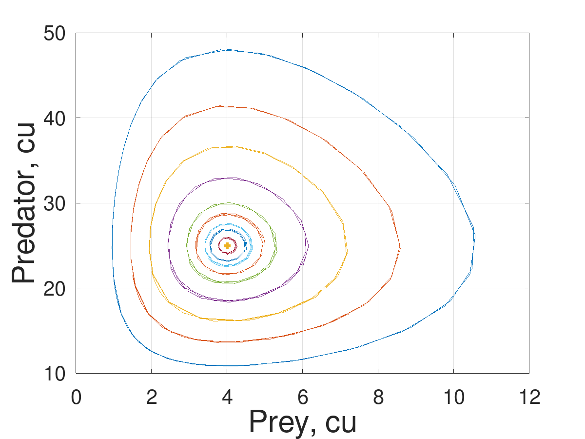
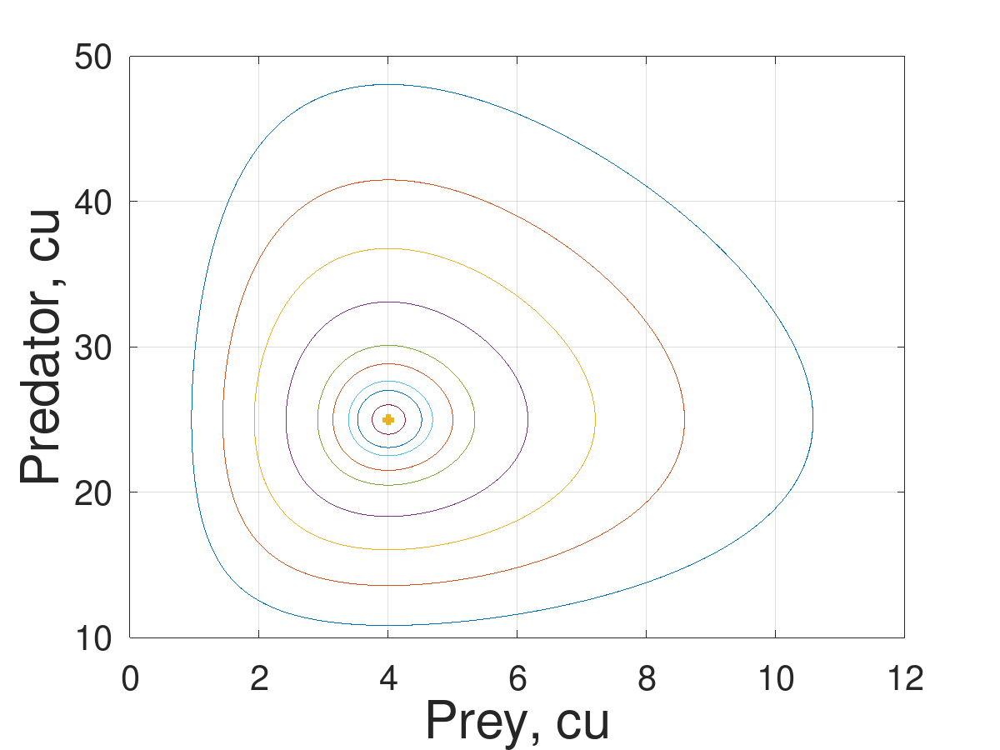
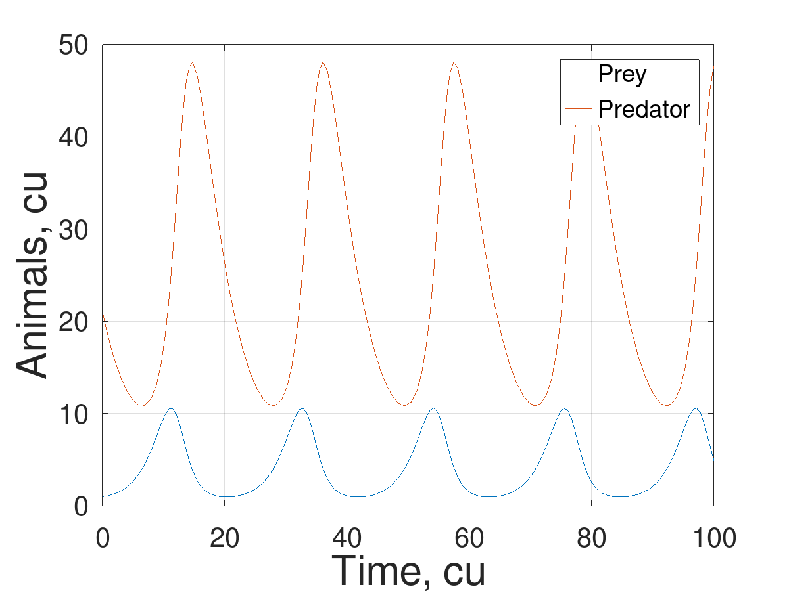
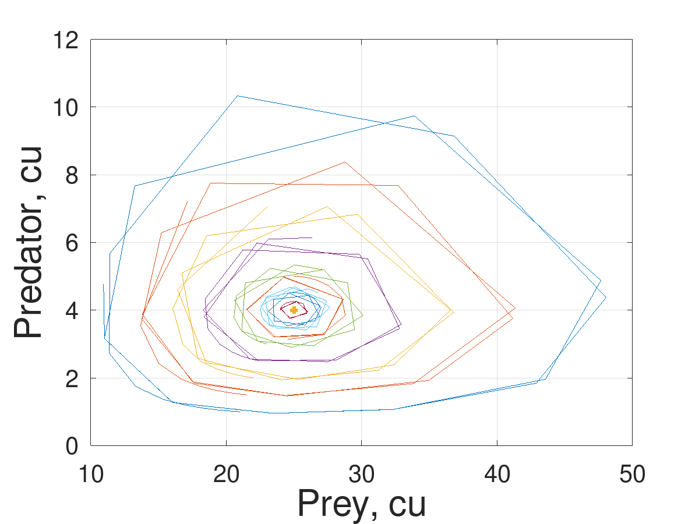
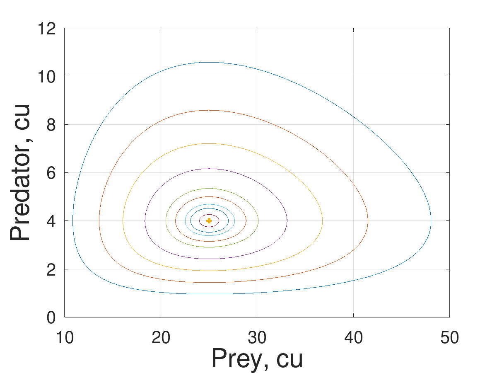
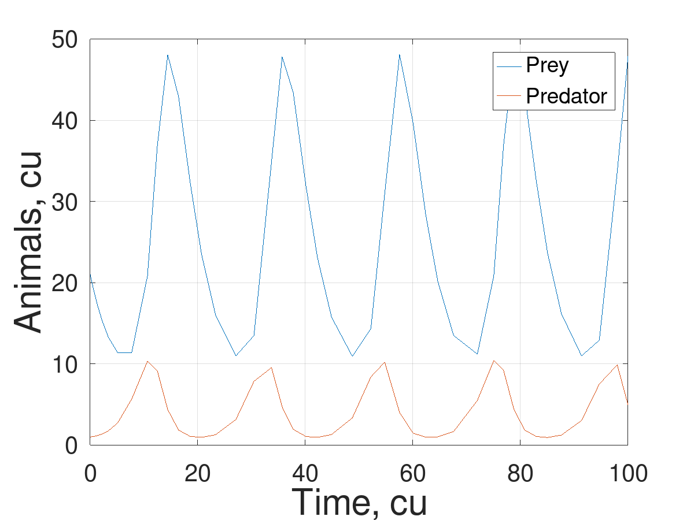

---
## Front matter
lang: ru-RU
title: Этап 3
subtitle: Программная реализация проекта хищник-жертва
author:
  - Беличева Д. М.,
  - Демидова Е. А.,
  - Самигуллин Э. А.,
  - Смирнов-Мальцев Е. Д.
institute:
  - Российский университет дружбы народов, Москва, Россия

date: 3 июня 2023


## i18n babel
babel-lang: russian
babel-otherlangs: english

## Formatting pdf
toc: false
toc-title: Содержание
slide_level: 2
aspectratio: 169
section-titles: true
theme: metropolis
header-includes:
 - \metroset{progressbar=frametitle,sectionpage=progressbar,numbering=fraction}
 - '\makeatletter'
 - '\beamer@ignorenonframefalse'
 - '\makeatother'
---

# Информация

## Состав исследовательской команды

Студенты группы НКНбд-01-21

- Беличева Дарья Михайловна
- Демидова Екатерина Алексеевна
- Самигуллин Эмиль Артурович
- Смирнов-Мальцев Егор Дмитриевич

# Вводная часть

## Цель

- Программная реализация проекта хищник-жертва

## Задачи

- Описать функции для решения ОДУ в Octave
- Построить график зависимости числа хищниов от числа жертв
- Построить графики зависимости числа видов от времени
- Найти стационарное состояние системы

# Программная реализация

## Методы решения в Octave

- `ode23(@f, interval, X0, options)` -- метод Богацки-Шампина
- `ode45(@f, interval, X0, options)` -- метод Дормана-Принса

Опции:

- `RelTol` -- относительная точность решения
- `AbsTol` -- абсолютная точность решения
- `InitialStep` -- начальное значение шага
- `MaxStep` -- максимальное значение шага

## Система уравнений 

```octave
function dx=f(t, x)
  a = 0.2; % коэффициент естественной смертности хищников
  b = 0.05; % коэффициент естественного прироста жертв
  c = 0.5; % коэффициент увеличения числа хищников
  d = 0.02; % коэффициент смертности жертв
  dx(1) = -a*x(1) + b*x(1)*x(2);
  dx(2) = c*x(2) - d*x(1)*x(2);
endfunction
```

## Реализация методом Богацки-Шампина

```octave
A(:,1) =  21:0.5:25;
A(:,2) = 1:0.5:5;
 
for i = 1:size(A(:,1))
    [T M] = ode23 (@f, [0 50],  A(i,:));
end 
```
## Реализация методом Богацки-Шампина

Построим стационарную точку системы.

```octave
[T M] = ode23 (@f, [0 30],  [25 4]);
```
## Реализация методом Богацки-Шампина

Построим зависимости численности популяций хищников и жертв.

{#fig:001 width=50%}

## Реализация методом Богацки-Шампина

Реализация решения методом Богацки-Шампина с максимальным шагом 0.1.

```octave
A(:,1) =  21:0.5:25;
A(:,2) = 1:0.5:5;
opt = odeset ("MaxStep", 0.1);
for i = 1:size(A(:,1))
[T M] = ode23 (@f, [0 50],  A(i,:),opt);
```
## Реализация методом Богацки-Шампина

{#fig:002 width=60%}

## Реализация методом Богацки-Шампина

Построим зависимость видов от времени.

``` octave
A(:,1) =  21:0.5:25;
A(:,2) = 1:0.5:5;
 
[T M] = ode23 (@f, [0 100],  [21 1]);
```
## Реализация методом Богацки-Шампина

{#fig:003 width=60%}

## Реализация методом Дормана-Принса

``` octave
A(:,1) =  21:0.5:25;
A(:,2) = 1:0.5:5;
for i = 1:size(A(:,1))
    [T M] = ode45 (@f, [0 50],  A(i,:));
end
```
## Реализация методом Дормана-Принса

Построим стационарную точку системы.

``` octave
[T M] = ode45 (@f, [0 50],  [25 4]);
```
## Реализация методом Дормана-Принса

{#fig:004 width=60%}

## Реализация методом Дормана-Принса

Реализация решения методом Дормана-Принса с максимальным шагом 0.1.

``` octave
A(:,1) =  21:0.5:25;
A(:,2) = 1:0.5:5;
opt = odeset ("MaxStep", 0.1);
for i = 1:size(A(:,1))
    [T M] = ode45 (@f, [0 50],  A(i,:),opt);
end
```
## Реализация методом Дормана-Принса

{#fig:005 width=60%}

## Реализация методом Дормана-Принса

Построение зависимости видов от времени.

``` octave
A(:,1) =  21:0.5:25;
A(:,2) = 1:0.5:5;
par = odeset("MaxStep", 0.1)
 
    [T M] = ode45 (@f, [0 100],  [21 1], par);
```
## Реализация методом Дормана-Принса

{#fig:006 width=60%}

# Заключение

## Выводы

В процессе выполнения этого этапа проекта мы выполнили программную реализацию проекта хищник-жертва.

## Список литературы

1. GNU Octave Documentation [Электронный ресурс]. Free Software Foundation,2023. URL: https://docs.octave.org/v4.2.0/Matlab_002dcompatible-solvers.html.
