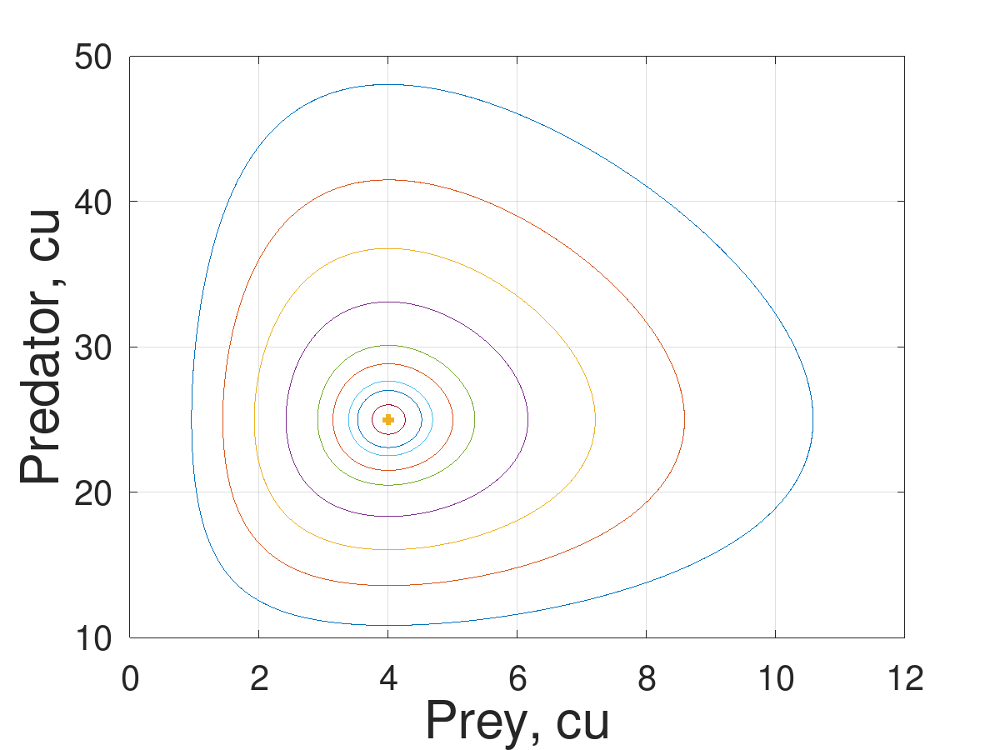
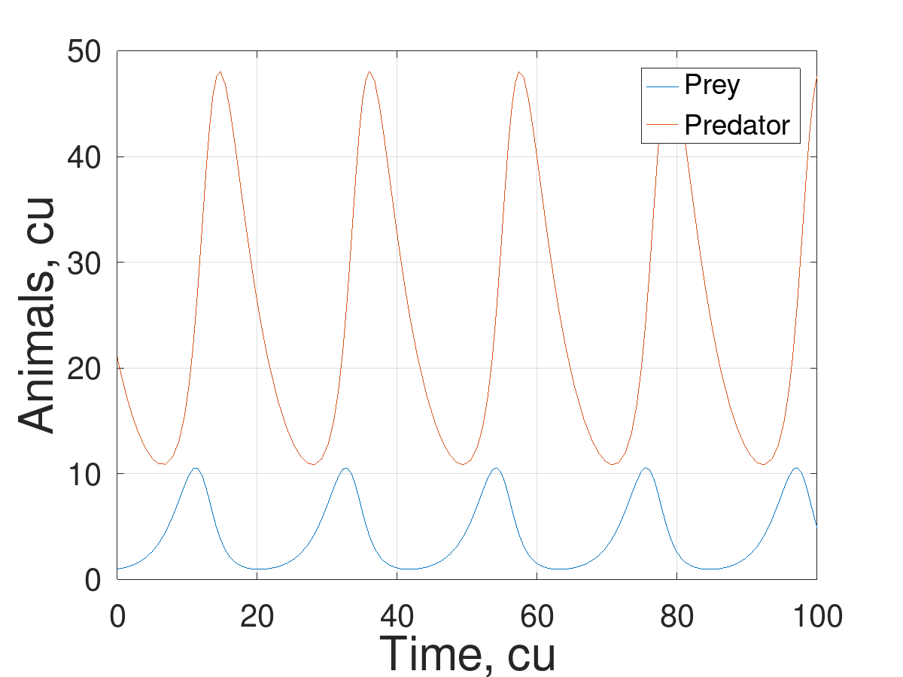

---
## Front matter
title: "Групповой проект хищник-жертва"
subtitle: "Программная реализация проекта"
author: 
  - Беличева Д. М.,
  - Демидова Е. А.,
  - Самигуллин Э. А.,
  - Смирнов-Мальцев Е. Д.

## Generic otions
lang: ru-RU
toc-title: "Содержание"

## Bibliography
bibliography: bib/cite.bib
csl: pandoc/csl/gost-r-7-0-5-2008-numeric.csl

## Pdf output format
toc: true # Table of contents
toc-depth: 2
lof: true # List of figures
lot: false # List of tables
fontsize: 12pt
linestretch: 1.5
papersize: a4
documentclass: scrreprt
## I18n polyglossia
polyglossia-lang:
  name: russian
  options:
	- spelling=modern
	- babelshorthands=true
polyglossia-otherlangs:
  name: english
## I18n babel
babel-lang: russian
babel-otherlangs: english
## Fonts
mainfont: PT Serif
romanfont: PT Serif
sansfont: PT Sans
monofont: PT Mono
mainfontoptions: Ligatures=TeX
romanfontoptions: Ligatures=TeX
sansfontoptions: Ligatures=TeX,Scale=MatchLowercase
monofontoptions: Scale=MatchLowercase,Scale=0.9
## Biblatex
biblatex: true
biblio-style: "gost-numeric"
biblatexoptions:
  - parentracker=true
  - backend=biber
  - hyperref=auto
  - language=auto
  - autolang=other*
  - citestyle=gost-numeric
## Pandoc-crossref LaTeX customization
figureTitle: "Рис."
tableTitle: "Таблица"
listingTitle: "Листинг"
lofTitle: "Список иллюстраций"
lotTitle: "Список таблиц"
lolTitle: "Листинги"
## Misc options
indent: true
header-includes:
  - \usepackage{indentfirst}
  - \usepackage{float} # keep figures where there are in the text
  - \floatplacement{figure}{H} # keep figures where there are in the text
---

# Цель работы

- Программная реализация проекта хищник-жертва.

# Задачи

- Описать функции для решения ОДУ в Octave
- Построить график зависимости числа хищниов от числа жертв
- Построить графики зависимости числа видов от времени
- Найти стационарное состояние системы

# Теоретическое введение

В Octave нет метода Эйлера, однако есть методы Рунге-Кутты[@octave-doc:bash].

`ode23(@f, interval, X0, options)`, `ode45(@f, interval, X0, options)` --- функции решений обыкновенных нежёстких дифференциальных уравнений (или систем) методом Рунге-Кутты 2-3-го и 4-5-го порядка точности соответственно.

Функции решают систему дифференциальных уравнений, автоматически подбирая шаг для достижения необходимой точности.
Входными параметрами этих функций являются:

- `f` -- вектор-функция для вычисления правой части дифференциального уравнения или системы;
- `interval` -- массив из двух чисел, определяющий интервал интегрирования дифференциального уравнения или системы;
- `X0` -- вектор начальных условий системы дифференциальных систем;
- `option` -- параметры управления ходом решения дифференциального уравнения или системы.

При решении дифференциальных уравнений необходимо определить следующие параметры:

- `RelTol` -- относительная точность решения, значение по умолчанию 10−3;
- `AbsTol` -- абсолютная точность решения, значение по умолчанию 10−3;
- `InitialStep` -- начальное значение шага изменения независимой переменной, значение по умолчанию 0.025;
- `MaxStep` -- максимальное значение шага изменения независимой переменной, значение по умолчанию 0.025.

Все функции возвращают:

- массив T - координат узлов сетки, в которых ищется решение;
- матрицу X, i-й столбец которой является значением вектор-функции решения в узле Тi.

# Рунге-Кутта второго и третьего порядка

1. Реализация алгоритма Рунге-Кутта второго и третьего порядка с параметрами по умолчанию(рис. @fig:001).

```octave
function dx=f(t, x)
  a = 0.2; % коэффициент естественной смертности хищников
  b = 0.05; % коэффициент естественного прироста жертв
  c = 0.5; % коэффициент увеличения числа хищников
  d = 0.02; % коэффициент смертности жертв
  dx(1) = -a*x(1) + b*x(1)*x(2);
  dx(2) = c*x(2) - d*x(1)*x(2);
endfunction
 
A(:,1) =  21:0.5:25;
A(:,2) = 1:0.5:5;
 
for i = 1:size(A(:,1))
    [T M] = ode23 (@f, [0 50],  A(i,:));
    X = M(:, 1);
    Y = M(:, 2);
    plot(X, Y);
    hold on;
end 
 
[T M] = ode23 (@f, [0 30],  [25 4]);
X = M(:, 1);
Y = M(:, 2);
plot(X, Y, '+',"linewidth", 3);
```

{#fig:001 width=70%}

2. Реализация алгоритма Рунге-Кутта второго и третьего порядка с максимальным шагом в 0.1 (рис. @fig:002).

```octave
clear; clf;
function dx=f(t, x)
  a = 0.2; % коэффициент естественной смертности хищников
  b = 0.05; % коэффициент естественного прироста жертв
  c = 0.5; % коэффициент увеличения числа хищников
  d = 0.02; % коэффициент смертности жертв
  dx(1) = -a*x(1) + b*x(1)*x(2);
  dx(2) = c*x(2) - d*x(1)*x(2);
endfunction
 
A(:,1) =  21:0.5:25;
A(:,2) = 1:0.5:5;
opt = odeset ("MaxStep", 0.1);
for i = 1:size(A(:,1))
[T M] = ode23 (@f, [0 50],  A(i,:),opt);
X = M(:, 1);
Y = M(:, 2);
plot(X, Y);
hold on;
end
 
[T M] = ode23 (@f, [0 50],  [25 4]);
X = M(:, 1);
Y = M(:, 2);
plot(X, Y, '+',"linewidth", 3);
grid on;
set(gca, "FontSize",20)
 
xlabel('Prey, cu', "fontsize",30);
ylabel('Predator, cu', "fontsize",30)
```

{#fig:002 width=70%}

3. Построение зависимости видов от времени модели хищник-жертва с использованием Рунге-Кутта второго и третьего порядка (рис. @fig:003).

``` octave
function dx=f(t, x)
  a = 0.2; % коэффициент естественной смертности хищников
  b = 0.05; % коэффициент естественного прироста жертв
  c = 0.5; % коэффициент увеличения числа хищников
  d = 0.02; % коэффициент смертности жертв
  dx(1) = -a*x(1) + b*x(1)*x(2);
  dx(2) = c*x(2) - d*x(1)*x(2);
endfunction
 
A(:,1) =  21:0.5:25;
A(:,2) = 1:0.5:5;
 
[T M] = ode23 (@f, [0 100],  [21 1]);
X = M(:, 1);
Y = M(:, 2);
plot(T,X,T, Y);
hold on;
 
grid on;
set(gca, "FontSize",20)
legend("Prey", "Predator")
xlabel('Time, cu', "fontsize",30);
ylabel('Animals, cu', "fontsize",30)
```

{#fig:003 width=70%}

# Рунге-Кутта четвертого и пятого порядка

1. Реализация алгоритма Рунге-Кутта четвертого и пятого порядка с параметрами по умолчанию(рис. @fig:004).

```octave
function dx=f(t, x)
  a = 0.2; % коэффициент естественной смертности хищников
  b = 0.05; % коэффициент естественного прироста жертв
  c = 0.5; % коэффициент увеличения числа хищников
  d = 0.02; % коэффициент смертности жертв
  dx(1) = -a*x(1) + b*x(1)*x(2);
  dx(2) = c*x(2) - d*x(1)*x(2);
endfunction

A(:,1) =  21:0.5:25;
A(:,2) = 1:0.5:5;
for i = 1:size(A(:,1))
    [T M] = ode45 (@f, [0 50],  A(i,:));
    X = M(:, 1);
    Y = M(:, 2);
    plot(X, Y);
    hold on;
end

[T M] = ode45 (@f, [0 50],  [25 4]);
X = M(:, 1);
Y = M(:, 2);
plot(X, Y, '+',"linewidth", 3);
grid on;
set(gca, "FontSize",20)

xlabel('Prey, cu', "fontsize",30);
ylabel('Predator, cu', "fontsize",30)
```

{#fig:004 width=70%}

2. Реализация алгоритма Рунге-Кутта четвертого и пятого порядка с максимальным шагом 0.1 (рис. @fig:005).

```octave
function dx=f(t, x)
  a = 0.2; % коэффициент естественной смертности хищников
  b = 0.05; % коэффициент естественного прироста жертв
  c = 0.5; % коэффициент увеличения числа хищников
  d = 0.02; % коэффициент смертности жертв
  dx(1) = -a*x(1) + b*x(1)*x(2);
  dx(2) = c*x(2) - d*x(1)*x(2);
endfunction
 
A(:,1) =  21:0.5:25;
A(:,2) = 1:0.5:5;
opt = odeset ("MaxStep", 0.1);
for i = 1:size(A(:,1))
    [T M] = ode45 (@f, [0 50],  A(i,:),opt);
    X = M(:, 1);
    Y = M(:, 2);
    plot(X, Y);
    hold on;
end
 
[T M] = ode45 (@f, [0 50],  [25 4]);
X = M(:, 1);
Y = M(:, 2);
plot(X, Y, '+',"linewidth", 3);
grid on;
set(gca, "FontSize",20)
 
xlabel('Prey, cu', "fontsize",30);
ylabel('Predator, cu', "fontsize",30)
```

{#fig:005 width=70%}

3. Построение зависимости видов от времени модели хищник-жертва с использованием Рунге-Кутта четвертого и пятого порядка (рис. @fig:006).

``` octave
function dx=f(t, x)
  a = 0.2; % коэффициент естественной смертности хищников
  b = 0.05; % коэффициент естественного прироста жертв
  c = 0.5; % коэффициент увеличения числа хищников
  d = 0.02; % коэффициент смертности жертв
  dx(1) = -a*x(1) + b*x(1)*x(2);
  dx(2) = c*x(2) - d*x(1)*x(2);
endfunction
 
A(:,1) =  21:0.5:25;
A(:,2) = 1:0.5:5;
par = odeset("MaxStep", 0.1)
 
    [T M] = ode45 (@f, [0 100],  [21 1], par);
    X = M(:, 1);
    Y = M(:, 2);
    plot(T,X,T, Y);
    hold on;
 
grid on;
set(gca, "FontSize",20)
legend("Prey", "Predator")
xlabel('Time, cu', "fontsize",30);
ylabel('Animals, cu', "fontsize",30)
```

{#fig:006 width=70%}

# Вывод

В результате работы была выполнена программная реализация проекта, а  именно были построены графики зависимости видов друг от друга, от времени и найдено стационарное состояние системы с помощью методов Рунге_Кутты 2-3-го и 4-5-го порядка точности.

# Список литературы{.unnumbered}

::: {#refs}
:::