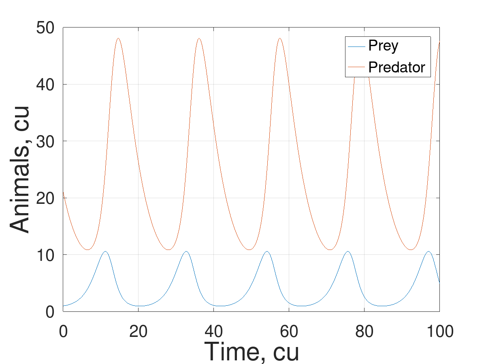
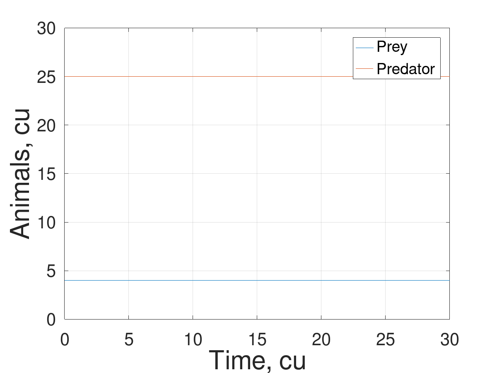
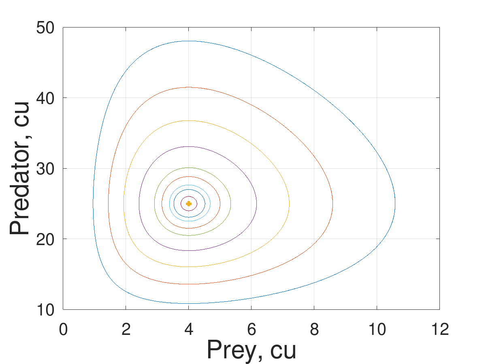
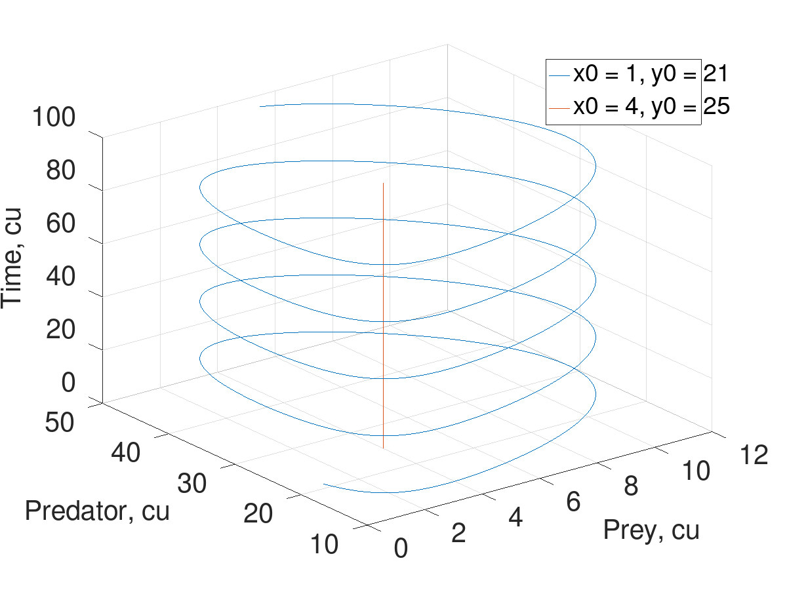
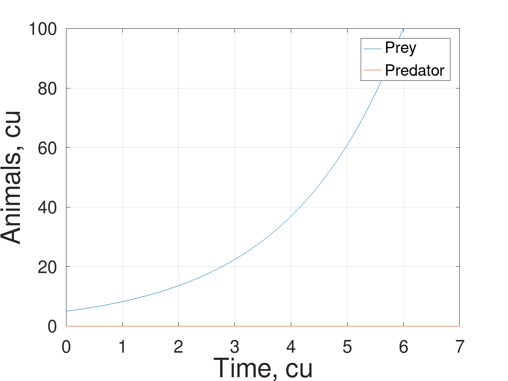
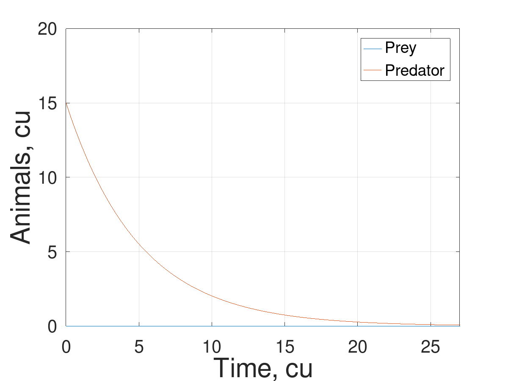

---
## Front matter
lang: ru-RU
title: Этап 4
subtitle: Результаты проекта хищник-жертва
author:
  - Беличева Д. М.,
  - Демидова Е. А.,
  - Самигуллин Э. А.,
  - Смирнов-Мальцев Е. Д.
institute:
  - Российский университет дружбы народов, Москва, Россия

date: 5 июня 2023

## i18n babel
babel-lang: russian
babel-otherlangs: english

## Formatting pdf
toc: false
toc-title: Содержание
slide_level: 2
aspectratio: 169
section-titles: true
theme: metropolis
header-includes:
 - \metroset{progressbar=frametitle,sectionpage=progressbar,numbering=fraction}
 - '\makeatletter'
 - '\beamer@ignorenonframefalse'
 - '\makeatother'
---

# Информация

## Состав исследовательской команды

Студенты группы НКНбд-01-21

- Беличева Дарья Михайловна
- Демидова Екатерина Алексеевна
- Самигуллин Эмиль Артурович
- Смирнов-Мальцев Егор Дмитриевич

# Вводная часть

## Цель

Исследование модели Лотки-Вольтерра.

## Задачи

- Провести аналитическое исследование модели хищник-жертва
- Построить график зависимости числа хищниов от числа жертв
- Построить графики зависимости числа видов от времени
- Найти стационарное состояние системы

## Инструменты и методы

- Система Octave
- Метод Богацки-Шампина (`ode23()`)
- Метод Дормана-Принса (`ode45()`)

# Аналитическое исследование модели

## Описание модели Лотки-Вольтерра

$$\begin{cases}
  &\dot{x} = \alpha x-\beta xy,\\
  &\dot{y} = -\gamma y+\delta xy.
\end{cases}$$

- $\alpha$ - естественный прирост числа жертв;
- $\gamma$ - естественное вымирание хищников;
- $\beta$ - смертность жертв;
- $\delta$ - прирост числа хищников.

## Стационарное состояние системы

$$\begin{cases}
  \alpha x-\beta xy = 0,\\
  -\gamma y+\delta xy = 0,
\end{cases}$$

$$\begin{cases}
  x = \dfrac{\gamma}{\delta},\\
  y = \dfrac{\alpha}{\beta}.
\end{cases}$$

## Ситуация отсутствия жертв

Пусть $x = 0$, тогда

$$
\dot{y} = -\gamma y,
$$
$$
y = Ce^{-\gamma t}, C\in R
$$

## Ситуация отсутствия хищников

Пусть $y = 0$, тогда

$$
\dot{x} = \alpha x,
$$
$$
x = Ce^{\alpha t}, C\in R
$$

# Построение и анализ графиков

## Зависимость видов от времени

{#fig:003 width=60%}

## Стационарное состояние системы

{#fig:004 width=60%}

## Зависимость жертв от хищников

{#fig:001 width=60%}

## Зависимость жертв от хищников

{#fig:002 width=60%}

## Ситуация отсутствия хищников

{#fig:005 width=60%}

## Ситуация отсутствия жертв

{#fig:006 width=60%}

# Заключение

## Результаты

- Проведено аналитическое исследование модели хищник-жертва.
- Построен график зависимости числа хищниов от числа жертв
- Построены графики зависимости числа видов от времени
- Найдено стационарное состояние системы.

## Список литературы

1. Вольтерра В. Математическая теория борьбы за существование. Наука, 1976. 354 с.
2. GNU Octave Documentation [Электронный ресурс]. Free Software Foundation, 2023. URL: https://docs.octave.org/v4.2.0/Matlab_002dcompatible-solvers.html.
