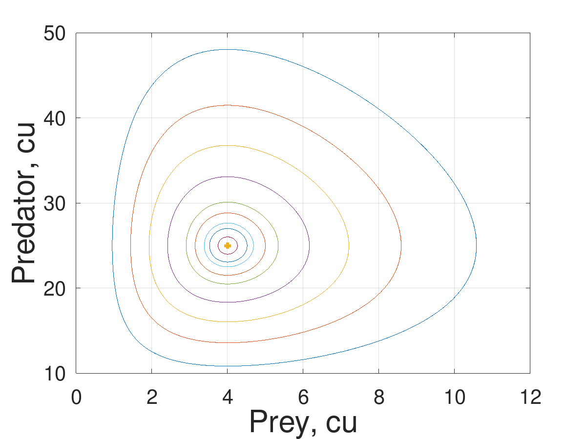
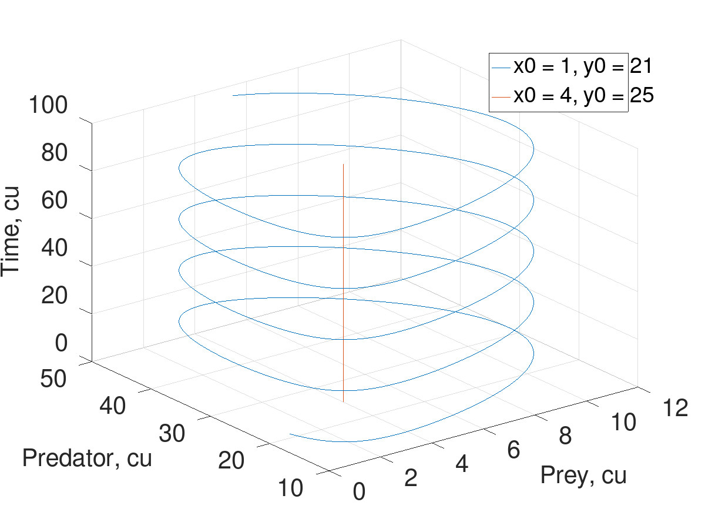
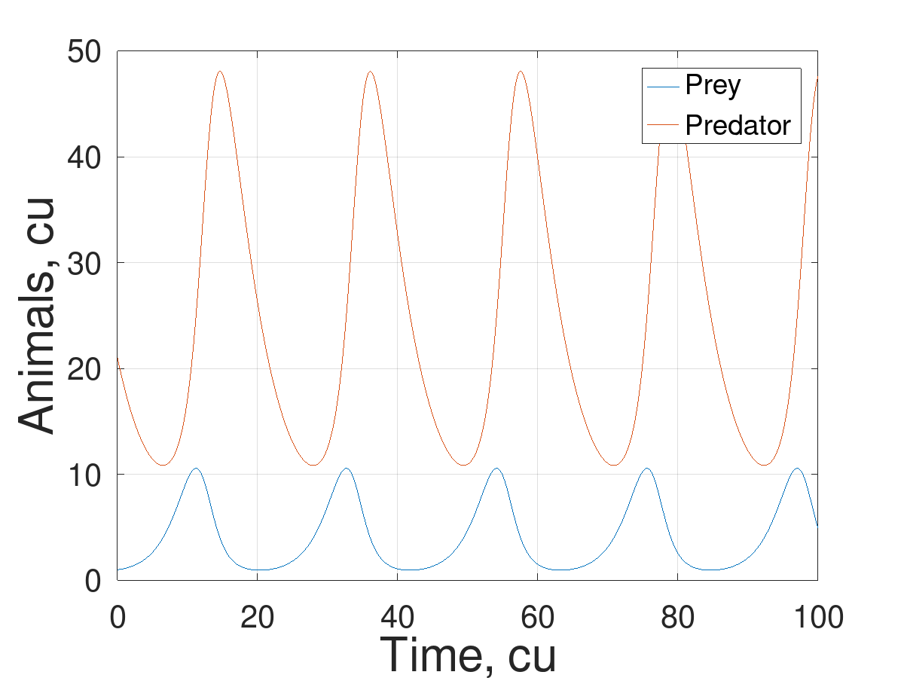
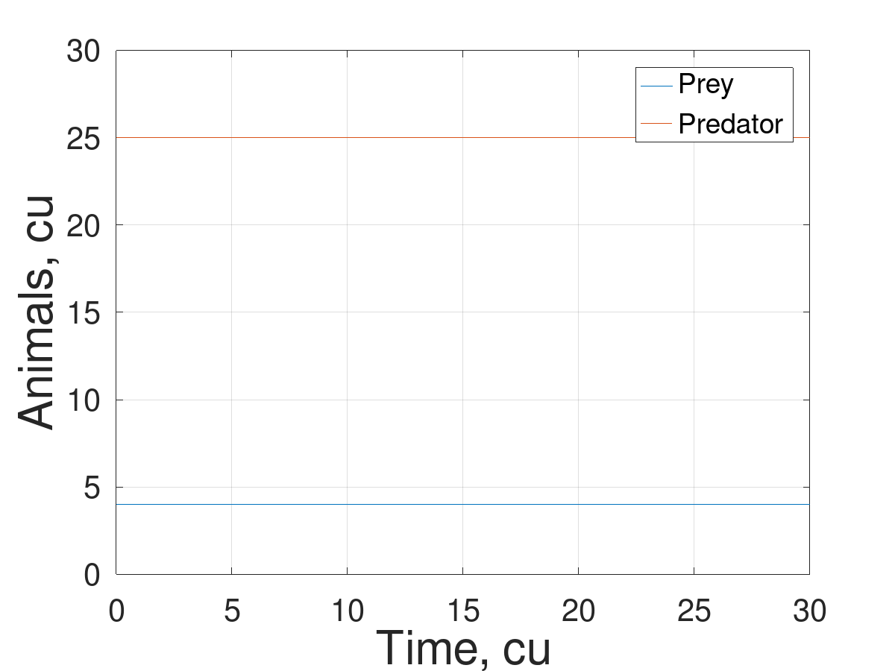
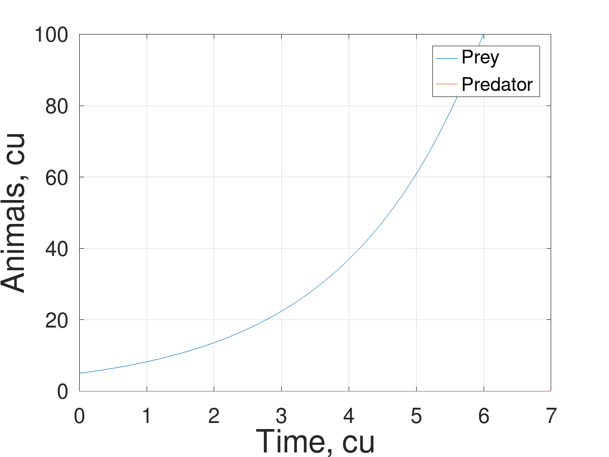
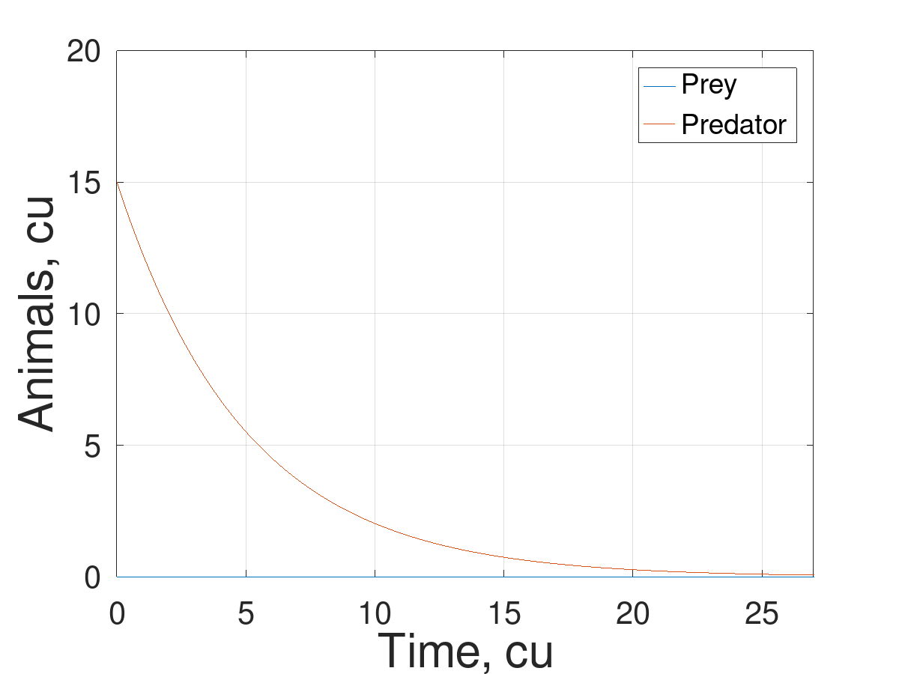

---
## Front matter
title: "Этап 4"
subtitle: "Результаты проекта"
author: 

  - Беличева Д. М.,
  - Демидова Е. А.,
  - Самигуллин Э. А.,
  - Смирнов-Мальцев Е. Д.

## Generic otions
lang: ru-RU
toc-title: "Содержание"

## Bibliography
bibliography: bib/cite.bib
csl: pandoc/csl/gost-r-7-0-5-2008-numeric.csl

## Pdf output format
toc: true # Table of contents
toc-depth: 2
lof: true # List of figures
lot: false # List of tables
fontsize: 12pt
linestretch: 1.5
papersize: a4
documentclass: scrreprt
## I18n polyglossia
polyglossia-lang:
  name: russian
  options:
	- spelling=modern
	- babelshorthands=true
polyglossia-otherlangs:
  name: english
## I18n babel
babel-lang: russian
babel-otherlangs: english
## Fonts
mainfont: PT Serif
romanfont: PT Serif
sansfont: PT Sans
monofont: PT Mono
mainfontoptions: Ligatures=TeX
romanfontoptions: Ligatures=TeX
sansfontoptions: Ligatures=TeX,Scale=MatchLowercase
monofontoptions: Scale=MatchLowercase,Scale=0.9
## Biblatex
biblatex: true
biblio-style: "gost-numeric"
biblatexoptions:
  - parentracker=true
  - backend=biber
  - hyperref=auto
  - language=auto
  - autolang=other*
  - citestyle=gost-numeric
## Pandoc-crossref LaTeX customization
figureTitle: "Рис."
tableTitle: "Таблица"
listingTitle: "Листинг"
lofTitle: "Список иллюстраций"
lotTitle: "Список таблиц"
lolTitle: "Листинги"
## Misc options
indent: true
header-includes:
  - \usepackage{indentfirst}
  - \usepackage{float} # keep figures where there are in the text
  - \floatplacement{figure}{H} # keep figures where there are in the text
---

# Цель работы

Исследование модели Лотки-Вольтерра.

# Задачи

- Провести аналитическое исследование модели хищник-жертва.
- Построить график зависимости числа хищниов от числа жертв
- Построить графики зависимости числа видов от времени
- Найти стационарное состояние системы.

# Теоретическое введение

## Модель хищник-жертва

Модель "Хищник-жертва" основывается на следующих предположениях [@Volterra:bash]:

1. Численность популяции жертв $x$ и хищников $y$ зависят только от времени (модель не учитывает пространственное распределение популяции на занимаемой территории)

2. В отсутствии взаимодействия численность видов изменяется по модели Мальтуса (экспоненциальный рост с постоянным темпом), при этом число жертв увеличивается, а число хищников падает

3. Естественная смертность жертвы и естественная рождаемость хищника считаются несущественными

4. Эффект насыщения численности обеих популяций не учитывается

5. Скорость роста численности жертв уменьшается пропорционально численности хищников

$$\begin{cases}
  &\dot{x} = \alpha x-\beta xy\\
  &\dot{y} = -\gamma y+\delta xy
\end{cases}$$

В этой модели $x$ – число жертв, $y$ - число хищников. Коэффициент $\alpha$ описывает скорость естественного прироста числа жертв в отсутствие хищников, $\gamma$ - естественное вымирание хищников, лишенных пищи в виде жертв. Вероятность взаимодействия жертвы и хищника считается пропорциональной как количеству жертв, так и числу самих хищников. Каждый акт взаимодействия уменьшает популяцию жертв, но способствует увеличению популяции хищников (члены $-\beta xy$ и $\delta xy$ в правой части уравнения).

## Программные средства

В Octave системы дифферециальных уравнений можно решать следующими методами[@octave-doc:bash]:

`ode23(@f, interval, X0, options)`, `ode45(@f, interval, X0, options)` --- функции решений обыкновенных нежёстких дифференциальных уравнений (или систем) методом Рунге-Кутты 2-3-го и 4-5-го порядка точности соответственно.

Функции решают систему дифференциальных уравнений, автоматически подбирая шаг для достижения необходимой точности.
Входными параметрами этих функций являются:

- `f` -- вектор-функция для вычисления правой части дифференциального уравнения или системы;
- `interval` -- массив из двух чисел, определяющий интервал интегрирования дифференциального уравнения или системы;
- `X0` -- вектор начальных условий системы дифференциальных систем;
- `option` -- параметры управления ходом решения дифференциального уравнения или системы.

При решении дифференциальных уравнений необходимо определить следующие параметры:

- `RelTol` -- относительная точность решения, значение по умолчанию 10−3;
- `AbsTol` -- абсолютная точность решения, значение по умолчанию 10−3;
- `InitialStep` -- начальное значение шага изменения независимой переменной, значение по умолчанию 0.025;
- `MaxStep` -- максимальное значение шага изменения независимой переменной, значение по умолчанию 0.025.

Все функции возвращают:

- массив T - координат узлов сетки, в которых ищется решение;
- матрицу X, i-й столбец которой является значением вектор-функции решения в узле Тi.

# Аналитическое исследование модели

## Стационарное состояние системы

Найдём стационарное состояние системы. Для этого приравняем её правые части к нулю.

$$\begin{cases}
  \alpha x-\beta xy = 0\\
  -\gamma y+\delta xy = 0
\end{cases}$$

Из полученной системы получаем, что стационарное состояние системы будет в точке $x_0 = \dfrac{\gamma}{\delta}$, $y_0 = \dfrac{\alpha}{\beta}$. Если начальные значения задать в стационарном состоянии $x(0) = x_0$, $y(0) = y_0$, то в любой момент времени численность популяций изменяться не будет. При малом отклонении от положения равновесия численности как хищника, так и жертвы с течением времени не возвращаются к равновесным значениям, а совершают периодические колебания вокруг стационарной точки.

## Ситуация отсутствия одного из видов

Из системы сразу следует, что если жертв нет (x = 0), то хищники будут вымирать экспоненциально с неким начальным коэффициентом ($\gamma$ согласно уравнению).
$$
\dot{y} = -\gamma y,
$$
$$
y = Ce^{-\gamma t}, C\in R
$$

Схожую ситуацию получаем при полном отсутствии хищников (y = 0):
$$
\dot{x} = -\alpha x,
$$
$$
x = Ce^{\alpha t}, C\in R
$$
Рост жертв получается экспоненциальным с некой заранее заданной константой ($\alpha$).

# Построение и анализ графиков

Был построен фазовый портрет системы при разных начальных условиях, из графика видно, что решения представляют собой замкнутые траектории расположенные вокруг стационарной точки(рис. @fig:001).

{#fig:001 width=70%}

На 3D графике видно, что решение модели хищник-жертва при стационарном состоянии системы не меняется во времени, а при произвольном начальном условии представляет собой спираль(рис. @fig:002).

{#fig:002 width=70%}

При начальном условии $x_0$ = 1$, $y_0 = 21$ график зависимости жертв и хищников от времени выглядит следующим образом(рис. @fig:003):

{#fig:003 width=70%}

При начальном условии $x_0 = 4$, $y_0 = 25$ видно, что система находится в стационарном состоянии, число хищников и жертв не меняется во времени(рис. @fig:004).

{#fig:004 width=70%}

При начальном условии $x_0$ = 5$, $y_0 = 0$ график жертв экспоненциально растёт(рис. @fig:005).

{#fig:005 width=70%}

При начальном условии $x_0$ = 0$, $y_0 = 15$ график хищников экспоненциально падает(рис. @fig:006).

{#fig:006 width=70%}

# Выводы

В результате работы:

- Проведено аналитическое исследование модели хищник-жертва.
- Построен график зависимости числа хищниов от числа жертв
- Построены графики зависимости числа видов от времени
- Найдено стационарное состояние системы.

# Список литературы{.unnumbered}

::: {#refs}
:::
