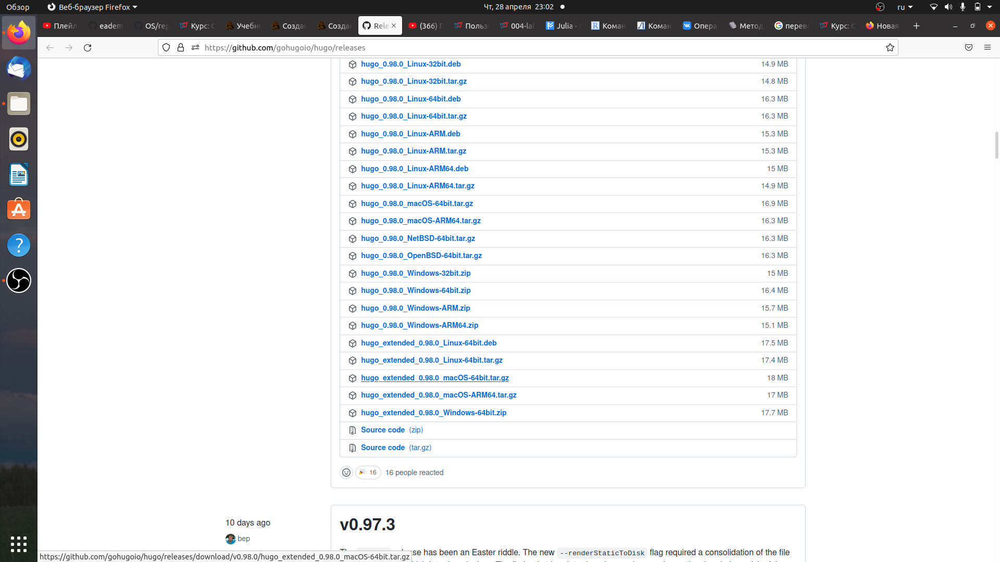
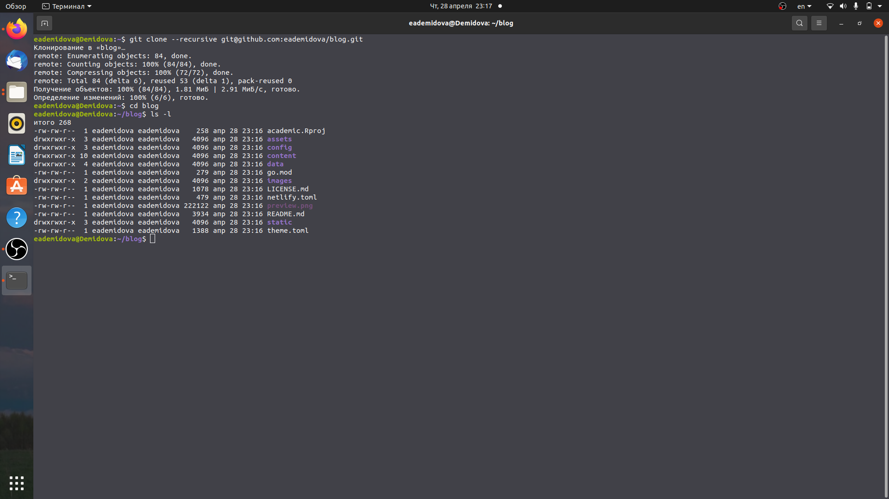
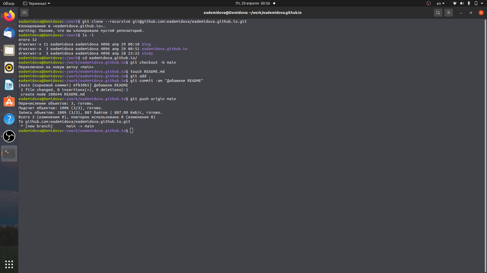
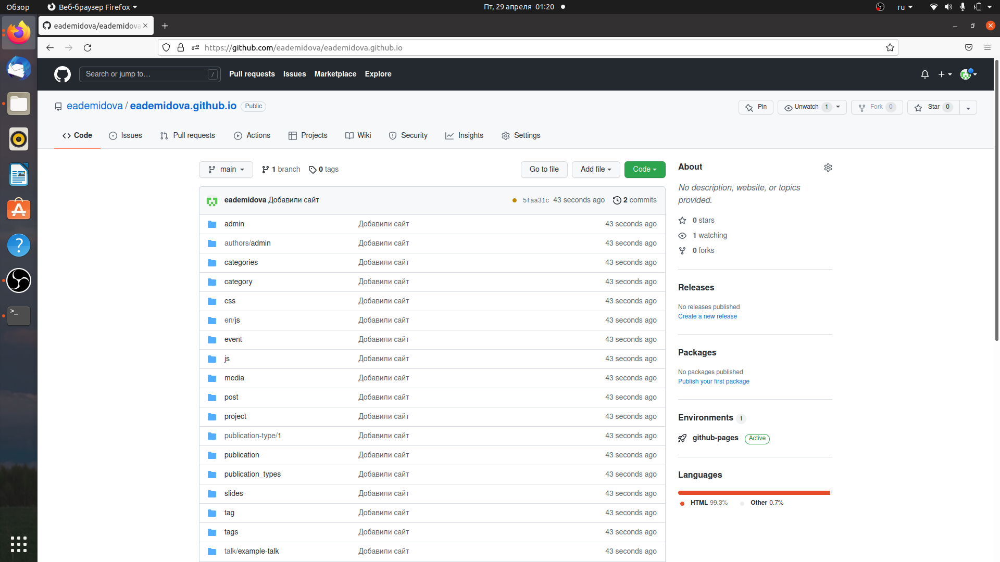

---
## Front matter
lang: ru-RU
title: Индивидуальный проект. Этапс1.
author: |
	Демидова Е.А.
institute: Российский Университет дружбы народов
date: Операционные системы -- 2022

## Formatting
toc: false
slide_level: 2
theme: metropolis
header-includes: 
 - \metroset{progressbar=frametitle,sectionpage=progressbar,numbering=fraction}
 - '\makeatletter'
 - '\beamer@ignorenonframefalse'
 - '\makeatother'
aspectratio: 43
section-titles: true
---

# Введение

## Введение

**Цель работы**

Разместить на Github pages заготовки для персонального сайта.

**Задачи**

- Установить необходимое программное обеспечение.
- Скачать шаблон темы сайта.
- Разместить его на хостинге git.
- Установить параметр для URLs сайта.
- Разместить заготовку сайта на Github pages

# Результаты работы

## Установить необходимое программное обеспечение

Установим hugo

{ #fig:001 width=80% }

## Скачать шаблон темы сайта. Разместить его на хостинге git

Скачаем шаблон темы сайта и создадим репозиторий, а затем клонируем его на компьютер

{ #fig:003 width=70% }

## Установить параметр для URLs сайта

Затем создадим ещё один репозиторий со специальным названием eademidova.github.io.git, клонируем его на компьютер и добавим файл README.md в ветку main

{ #fig:007 width=70% }

## Разместить заготовку сайта на Github pages

Затем привяжем к каталогу public созданный репозиторий с помощью команды git submodule add -b main git@github.com:eademidova/eademidova.github.io.git public. Затем добавим сайт в репозиторий

{ #fig:009 width=70% }

## Проверка

Проверим работает ли сайт по ссылке eademidova,github.io

{ #fig:010 width=70% }

## Выводы

В результате работы была размещена заготовка для персонального сайта на GitGubPages.

## Список литературы

1. About GitHub Pages [Электронный ресурс]. web-revenue.ru, 2021. URL: https:
//web-revenue.ru/instrumenti/github-pages.
2. Installing Hugo [Электронный ресурс]. GitHub, Inc., 2022. URL: https://gith
ub.com/gohugoio/hugo/releases.

## {.standout}

Спасибо за внимание
