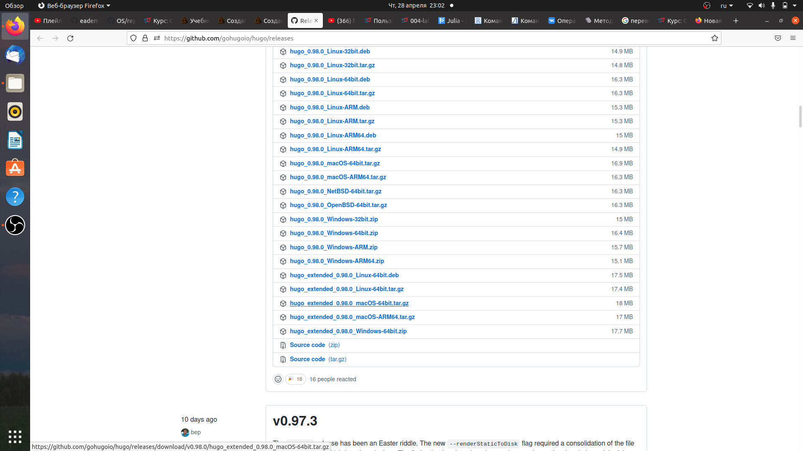
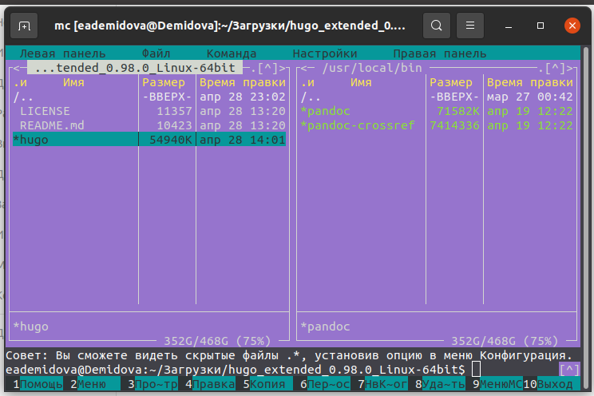
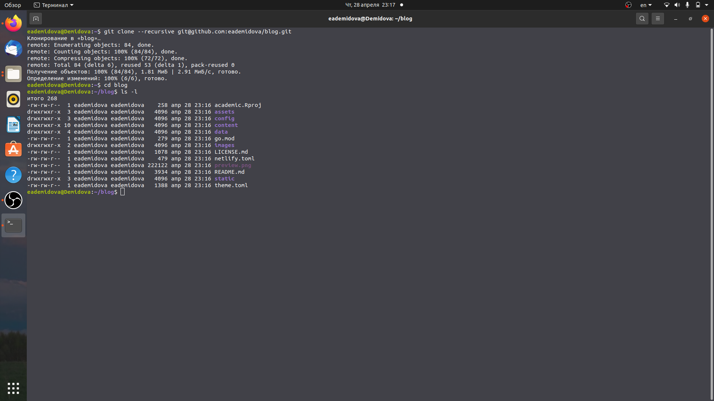
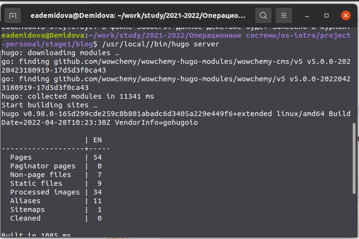
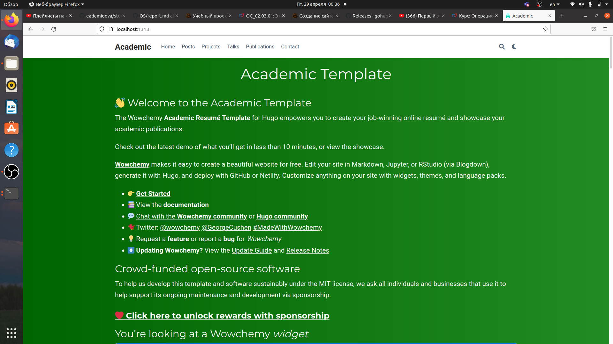
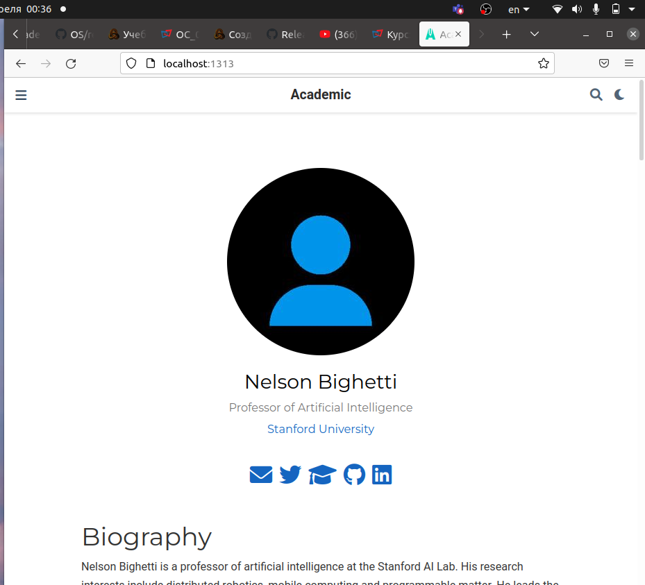
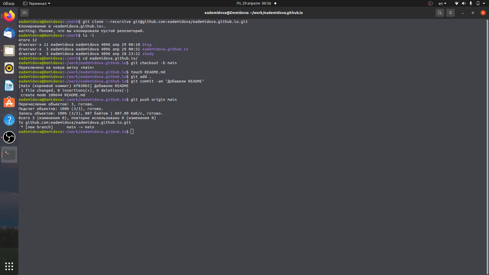
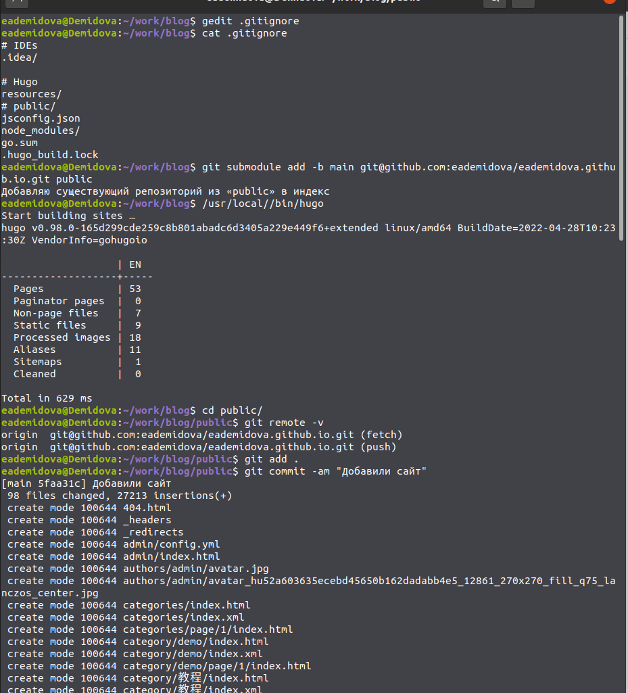
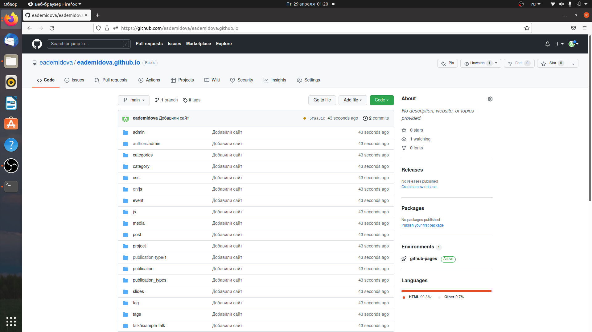
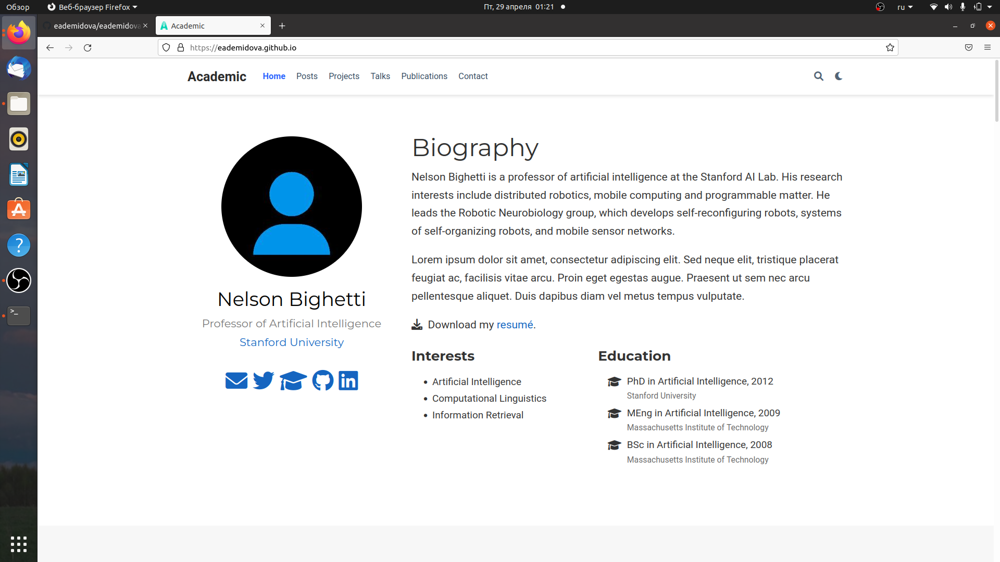

---
## Front matter
title: "Индивидуальный проект"
subtitle: "Этап 1"
author: "Демидова Екатерина Алексеевна"

## Generic otions
lang: ru-RU
toc-title: "Содержание"

## Bibliography
bibliography: bib/cite.bib
csl: pandoc/csl/gost-r-7-0-5-2008-numeric.csl

## Pdf output format
toc: true # Table of contents
toc-depth: 2
lof: true # List of figures
lot: false # List of tables
fontsize: 12pt
linestretch: 1.5
papersize: a4
documentclass: scrreprt
## I18n polyglossia
polyglossia-lang:
  name: russian
  options:
	- spelling=modern
	- babelshorthands=true
polyglossia-otherlangs:
  name: english
## I18n babel
babel-lang: russian
babel-otherlangs: english
## Fonts
mainfont: PT Serif
romanfont: PT Serif
sansfont: PT Sans
monofont: PT Mono
mainfontoptions: Ligatures=TeX
romanfontoptions: Ligatures=TeX
sansfontoptions: Ligatures=TeX,Scale=MatchLowercase
monofontoptions: Scale=MatchLowercase,Scale=0.9
## Biblatex
biblatex: true
biblio-style: "gost-numeric"
biblatexoptions:
  - parentracker=true
  - backend=biber
  - hyperref=auto
  - language=auto
  - autolang=other*
  - citestyle=gost-numeric
## Pandoc-crossref LaTeX customization
figureTitle: "Рис."
tableTitle: "Таблица"
listingTitle: "Листинг"
lofTitle: "Список иллюстраций"
lotTitle: "Список таблиц"
lolTitle: "Листинги"
## Misc options
indent: true
header-includes:
  - \usepackage{indentfirst}
  - \usepackage{float} # keep figures where there are in the text
  - \floatplacement{figure}{H} # keep figures where there are in the text
---

# Цель работы

Разместить на Github pages заготовки для персонального сайта.

# Задание

- Установить необходимое программное обеспечение.
- Скачать шаблон темы сайта.
- Разместить его на хостинге git.
- Установить параметр для URLs сайта.
- Разместить заготовку сайта на Github pages

# Теоретическое введение

GitHub Pages - это сервис, на котором можно бесплатно размещать статические веб-сайты (html/css/js/изображения)[@wr:bash]. 

Сервис Github Pages предоставляет следующие возможности для статических сайтов:

- Использование HTML, CSS, языка разметки Markdown;
- Встраивание изображений и другого медиа;
- Использование JavaScript.

Ограничения:

- Нельзя использовать на сайте PHP либо другие серверные языки — от сюда вытекает: если нужны
формы например, обратной связи, то их придется создать в каких-нибудь конструкторах типа
FormDesigner и затем уже встроить;
- Серверный код и серверные скрипты выполняться не будут;
- Cookies не используются.

В работе был использован репозиторий с установочными файлами hugo[@hugo:bash].

# Выполнение лабораторной работы

Установим необходимое программное обеспечение, а именно hugo, скачав архив hego_extended_o.98.0_Linux-64bit.tar.gz и поместив исполняемый файл в папку /usr/local/bin. (рис. [-@fig:001, -@fig:002])

{ #fig:001 width=70% }

{ #fig:002 width=70% }

Скачаем шаблон темы сайта и создадим репозиторий, а затем клонируем его на компьютер (рис. [-@fig:003])

{ #fig:003 width=70% }

Запустим сервер с помощью команды /usr/local//bin/hugo server (рис. [-@fig:004])

{ #fig:004 width=70% }

Затем перейдем по полученной ссылке и удалим файл demo.md (рис. [-@fig:005, -@fig:006])

{ #fig:005 width=70% }

{ #fig:006 width=70% }

Затем создадим ещё один репозиторий со специальным названием eademidova.github.io.git, клонируем его на компьютер и добавим файл README.md в ветку main (рис. [-@fig:007])

{ #fig:007 width=70% }

Затем в файле .gitignore закомментируем /public, чтобы каталоги public не игнорировались (рис. [-@fig:008])

{ #fig:008 width=70% }

Затем привяжем к каталогу public созданный репозиторий с помощью команды git submodule add -b main git@github.com:eademidova/eademidova.github.io.git public. Затем добавим сайт в репозиторий (рис. [-@fig:009])

{ #fig:009 width=70% }

Проверим работает ли сайт по ссылку eademidova,github.io (рис. [-@fig:010])

{ #fig:010 width=70% }

# Выводы

В результате работы была размещена заготовка для персонального сайта на GitGubPages.

# Список литературы{.unnumbered}

::: {#refs}
:::
