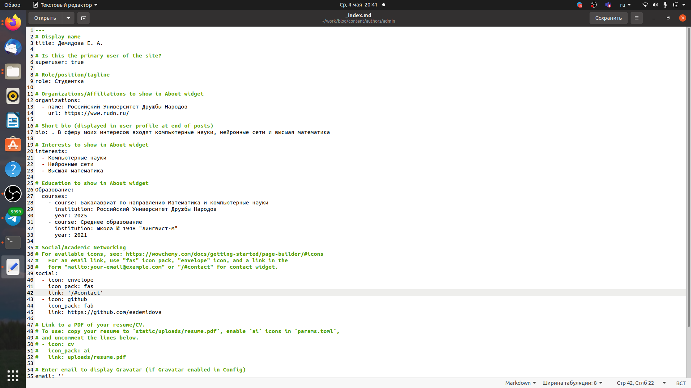
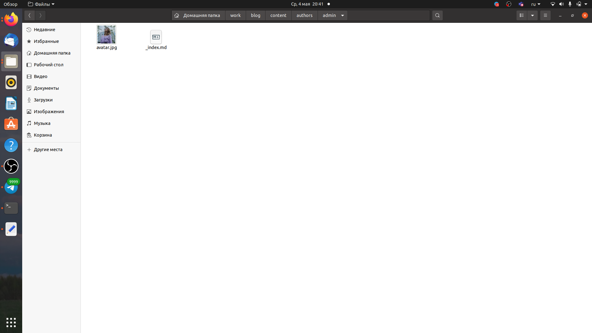
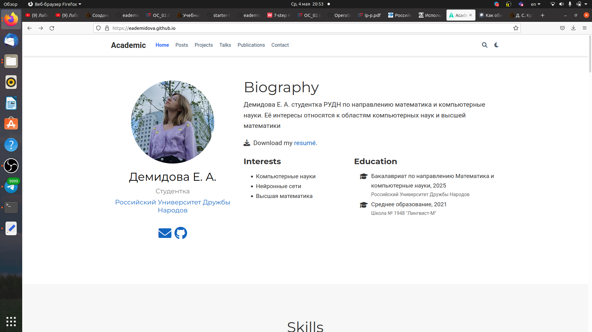
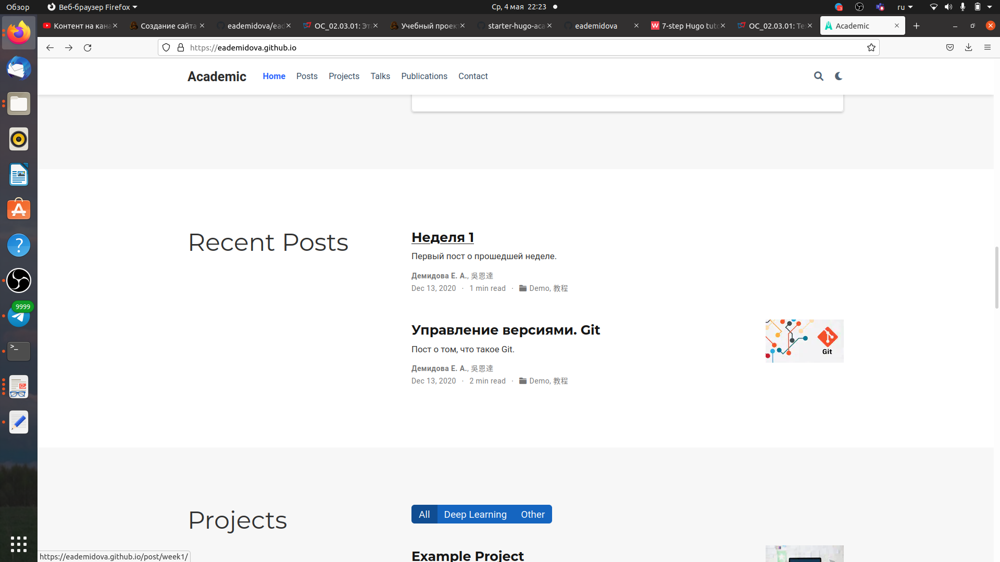

---
## Front matter
lang: ru-RU
title: Индивидуальный проект
subtitle: Этап 2
author:
  - Демидова Е. А.
institute:
  - Российский университет дружбы народов, Москва, Россия
date: 02 мая 2003

## i18n babel
babel-lang: russian
babel-otherlangs: english

## Formatting pdf
toc: false
toc-title: Содержание
slide_level: 2
aspectratio: 169
section-titles: true
theme: metropolis
header-includes:
 - \metroset{progressbar=frametitle,sectionpage=progressbar,numbering=fraction}
 - '\makeatletter'
 - '\beamer@ignorenonframefalse'
 - '\makeatother'
---

# Информация

## Докладчик

:::::::::::::: {.columns align=center}
::: {.column width="70%"}

  * Демидова Екатерина Алексеевна
  * студентка группы НКНбд-01-21
  * Российский университет дружбы народов
  * <https://github.com/eademidova>

:::
::: {.column width="30%"}

:::
::::::::::::::

# Введение

## Введение

**Цель работы**

Добавить к сайту данные о себе и сделать два поста.

**Задачи**

1. Добавить к сайту данные о себе
- Разместить фотографию владельца сайта.
- Разместить краткое описание владельца сайта (Biography).
- Добавить информацию об интересах (Interests).
- Добавить информацию от образовании (Education).
2. Сделать пост по прошедшей неделе.
3. Добавить пост на тему Управление версиями. Git.

# Результаты работы

## Изменение информации о себе

Внесли изменения личной информации в файл _index.md, имеющий путь ~/work/blog/content/authors/admin.

{ #fig:001 width=70% }

## Добавление фотографии

Добавили фотографию в папку ~/work/blog/content/authors/admin.

{ #fig:002 width=70% }

## Загрузка изменений

Внесли изменения и проверим их корректность.

{ #fig:004 width=70% }

## Статьи

Написали статьи и добавим мх на сайт.

{ #fig:007 width=70% }

## Выводы

В результате выполнения второго этапа индивидуального проекта была изменена информация о себе на сайте и добавлено два поста.

## Список литературы

1. About VCS [Электронный ресурс]. Wikimedia Foundation, Inc, 2022. URL:
https://ru.wikipedia.org/wiki/%D0%A1%D0%B8%D1%81%D1%82%D0%B5%D
0%BC%D0%B0_%D1%83%D0%BF%D1%80%D0%B0%D0%B2%D0%BB%D0%B
5%D0%BD%D0%B8%D1%8F_%D0%B2%D0%B5%D1%80%D1%81%D0%B8%D1
%8F%D0%BC%D0%B8.
2. About Git [Электронный ресурс]. Habr, 2018. URL: https://habr.com/ru/post/4
51662/.

## {.standout}

Спасибо за внимание
