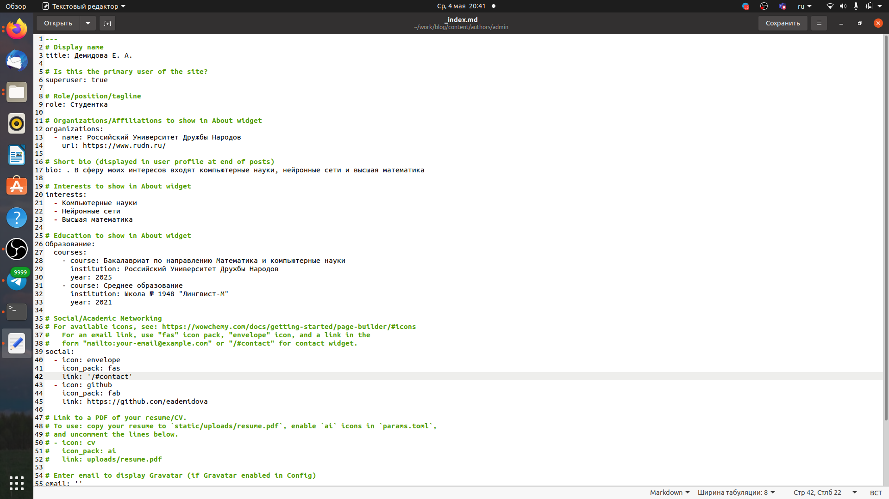
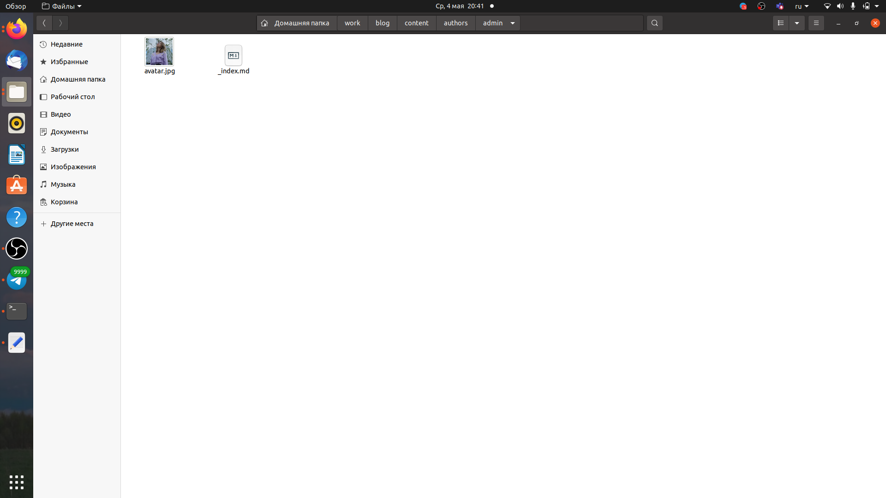
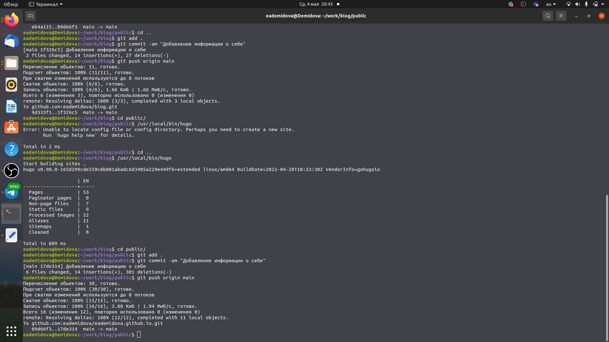
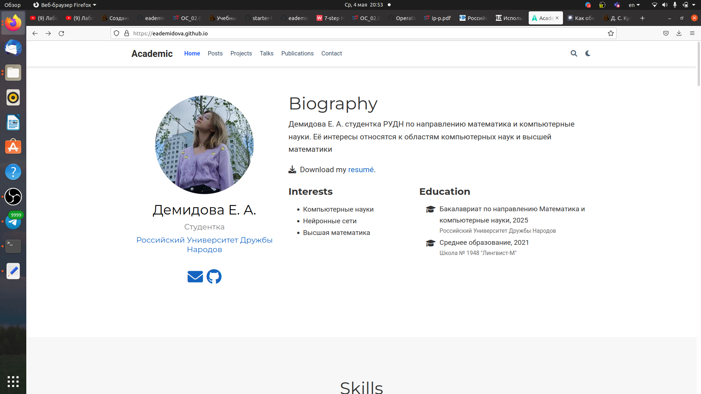
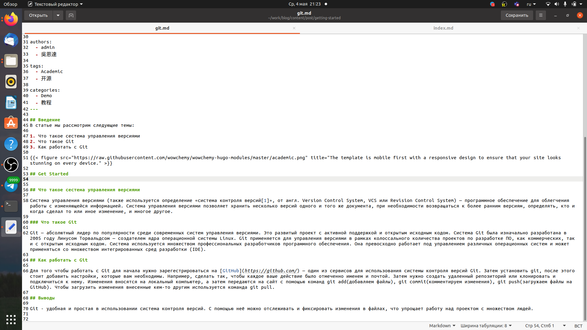
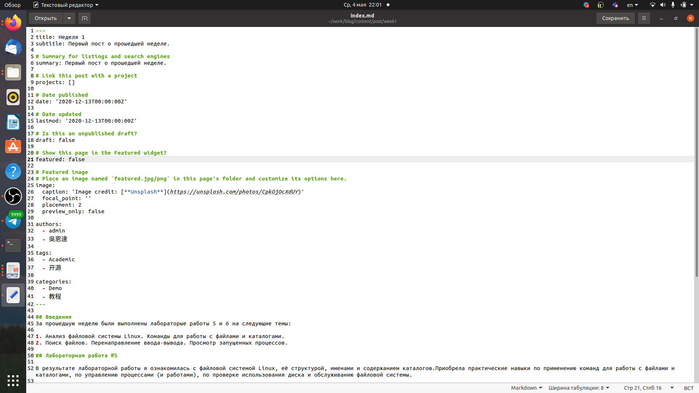
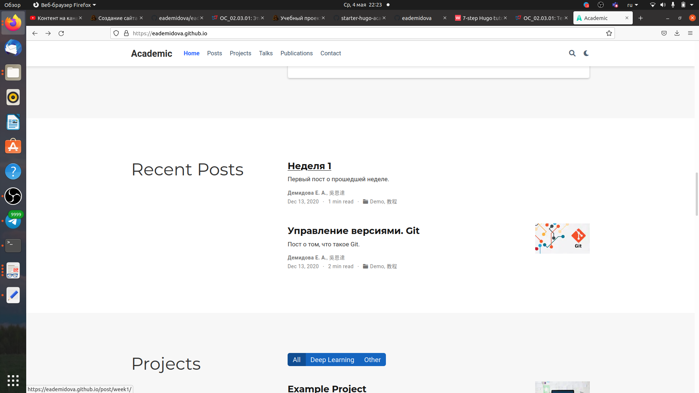

---
## Front matter
title: "Индивидуальный проект"
subtitle: "Этап 2"
author: "Демидова Екатерина Алексеевна"

## Generic otions
lang: ru-RU
toc-title: "Содержание"

## Bibliography
bibliography: bib/cite.bib
csl: pandoc/csl/gost-r-7-0-5-2008-numeric.csl

## Pdf output format
toc: true # Table of contents
toc-depth: 2
lof: true # List of figures
lot: false # List of tables
fontsize: 12pt
linestretch: 1.5
papersize: a4
documentclass: scrreprt
## I18n polyglossia
polyglossia-lang:
  name: russian
  options:
	- spelling=modern
	- babelshorthands=true
polyglossia-otherlangs:
  name: english
## I18n babel
babel-lang: russian
babel-otherlangs: english
## Fonts
mainfont: PT Serif
romanfont: PT Serif
sansfont: PT Sans
monofont: PT Mono
mainfontoptions: Ligatures=TeX
romanfontoptions: Ligatures=TeX
sansfontoptions: Ligatures=TeX,Scale=MatchLowercase
monofontoptions: Scale=MatchLowercase,Scale=0.9
## Biblatex
biblatex: true
biblio-style: "gost-numeric"
biblatexoptions:
  - parentracker=true
  - backend=biber
  - hyperref=auto
  - language=auto
  - autolang=other*
  - citestyle=gost-numeric
## Pandoc-crossref LaTeX customization
figureTitle: "Рис."
tableTitle: "Таблица"
listingTitle: "Листинг"
lofTitle: "Список иллюстраций"
lotTitle: "Список таблиц"
lolTitle: "Листинги"
## Misc options
indent: true
header-includes:
  - \usepackage{indentfirst}
  - \usepackage{float} # keep figures where there are in the text
  - \floatplacement{figure}{H} # keep figures where there are in the text
---

# Цель работы

Добавить к сайту данные о себе и сделать два поста.

# Задание

1. Добавить к сайту данные о себе
 Список добавляемых данных.
- Разместить фотографию владельца сайта.
- Разместить краткое описание владельца сайта (Biography).
- Добавить информацию об интересах (Interests).
- Добавить информацию от образовании (Education).
2. Сделать пост по прошедшей неделе.
3. Добавить пост на тему по выбору:
   - Управление версиями. Git.
   - Непрерывная интеграция и непрерывное развертывание (CI/CD).

# Теоретическое введение

Система управления версиями (также используется определение «система контроля версий», от англ. Version Control System, VCS или Revision Control System) — программное обеспечение для облегчения работы с изменяющейся информацией. Система управления версиями позволяет хранить несколько версий одного и того же документа, при необходимости возвращаться к более ранним версиям, определять, кто и когда сделал то или иное изменение, и многое другое[@wiki:bash]. 

Основная задача системы управление версий — это упрощение работы с потоками изменяющейся информации. Главной парадигмой системы управления версий является локализация данных каждого разработчика проекта. Каждый разработчик имеет на своей машине локальный репозиторий. В случае необходимости изменения отправляются из локального репозитория в удаленное хранилище в определенную ветку. И любой разработчик из распределенной команды может скачать новые изменения в проекте, чтобы продолжить совместную работу над проектом[@habr:bash].

# Выполнение проекта

Внесем изменения личной информации в файл _index.md, имеющий путь ~/work/blog/content/authors/admin (рис. [-@fig:001])

{ #fig:001 width=70% }

Добавим фотографию в папку ~/work/blog/content/authors/admin (рис. [-@fig:002])

{ #fig:002 width=70% }

Затем добавим внесенные изменения в репозиторий blog и затем использовав hugo внесём изменения в насш сайт (рис. [-@fig:003])

{ #fig:003 width=70% }

Проверим все ли изменения были успешно внесены (рис. [-@fig:004;-@fig:005]))

{ #fig:004 width=70% }

Теперь напишем статью по теме Управление версиями. Git. в файле index.md, имеющем путь ~/work/blog/content/post/getting-started  (рис. [-@fig:004;-@fig:005]))

{ #fig:005 width=70% }

Теперь напишем статью по прошедшей неделе. в файле index.md, имеющем путь ~/work/blog/content/post/week1  (рис. [-@fig:006])

{ #fig:006 width=70% }

Добавим статьи на сайт и проверим все ли изменения были успешно внесены (рис. [-@fig:007])

{ #fig:007 width=70% }

# Выводы

В результате выполнения второго этапа индивидуального проекта была изменена информация о себе на сайте и добавлено два поста.

# Список литературы{.unnumbered}

::: {#refs}
:::
