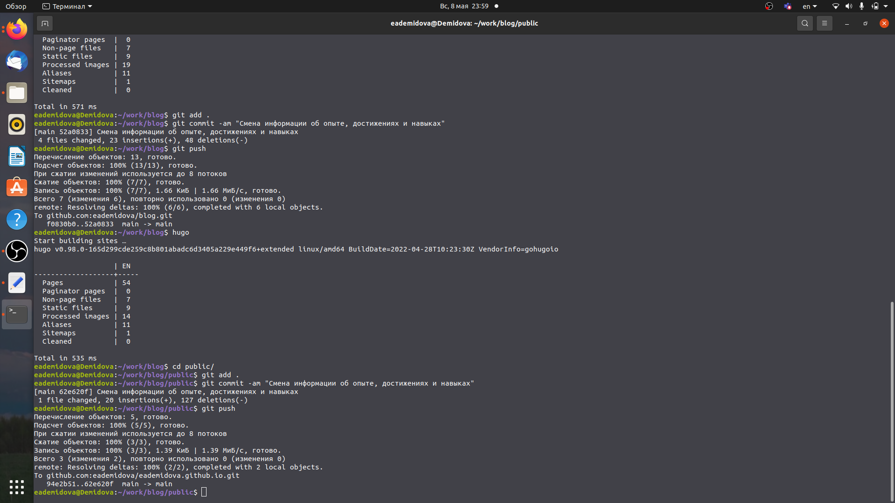
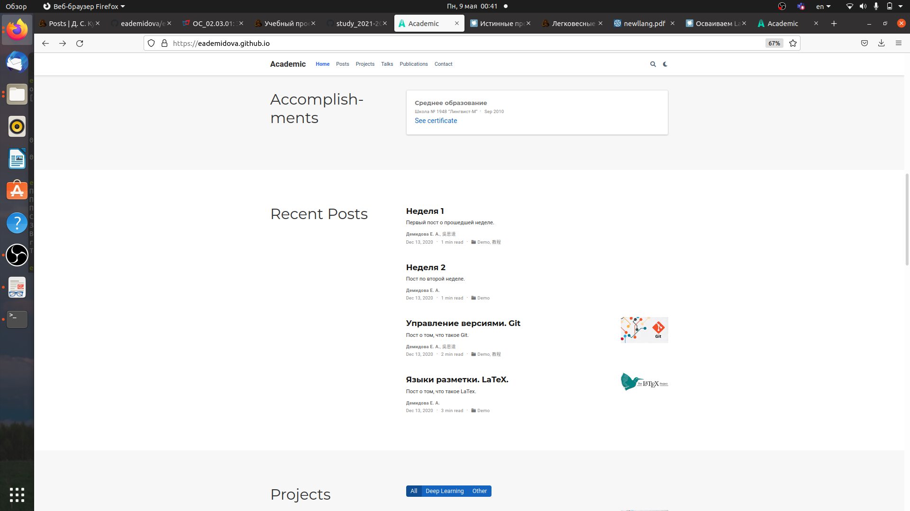

---
## Front matter
lang: ru-RU
title: Индивидуальный проект. Этап 3.
author: |
	Демидова Е.А.
institute: Российский Университет дружбы народов
date: Операционные системы -- 2022

## Formatting
toc: false
slide_level: 2
theme: metropolis
header-includes: 
 - \metroset{progressbar=frametitle,sectionpage=progressbar,numbering=fraction}
 - '\makeatletter'
 - '\beamer@ignorenonframefalse'
 - '\makeatother'
aspectratio: 43
section-titles: true
---

# Информация

## Докладчик

:::::::::::::: {.columns align=center}
::: {.column width="70%"}

  * Демидова Екатерина Алексеевна
  * студентка группы НКНбд-01-21
  * Российский университет дружбы народов
  * <https://github.com/eademidova>

:::
::: {.column width="30%"}

:::
::::::::::::::

# Введение

## Введение

**Цель работы**

Добавить к сайту данные о достижениях и сделать два поста.

**Задачи**

1. Список достижений.
 - Добавить информацию о навыках (Skills).
 - Добавить информацию об опыте (Experience).
 - Добавить информацию о достижениях (Accomplishments).
2. Сделать пост по прошедшей неделе.
3. Добавить пост на теме Языки разметки. LaTeX.

# Результаты работы

## Изменение информации о достижениях

- Внесли изменения информации о навыках в файл slills.md, имеющий путь ~/work/blog/content/home

- Внесли изменения информации об опыте в файл experience.md, имеющий путь ~/work/blog/content/home

- Внесли изменения информации о достижениях в файл accomplishments.md, имеющий путь ~/work/blog/content/home

## Загрузка изменений

Затем загрузим изменения на сайт
{ #fig:004 width=70% }

Проверим все ли изменения были успешно внесены
{ #fig:005 width=70% }

## Статьи

Напишем статьи по прошедщшей неделе и по теме Языки разметки. LaTex. Добавим статьи на сайт и проверим все ли изменения были успешно внесены.
{ #fig:008 width=70% }

## Выводы

В результате выполнения второго этапа индивидуального проекта была изменена информация о достижениях на сайте и добавлено два поста.

## Список литературы

1. Львовский С.М. Набор и вёрстка в системе LATEX. МЦНМО, 2006. 447 с.

## {.standout}

Спасибо за внимание
