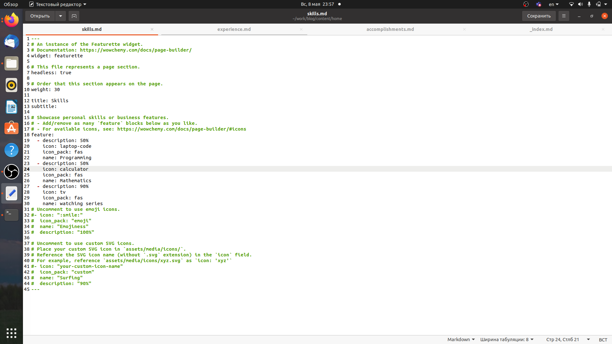
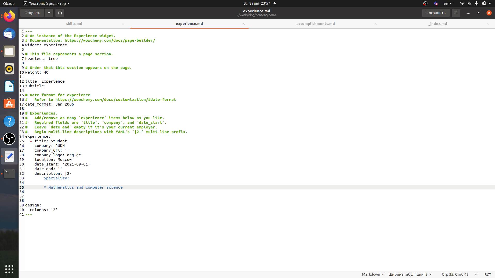
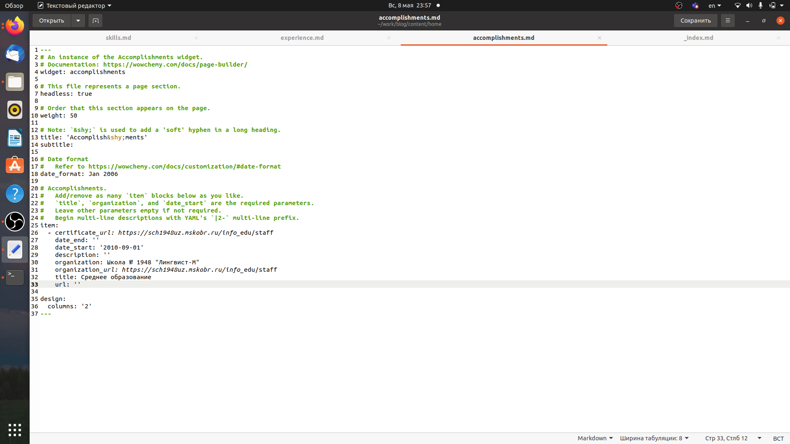
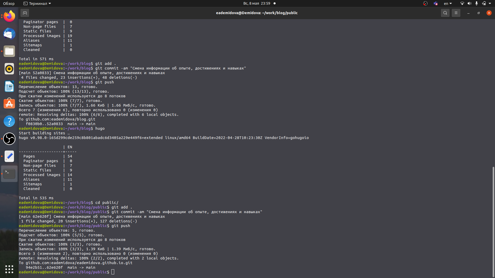
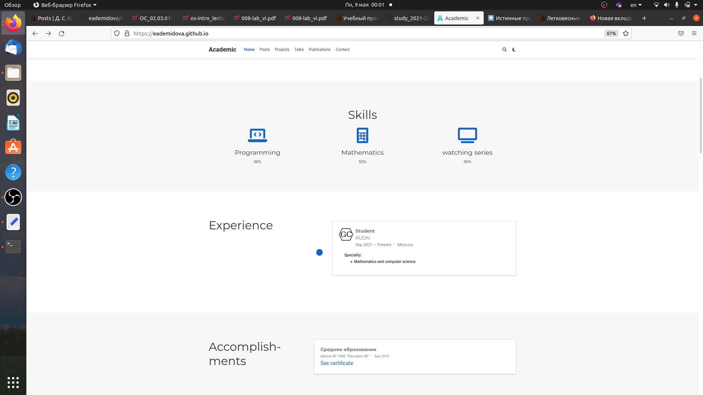
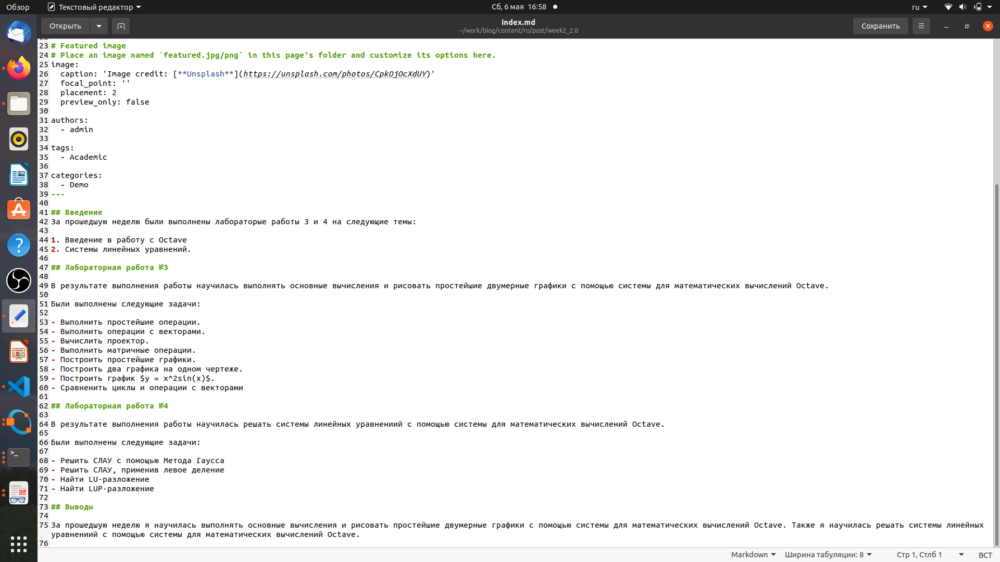
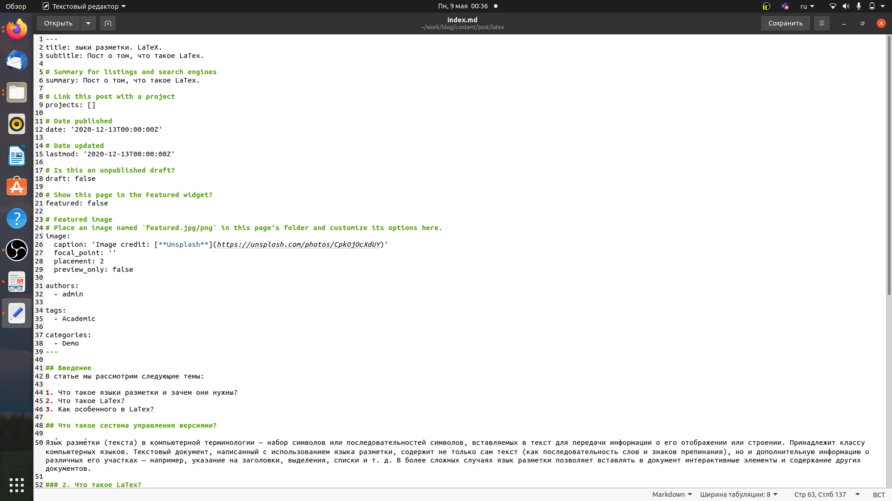
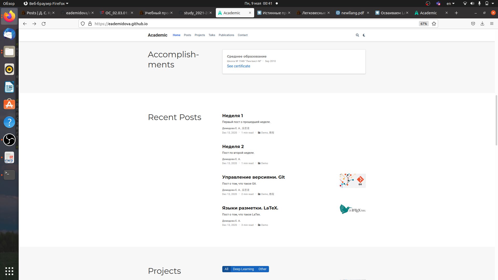

---
## Front matter
title: "Индивидуальный проект"
subtitle: "Этап 3"
author: "Демидова Екатерина Алексеевна"

## Generic otions
lang: ru-RU
toc-title: "Содержание"

## Bibliography
bibliography: bib/cite.bib
csl: pandoc/csl/gost-r-7-0-5-2008-numeric.csl

## Pdf output format
toc: true # Table of contents
toc-depth: 2
lof: true # List of figures
lot: false # List of tables
fontsize: 12pt
linestretch: 1.5
papersize: a4
documentclass: scrreprt
## I18n polyglossia
polyglossia-lang:
  name: russian
  options:
	- spelling=modern
	- babelshorthands=true
polyglossia-otherlangs:
  name: english
## I18n babel
babel-lang: russian
babel-otherlangs: english
## Fonts
mainfont: PT Serif
romanfont: PT Serif
sansfont: PT Sans
monofont: PT Mono
mainfontoptions: Ligatures=TeX
romanfontoptions: Ligatures=TeX
sansfontoptions: Ligatures=TeX,Scale=MatchLowercase
monofontoptions: Scale=MatchLowercase,Scale=0.9
## Biblatex
biblatex: true
biblio-style: "gost-numeric"
biblatexoptions:
  - parentracker=true
  - backend=biber
  - hyperref=auto
  - language=auto
  - autolang=other*
  - citestyle=gost-numeric
## Pandoc-crossref LaTeX customization
figureTitle: "Рис."
tableTitle: "Таблица"
listingTitle: "Листинг"
lofTitle: "Список иллюстраций"
lotTitle: "Список таблиц"
lolTitle: "Листинги"
## Misc options
indent: true
header-includes:
  - \usepackage{indentfirst}
  - \usepackage{float} # keep figures where there are in the text
  - \floatplacement{figure}{H} # keep figures where there are in the text
---

# Цель работы

Добавить к сайту данные о достижениях и сделать два поста.

# Задание

Добавить к сайту достижения.

1. Список достижений.
 - Добавить информацию о навыках (Skills).
 - Добавить информацию об опыте (Experience).
 - Добавить информацию о достижениях (Accomplishments).
2. Сделать пост по прошедшей неделе.
3. Добавить пост на тему по выбору:
 - Легковесные языки разметки.
 - Языки разметки. LaTeX.
 - Язык разметки Markdown.

# Теоретическое введение

TEX — это созданная американским математиком и программистом Дональдом Кнутом (Donald E. Knuth) система для верстки текстов с формулами. Сам по себе TEX представляет собой специализированный язык программирования (Кнут не только придумал язык, но и написал для него транслятор, причем таким образом, что он работает совершенно одинаково на самых разных компьютерах), на котором пишутся издательские системы, используемые на практике. Точнее говоря, каждая издательская система на базе TEX’а представляет собой пакет макроопределений (макропакет) этого языка. В частности, LATEX (произносится «латех» или «лэйтех», пишется также «LaTeX») — это созданная Лесли Лэмпортом (Leslie Lamport) издательская система на базе TEX’а [@latex:2006:bash].

# Выполнение проекта

Внесем изменения информации о навыках в файл slills.md, имеющий путь ~/work/blog/content/home (рис. [-@fig:001])

{ #fig:001 width=70% }

Внесем изменения информации об опыте в файл experience.md, имеющий путь ~/work/blog/content/home (рис. [-@fig:002])

{ #fig:002 width=70% }

Внесем изменения информации о достижениях в файл accomplishments.md, имеющий путь ~/work/blog/content/home (рис. [-@fig:003])

{ #fig:003 width=70% }

Затем загрузим изменения на сайт (рис. [-@fig:004;-@fig:005]))

{ #fig:004 width=70% }

Проверим все ли изменения были успешно внесены (рис. [-@fig:004;-@fig:005]))

{ #fig:005 width=70% }

Теперь напишем статью по прошедшей неделе. в файле index.md, имеющем путь ~/work/blog/content/post/week2  (рис. [-@fig:006])

{ #fig:006 width=70% }

Теперь напишем статью по теме Языки разметки. LaTeX. в файле index.md, имеющем путь ~/work/blog/content/post/latex (рис. [-@fig:007])

{ #fig:007 width=70% }

Добавим статьи на сайт и проверим все ли изменения были успешно внесены (рис. [-@fig:008])

{ #fig:008 width=70% }

# Выводы

В результате выполнения второго этапа индивидуального проекта была изменена информация о достижениях на сайте и добавлено два поста.

# Список литературы{.unnumbered}

::: {#refs}
:::
