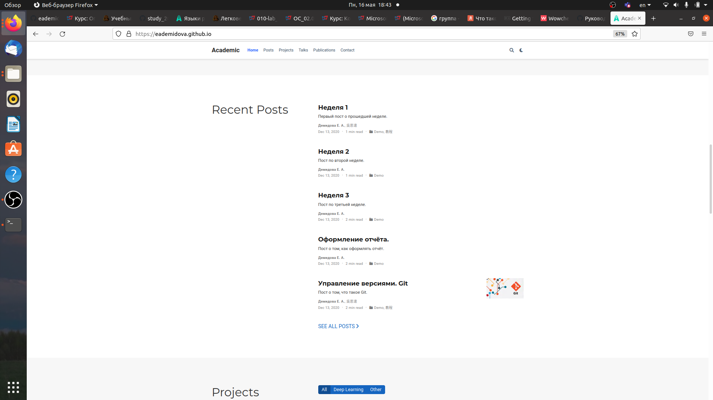

---
## Front matter
lang: ru-RU
title: Индивидуальный проект. Этап 4.
author: |
	Демидова Е.А.
institute: Российский Университет дружбы народов
date: Операционные системы -- 2022

## Formatting
toc: false
slide_level: 2
theme: metropolis
header-includes: 
 - \metroset{progressbar=frametitle,sectionpage=progressbar,numbering=fraction}
 - '\makeatletter'
 - '\beamer@ignorenonframefalse'
 - '\makeatother'
aspectratio: 43
section-titles: true
---

# Введение

## Введение

**Цель работы**

Добавить к сайту ссылки на интернет-ресурсы и сделать два поста.

**Задачи**

1. Добавить к сайту ссылки на гихаб и на ютуб.
2. Сделать пост по прошедшей неделе.
3. Добавить пост на тему Оформление отчёта.

# Результаты работы

## Добавление ссылок на интернет-ресурсы.

Внесем изменения информации в ссылки на интернет-ресурсы в файл имеющий путь ~/work/blog/content/authors/admin/_index.md. Добавим ссылки на источники и названия иконок из пака fab.
{ #fig:001 width=70% }

## Статьи

Написала статью по прошедшей неделе. в файле index.md, имеющем путь ~/work/blog/content/post/week3
{ #fig:002 width=70% }

## Статьи

Написала статью по теме Оформление отчёта в файле index.md, имеющем путь ~/work/blog/content/post/rep
{ #fig:003 width=70% }

## Загрузка изменений

Затем загрузим изменения на сайт и проверим все ли изменения были успешно внесены.
{ #fig:004 width=70% }
{ #fig:005 width=70% }

## Выводы

В результате выполнения четвертого этапа индивидуального проекта индивидуального проекта были добавлены к сайту ссылки на интернет-ресурсы и сделаны два поста.

## Список литературы

1. Что такое Markdown и как им пользоваться [Электронный ресурс]. 2018.
URL: https://lifehacker.ru/chto-takoe-markdown/.

## {.standout}

Спасибо за внимание
