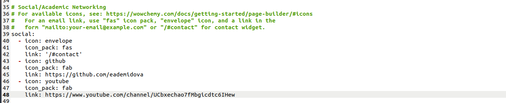
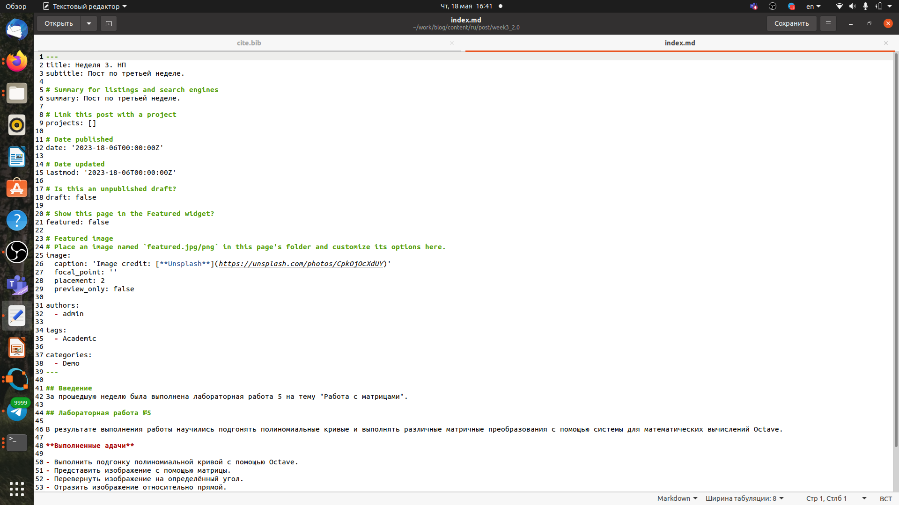
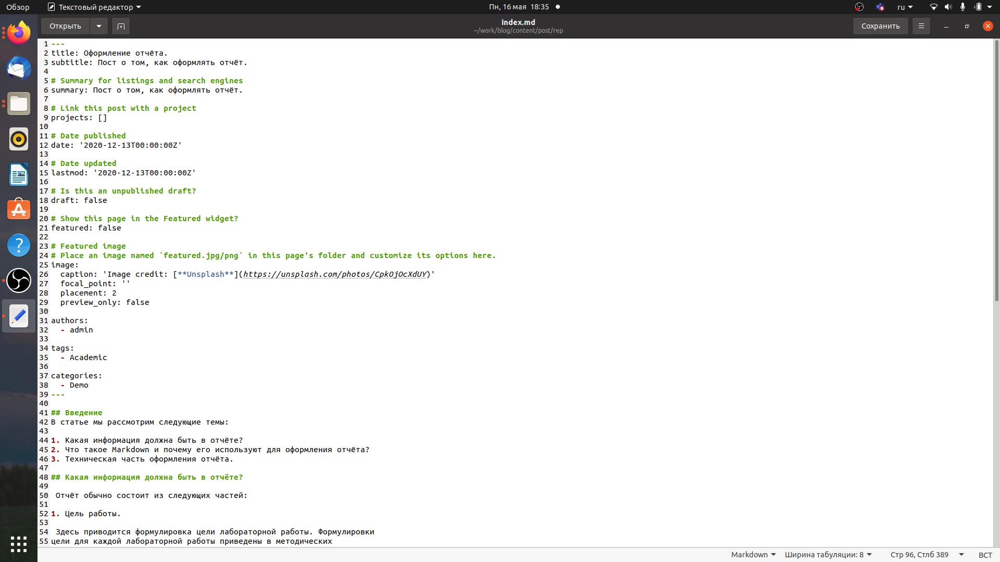
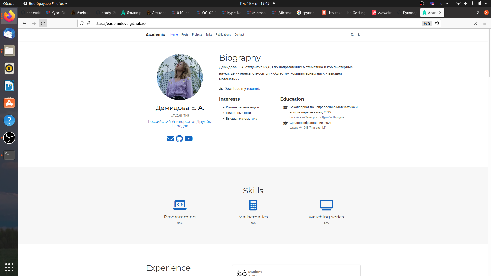
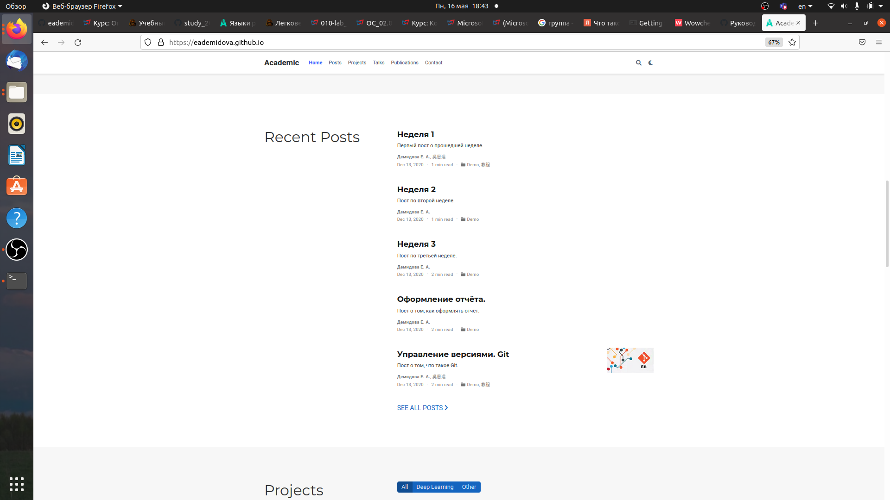

---
## Front matter
title: "Индивидуальный проект"
subtitle: "Этап 4"
author: "Демидова Екатерина Алексеевна"

## Generic otions
lang: ru-RU
toc-title: "Содержание"

## Bibliography
bibliography: bib/cite.bib
csl: pandoc/csl/gost-r-7-0-5-2008-numeric.csl

## Pdf output format
toc: true # Table of contents
toc-depth: 2
lof: true # List of figures
lot: false # List of tables
fontsize: 12pt
linestretch: 1.5
papersize: a4
documentclass: scrreprt
## I18n polyglossia
polyglossia-lang:
  name: russian
  options:
	- spelling=modern
	- babelshorthands=true
polyglossia-otherlangs:
  name: english
## I18n babel
babel-lang: russian
babel-otherlangs: english
## Fonts
mainfont: PT Serif
romanfont: PT Serif
sansfont: PT Sans
monofont: PT Mono
mainfontoptions: Ligatures=TeX
romanfontoptions: Ligatures=TeX
sansfontoptions: Ligatures=TeX,Scale=MatchLowercase
monofontoptions: Scale=MatchLowercase,Scale=0.9
## Biblatex
biblatex: true
biblio-style: "gost-numeric"
biblatexoptions:
  - parentracker=true
  - backend=biber
  - hyperref=auto
  - language=auto
  - autolang=other*
  - citestyle=gost-numeric
## Pandoc-crossref LaTeX customization
figureTitle: "Рис."
tableTitle: "Таблица"
listingTitle: "Листинг"
lofTitle: "Список иллюстраций"
lotTitle: "Список таблиц"
lolTitle: "Листинги"
## Misc options
indent: true
header-includes:
  - \usepackage{indentfirst}
  - \usepackage{float} # keep figures where there are in the text
  - \floatplacement{figure}{H} # keep figures where there are in the text
---

# Цель работы

Добавить к сайту ссылки на интернет-ресурсы и сделать два поста.

# Задание

1. Добавить к сайту ссылки на гихаб и на ютуб.
2. Сделать пост по прошедшей неделе.
3. Добавить пост на тему по выбору:
 - Оформление отчёта.
 - Создание презентаций.
 - Работа с библиографией.

# Теоретическое введение

Markdown — язык текстовой разметки, созданный писателем и блогером Джоном Грубером. Он предназначен для создания красиво оформленных текстов в обычных файлах формата TXT. Вам не нужны громоздкие процессоры вроде Word или Pages, чтобы создавать документы с жирным или курсивным начертанием, цитатами, ссылками и даже таблицами. [@md:bash].

# Выполнение проекта

Внесем изменения информации в ссылки на интернет-ресурсы в файл имеющий путь ~/work/blog/content/authors/admin/_index.md. Добавим ссылки на источники и названия иконок из пака fab. (рис. [-@fig:001])

{ #fig:001 width=70% }

Теперь напишем статью по прошедшей неделе. в файле index.md, имеющем путь ~/work/blog/content/post/week3 (рис. [-@fig:002])

{ #fig:002 width=70% }

Теперь напишем статью по теме Оформление отчёта в файле index.md, имеющем путь ~/work/blog/content/post/rep (рис. [-@fig:003])

{ #fig:003 width=70% }

Затем загрузим изменения на сайт и проверим все ли изменения были успешно внесены (рис. [-@fig:004;-@fig:005]))

{ #fig:004 width=70% }

{ #fig:005 width=70% }

# Выводы

В результате выполнения второго этапа индивидуального проекта были добавлены к сайту ссылки на интернет-ресурсы и сделаны два поста.

# Список литературы{.unnumbered}

::: {#refs}
:::
