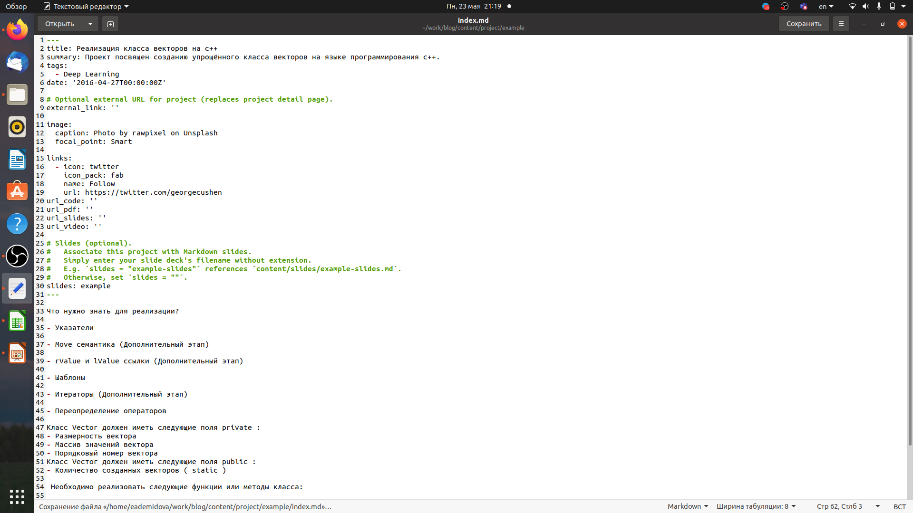
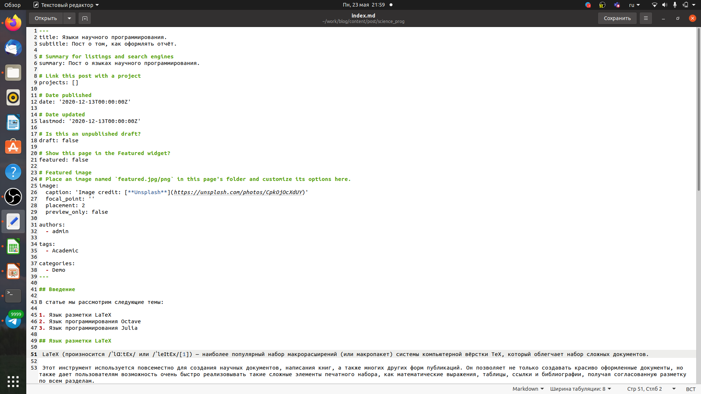
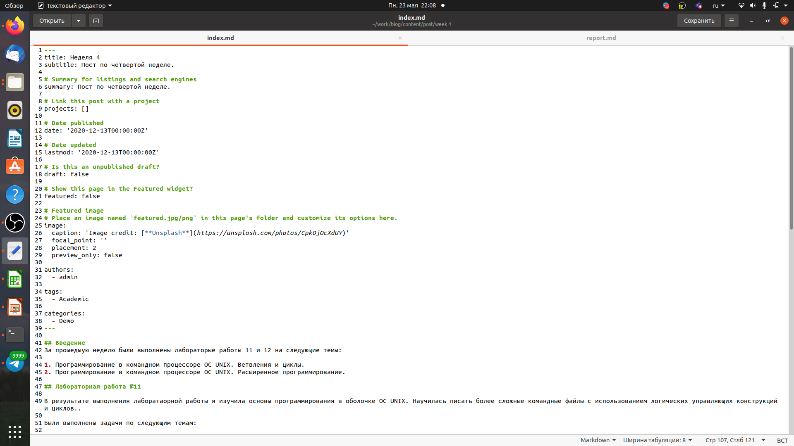
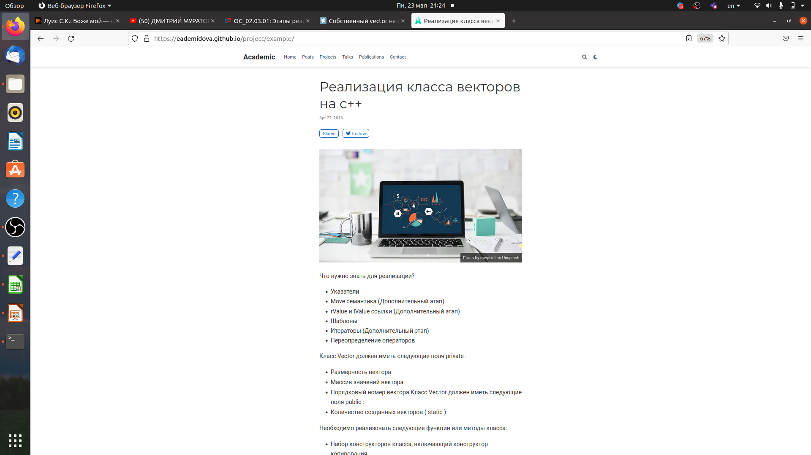
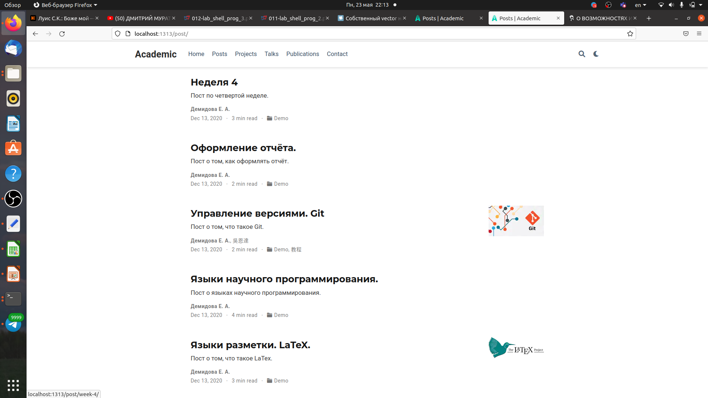

---
## Front matter
lang: ru-RU
title: Индивидуальный проект. Этап 5.
author: |
	Демидова Е.А.
institute: Российский Университет дружбы народов
date: Операционные системы -- 2022

## Formatting
toc: false
slide_level: 2
theme: metropolis
header-includes: 
 - \metroset{progressbar=frametitle,sectionpage=progressbar,numbering=fraction}
 - '\makeatletter'
 - '\beamer@ignorenonframefalse'
 - '\makeatother'
aspectratio: 43
section-titles: true
---

# Введение

## Введение

**Цель работы**

Добавить к сайту записи для персональных проектов и сделать два поста.

**Задачи**

1. Добавить с сайту все остальные элементы.
2. Сделать записи для персональных проектов.
3. Сделать пост по прошедшей неделе.
4. Добавить пост на тему Языки научного программирования.

# Результаты работы

## Добавление проекта.

Внесем изменения информации о проекте в файл имеющий путь ~/work/blog/content/project/example/index.md. Добавим основную информацию и этапы реализации проекта.
{ #fig:001 width=70% }

## Статьи

Написала статью по прошедшей неделе. в файле index.md, имеющем путь ~/work/blog/content/post/week4
{ #fig:002 width=70% }

## Статьи

Написала статью по теме "Научные языки программирования" index.md, имеющем путь ~/work/blog/content/post/science_prog (рис. [-@fig:003])
{ #fig:003 width=70% }

## Загрузка изменений

Затем загрузила изменения на сайт и проверим все ли изменения были успешно внесены
{ #fig:004 width=70% }
{ #fig:005 width=70% }

## Выводы

В результате выполнения пятого этапа индивидуального проекта индивидуального проекта были Добавлены к сайту записи для персональных проектов и сделаны два поста.

## Список литературы

1. Белов Г. В. А.Н.М. О ВОЗМОЖНОСТЯХ ИСПОЛЬЗОВАНИЯ ЯЗЫКА ПРОГРАММИРОВАНИЯ JULIA ДЛЯ РЕШЕНИЯ НАУЧНЫХ И ТЕХНИЧЕСКИХ ЗАДАЧ. Вестник МГТУ им. Н.Э. Баумана, 2020. 131 с.

## {.standout}

Спасибо за внимание
