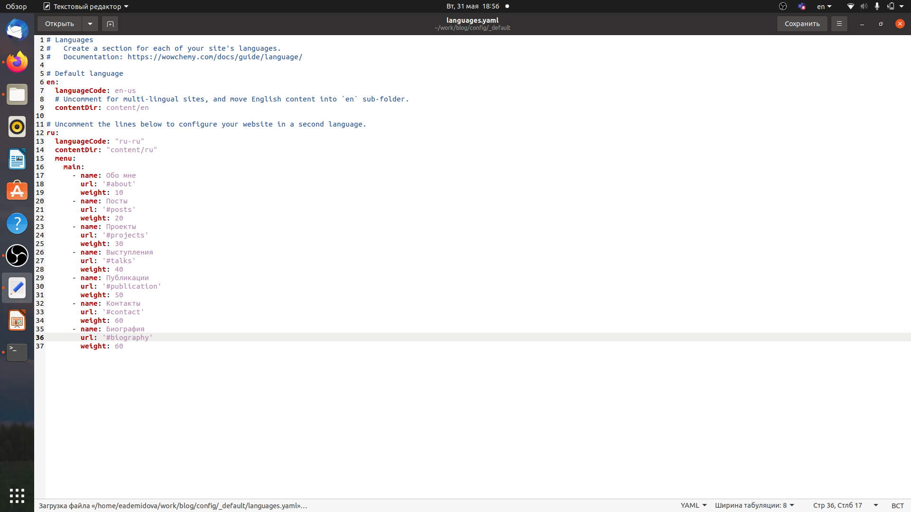
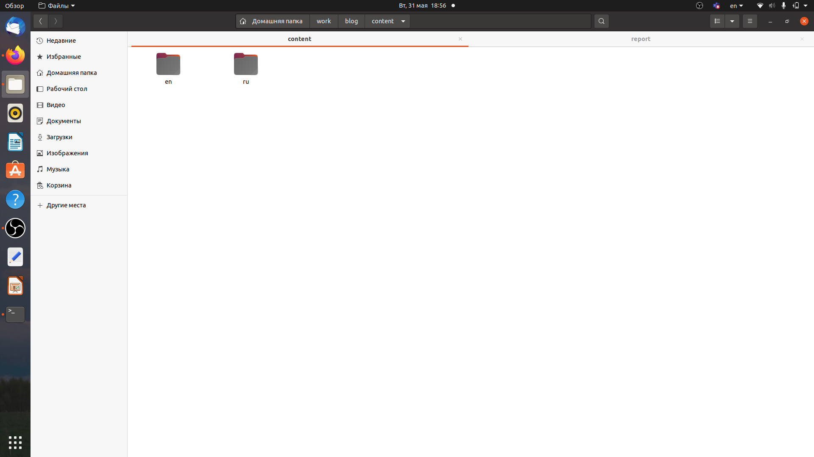
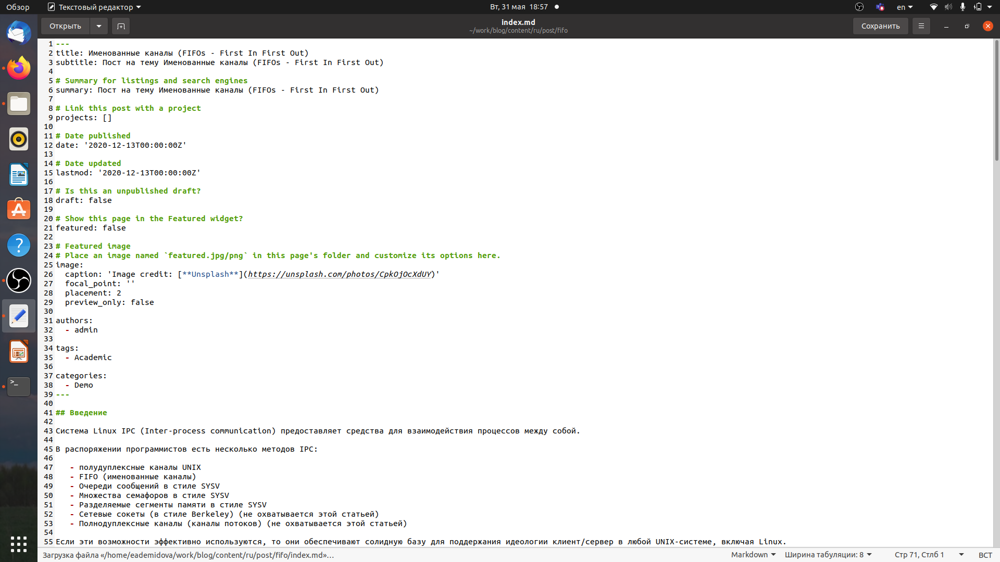
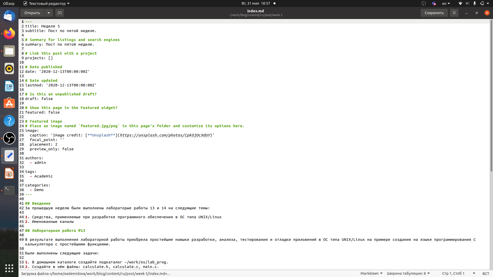
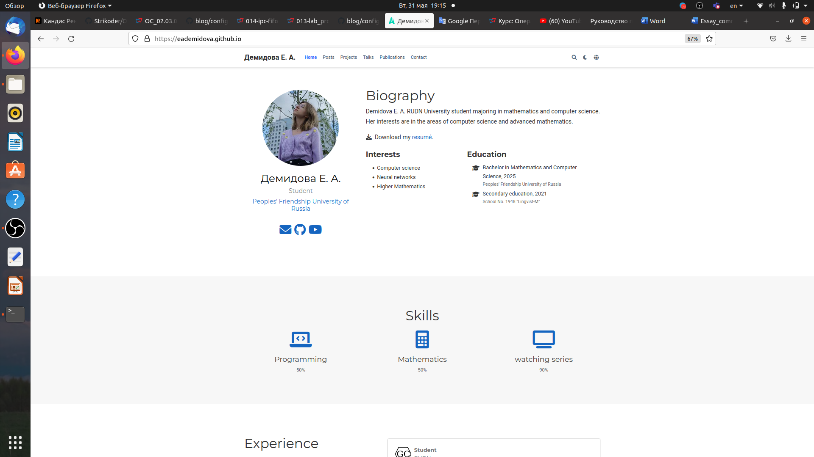

---
## Front matter
lang: ru-RU
title: Индивидуальный проект. Этап 6.
author: |
	Демидова Е.А.
institute: Российский Университет дружбы народов
date: Операционные системы -- 2022

## Formatting
toc: false
slide_level: 2
theme: metropolis
header-includes: 
 - \metroset{progressbar=frametitle,sectionpage=progressbar,numbering=fraction}
 - '\makeatletter'
 - '\beamer@ignorenonframefalse'
 - '\makeatother'
aspectratio: 43
section-titles: true
---

# Введение

## Введение

**Цель работы**

Сделать поддержку русского и английского языков и добавить две статьи.

**Задачи**

Размещение двуязычного сайта на Github.

- Сделать поддержку английского и русского языков.
- Разместить элементы сайта на обоих языках.
- Разместить контент на обоих языках.
- Сделать пост по прошедшей неделе.
- Добавить пост на тему по выбору (на двух языках).

# Результаты работы

## Добавление языка

Добавим русский язык в файл имеющий путь ~/work/blog/config/_default/languages.yaml.
{ #fig:001 width=70% }

## Создание директорий

Теперь в директории content создадим две директории ru и en. Переведём все статьи и прочие разделы на английский язык
{ #fig:002 width=70% }

## Статьи

Теперь напишем статью по теме Именованные каналы в файле index.md, имеющем путь ~/work/blog/content/post/fifo.
{ #fig:003 width=70% }

## Статьи

Также напишем статью по прошедшей неделе в файле index.md, имеющем путь ~/work/blog/content/post/week5.
{ #fig:004 width=70% }

## Загрузка изменений

Затем загрузим изменения на сайт и проверим все ли изменения были успешно внесены.
Вид сайта на русском.
{ #fig:005 width=70% }

## Загрузка изменений

Вид сайта на английском
{ #fig:006 width=70% }

## Выводы

В результате выполнения шестого этапа индивидуального проекта сайт был реализован на двух языках и были добавлены две статьи.

## Список литературы

1. Именованные каналы [Электронный ресурс]. Wikimedia Foundation, Inc.,
2022, URL: https://ru.wikipedia.org/wiki/%D0%98%D0%BC%D0%B5%D0%BD
%D0%BE%D0%B2%D0%B0%D0%BD%D0%BD%D1%8B%D0%B9_%D0%BA%D0
%B0%D0%BD%D0%B0%D0%BB.

## {.standout}

Спасибо за внимание
