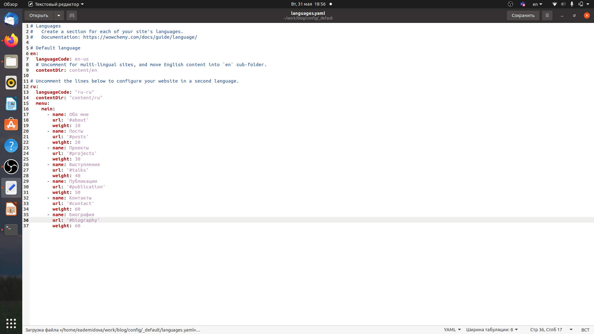
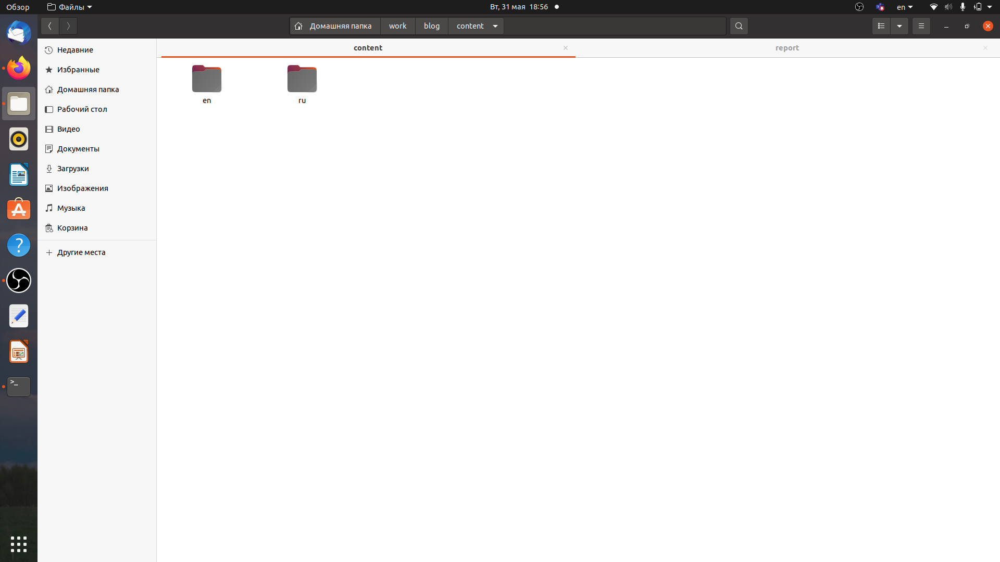
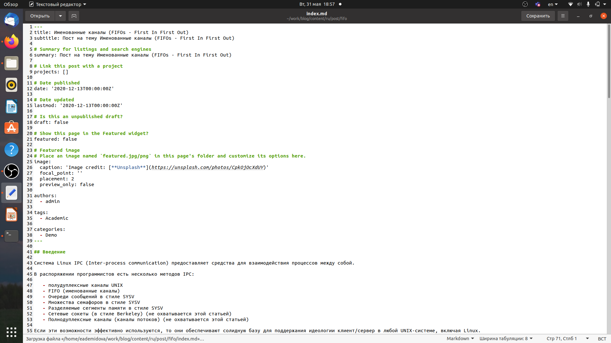
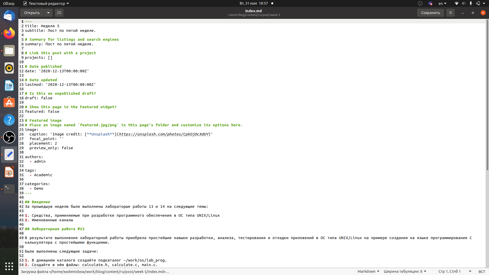

---
## Front matter
title: "Индивидуальный проект"
subtitle: "Этап 6"
author: "Демидова Екатерина Алексеевна"

## Generic otions
lang: ru-RU
toc-title: "Содержание"

## Bibliography
bibliography: bib/cite.bib
csl: pandoc/csl/gost-r-7-0-5-2008-numeric.csl

## Pdf output format
toc: true # Table of contents
toc-depth: 2
lof: true # List of figures
lot: false # List of tables
fontsize: 12pt
linestretch: 1.5
papersize: a4
documentclass: scrreprt
## I18n polyglossia
polyglossia-lang:
  name: russian
  options:
	- spelling=modern
	- babelshorthands=true
polyglossia-otherlangs:
  name: english
## I18n babel
babel-lang: russian
babel-otherlangs: english
## Fonts
mainfont: PT Serif
romanfont: PT Serif
sansfont: PT Sans
monofont: PT Mono
mainfontoptions: Ligatures=TeX
romanfontoptions: Ligatures=TeX
sansfontoptions: Ligatures=TeX,Scale=MatchLowercase
monofontoptions: Scale=MatchLowercase,Scale=0.9
## Biblatex
biblatex: true
biblio-style: "gost-numeric"
biblatexoptions:
  - parentracker=true
  - backend=biber
  - hyperref=auto
  - language=auto
  - autolang=other*
  - citestyle=gost-numeric
## Pandoc-crossref LaTeX customization
figureTitle: "Рис."
tableTitle: "Таблица"
listingTitle: "Листинг"
lofTitle: "Список иллюстраций"
lotTitle: "Список таблиц"
lolTitle: "Листинги"
## Misc options
indent: true
header-includes:
  - \usepackage{indentfirst}
  - \usepackage{float} # keep figures where there are in the text
  - \floatplacement{figure}{H} # keep figures where there are in the text
---

# Цель работы

Сделать поддержку русского и английского языков и добавить две статьи.

# Задание

Размещение двуязычного сайта на Github.

- Сделать поддержку английского и русского языков.
- Разместить элементы сайта на обоих языках.
- Разместить контент на обоих языках.
- Сделать пост по прошедшей неделе.
- Добавить пост на тему по выбору (на двух языках).

# Теоретическое введение

 В программировании именованный канал или именованный конвейер (англ. named pipe) — один из методов межпроцессного взаимодействия, расширение понятия конвейера в Unix и подобных ОС. Именованный канал позволяет различным процессам обмениваться данными, даже если программы, выполняющиеся в этих процессах, изначально не были написаны для взаимодействия с другими программами. Это понятие также существует и в Microsoft Windows, хотя там его семантика существенно отличается. Традиционный канал — «безымянен», потому что существует анонимно и только во время выполнения процесса. Именованный канал — существует в системе и после завершения процесса. Он должен быть «отсоединён» или удалён, когда уже не используется. Процессы обычно подсоединяются к каналу для осуществления взаимодействия между ними.[@wiki:bash] 

# Выполнение проекта

Добавим русский язык в файл имеющий путь ~/work/blog/config/_default/languages.yaml. (рис. [-@fig:001])

{ #fig:001 width=70% }

Теперь в директории content создадим две директории ru и en. Переведём все статьи и прочие разделы на английский язык (рис. [-@fig:002])

{ #fig:002 width=70% }

Теперь напишем статью по теме Именованные каналы в файле index.md, имеющем путь ~/work/blog/content/post/fifo и статью по прошедшей неделе в файле index.md, имеющем путь ~/work/blog/content/post/week5 (рис. [-@fig:003;-@fig:004])

{ #fig:003 width=70% }

{ #fig:004 width=70% }

Затем загрузим изменения на сайт и проверим все ли изменения были успешно внесены (рис. [-@fig:005;-@fig:006]))

{ #fig:005 width=70% }

{ #fig:006 width=70% }

# Выводы

В результате выполнения шестого этапа индивидуального проекта сайт был реализован на двух языках и были добавлены две статьи.

# Список литературы{.unnumbered}

::: {#refs}
:::
